# Mybatis 大纲

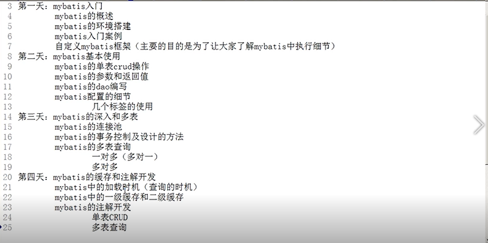

# 一 框架概述

## 1 什么是框架

它是我们软件开发中的一套解决方案，不同的框架解决的是不同的问题。

**框架本身不可以实现业务层，它只能为我们的软件逻辑，持久层，表现层提供一些解决方案。**

使用框架的好处：

- ​	框架封装了很多的细节，使开发者可以使用**极简的方式**实现功能。大大提高开发效率。


## 2 三层架构

**表现层：**用于展示数据的

**业务层：**是处理业务需求

**持久层：**是和数据库交互的

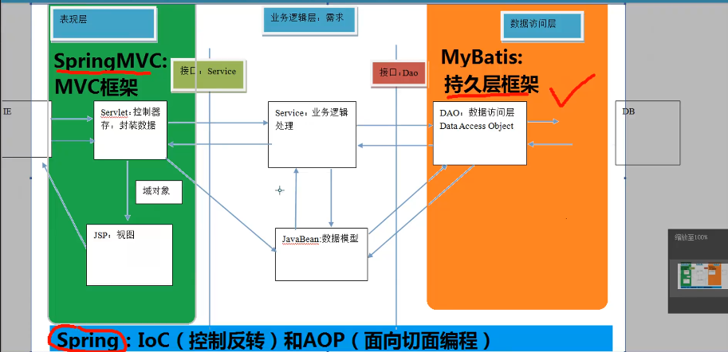


## 3 持久层技术解决方案

JDBC技术：

- Connection

- PreparedStatement
- ResultSet


Spring的JdbcTemplate：

- Spring中对jdbc的简单封装


Apache的DBUtils：

- 它和Spring的JdbcTemplate很像，也是对Jdbc的简单封装


以上这些都不是框架：

- JDBC是规范
- Spring的JdbcTemplate和Apache的DBUtils都只是工具类。


## 4 为什么要学习框架

在以前的代码中为了进行一次数据库的操作，我们需要经历获取数据库，打开数据库，获取sql语句，执行sql语句，释放结果集等等复杂的操作，然而知道要做打开数据库，关闭数据库这些操作的原理对于我们的实际开发又有多大的意义呢？我们在实际开发过程中不是最应该关注业务需求吗?

我们的实际核心关注点应该就是sql语句的实现，其他的细节都不是我们实现用户需求需要过分了解的东西，框架就能帮助我们屏蔽这些在开发中不必要关注的细节，从而大大地提高开发效率。

## 5 MyBatis框架概述

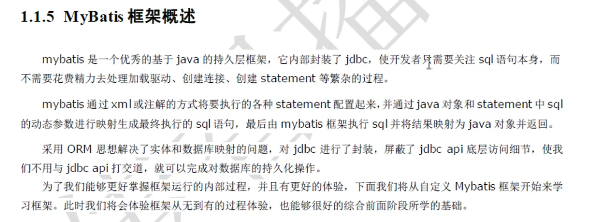

- ORM：即Object Relational Mapping对象关系映射，简单地说：就是把数据库表和实体类及实体类的属性对应起来，让我们可以操作实体类就实现操作数据库表。

  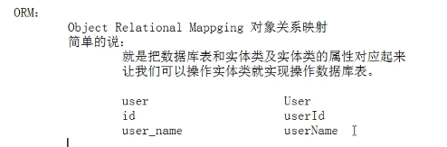


今天我们需要做到：实体类的属性和数据库表的字段名称保持一致。


# 二 Mybatis入门

## 1 Mybatis环境的搭建

### 1.1 创建maven工程并导入坐标

[Mybatis官方文档](https://mybatis.org/mybatis-3/zh/index.html)

我们首先要在pom.xml中导入jar包依赖，参加官方文档`入门`

我们这里使用的版本是3.4.5

```xml
<dependency>
  <groupId>org.mybatis</groupId>
  <artifactId>mybatis</artifactId>
  <version>3.4.5</version>
</dependency>
```

除此之外，如果我们必须还要导入mysql，如果我们还想要使用日志以及单元测试，我们还需要导入log4j以及junit。所以完整的pom.xml如下：

```xml
<?xml version="1.0" encoding="UTF-8"?>
<project xmlns="http://maven.apache.org/POM/4.0.0"
         xmlns:xsi="http://www.w3.org/2001/XMLSchema-instance"
         xsi:schemaLocation="http://maven.apache.org/POM/4.0.0 http://maven.apache.org/xsd/maven-4.0.0.xsd">
    <modelVersion>4.0.0</modelVersion>

    <groupId>com.itheima</groupId>
    <artifactId>day01_eesy_01mybatis</artifactId>
    <version>1.0-SNAPSHOT</version>
    <packaging>jar</packaging>

    <dependencies>
        <dependency>
            <groupId>org.mybatis</groupId>
            <artifactId>mybatis</artifactId>
            <version>3.4.5</version>
        </dependency>
        <dependency>
            <groupId>mysql</groupId>
            <artifactId>mysql-connector-java</artifactId>
            <version>5.1.6</version>
        </dependency>
        <dependency>
            <groupId>log4j</groupId>
            <artifactId>log4j</artifactId>
            <version>1.2.12</version>
        </dependency>
        <dependency>
            <groupId>junit</groupId>
            <artifactId>junit</artifactId>
            <version>4.10</version>
        </dependency>
    </dependencies>
</project>
```

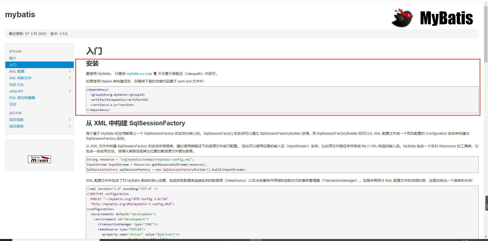

### 1.2 实现实体类

实体类属性名必须和数据库表的字段名一样。且必须实现**Serializable**接口。

写完属性以后我们用IDE自动生成get,set以及toString方法。

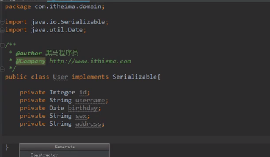

### 1.3 Mybatis主配置文件SqlMapConfig.xml

```xml
<?xml version="1.0" encoding="UTF-8" ?>
<!DOCTYPE configuration
        PUBLIC "-//mybatis.org//DTD Config 3.0//EN"
        "http://mybatis.org/dtd/mybatis-3-config.dtd">
<!--MyBatis的主配置文件-->
<configuration>
    <!--配置环境-->
    <!--default和id的名称应该一致，这里都是development-->
    <environments default="development">
    <!--配置mysql的环境-->
        <environment id="development">
            <!--配置事务的类型-->
            <transactionManager type="JDBC"/>
            <!--配置数据源（连接池）-->
            <dataSource type="POOLED">
                <!--配置连接数据库的信息-->
                <property name="driver" value="com.mysql.jdbc.Driver"/>
                <property name="url" value="jdbc:mysql://localhost:3306/eesy"/>
                <property name="username" value="root"/>
                <property name="password" value="root"/>
            </dataSource>
        </environment>
    </environments>

    <!--指定映射配置文件的位置，映射文件指每个dao独立的位置文件-->
    <mappers>
        <mapper resource="org/example/dao/IUserDao.xml"/>
<!--        <package name="org.example.dao"/>-->
    </mappers>
</configuration>
```

### 1.4 配置Dao的映射配置文件IUserDao.xml

```xml
<?xml version="1.0" encoding="UTF-8" ?>

        <!DOCTYPE mapper
                PUBLIC "-//mybatis.org//DTD Mapper 3.0//EN"
                "http://mybatis.org/dtd/mybatis-3-mapper.dtd">

        <mapper namespace="org.example.dao.IUserDao">
            <!--配置查询所有-->
            <!--resultType必须提高，指明方法的返回类型-->
            <select id="findAll" resultType="org.example.domain.User">
             select * from user
         </select>

        </mapper>
```

### 1.5 步骤总结

1. 创建maven工程并导入mybatis,mysql,log4j,junit的坐标
2. 创建实体类和dao的接口
3. 创建Mybatis的主配置文件：SqlMapConfig.xml
4. 创建映射配置文件：IUserDao.xml


### 1.6 环境搭建的注意事项

1. 创建IUserDao.xml和IUserDao.java时名称是为了和我们之前的知识保持一致。在Mybatis中它把持久层的操作接口名称和映射文件也叫做：Mapper。

   所以：IUserDao和IUserMapper是一种命名含义。

2. 在idea创建目录的时候，它和包是不一样的

   包在创建时：com.itheima.dao它是三级结构

   目录在创建时：com.itheima.dao是一级目录。所以在创建resources的目录时一定不要通过`com.itheima.dao`的方式一下子创建，应该一级级通过新建directory创建。

   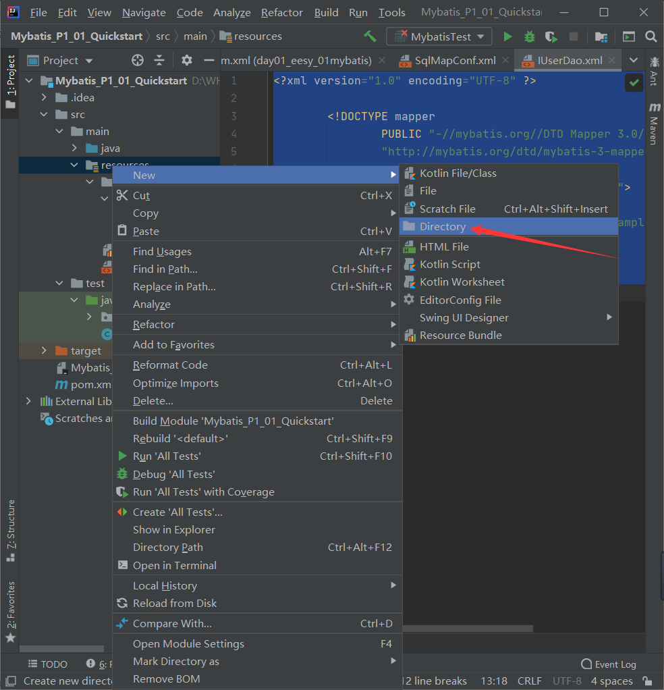

   

   3. 此外，mybatis的映射配置文件位置必须和dao接口的包结构相同。即IUserDao.java在`com.itheima.dao`下，则IUserDao.xml也必须在resources文件夹下的`com.itheima.dao`下。

   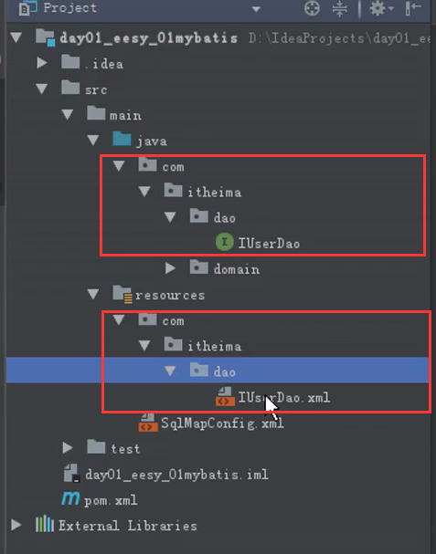

   

   4. 映射配置文件的mapper标签namespace属性的取值必须是dao接口的全限定类名。

      ```xml
   <?xml version="1.0" encoding="UTF-8" ?>
      
           <!DOCTYPE mapper
                      PUBLIC "-//mybatis.org//DTD Mapper 3.0//EN"
                   "http://mybatis.org/dtd/mybatis-3-mapper.dtd">
      
           <mapper namespace="org.example.dao.IUserDao">
                  <!--配置查询所有-->
                  <!--resultType必须提高，指明方法的返回类型-->
                  <select id="findAll" resultType="org.example.domain.User">
                   select * from user
               </select>
      
              </mapper>
      ```
   
      
   
   5. 映射配置文件的操作配置(select)，id属性的取值必须是dao接口的方法名。
   
      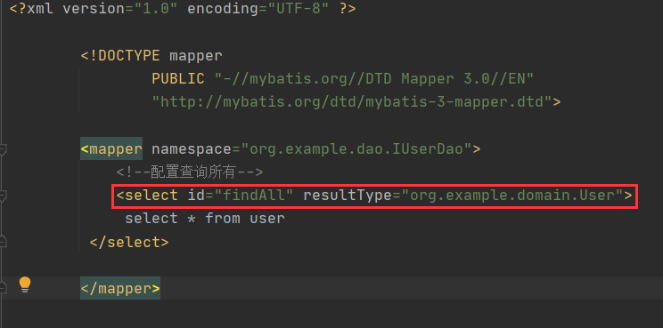
   
   
   
   当我们遵从了第三、四、五点之后，我们在开发中就无须再写dao的实现类。
   
   

## 2 Mybatis案例

### 2.1 配置log4j

先将log4j.properties拷贝到resources文件夹下。

```
# Set root category priority to INFO and its only appender to CONSOLE.
#log4j.rootCategory=INFO, CONSOLE            debug   info   warn error fatal
log4j.rootCategory=debug, CONSOLE, LOGFILE

# Set the enterprise logger category to FATAL and its only appender to CONSOLE.
log4j.logger.org.apache.axis.enterprise=FATAL, CONSOLE

# CONSOLE is set to be a ConsoleAppender using a PatternLayout.
log4j.appender.CONSOLE=org.apache.log4j.ConsoleAppender
log4j.appender.CONSOLE.layout=org.apache.log4j.PatternLayout
log4j.appender.CONSOLE.layout.ConversionPattern=%d{ISO8601} %-6r [%15.15t] %-5p %30.30c %x - %m\n

# LOGFILE is set to be a File appender using a PatternLayout.
log4j.appender.LOGFILE=org.apache.log4j.FileAppender
log4j.appender.LOGFILE.File=d:\axis.log
log4j.appender.LOGFILE.Append=true
log4j.appender.LOGFILE.layout=org.apache.log4j.PatternLayout
log4j.appender.LOGFILE.layout.ConversionPattern=%d{ISO8601} %-6r [%15.15t] %-5p %30.30c %x - %m\n
```


### 2.2 创建测试类

```java
import org.apache.ibatis.io.Resources;
import org.apache.ibatis.session.SqlSession;
import org.apache.ibatis.session.SqlSessionFactory;
import org.apache.ibatis.session.SqlSessionFactoryBuilder;
import org.example.dao.IUserDao;
import org.example.domain.User;
import java.io.InputStream;
import java.util.List;

/**
 * 入门案例的测试
 */
public class MybatisTest {
    public static void main(String[] args) throws  Exception{
        //1,读取配置文件
        InputStream inputStream = Resources.getResourceAsStream("SqlMapConfig.xml"); //注意：这里是org.apache.ibatis.io.Resources，而不是Resource（org.apache.log4j.lf5.util.Resource）

        //2,创建工厂（sqlSessionFactory)
        // Mybatis为我们提供了创建工程的类SqlSessionFactoryBuilder
        SqlSessionFactoryBuilder builder = new SqlSessionFactoryBuilder();
        SqlSessionFactory factory = builder.build(inputStream);

        //3,生产对象（sqlsession对象）
        SqlSession session = factory.openSession();

        //4,代理增强（使用sqlsession的创建Dao接口的代理对象）
        IUserDao userDao = session.getMapper(IUserDao.class);

        //5,代理执行方法
        List<User> users = userDao.findAll();
        for(User user:users)
            System.out.println(user);

        //6,释放资源
        session.close();
        inputStream.close();
    }
}

```

解读代码:

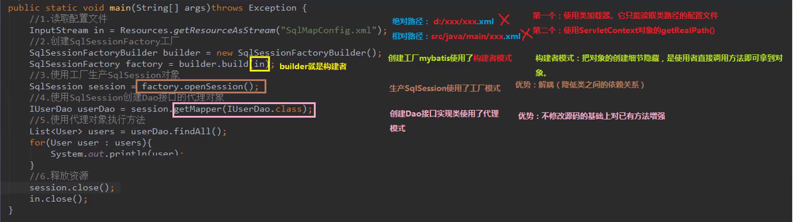

### 2.3 使用注解配置mybatis

之前我们是通过SqlMapConfig.xml以及IUserDao.xml来配置mybatis，接下来我们演示如何通过注解进行配置。

之前我们是在IUserDao.xml中配置sql语句，现在我们只需要在实体类接口的方法上进行配置即可，这里用到的是@Select("select * from user")注解，表示findAll()方法用到的sql语句就是select * from user.

```java
package org.example.dao;

import org.apache.ibatis.annotations.Select;
import org.example.domain.User;

import java.util.List;

/**
 * @author 黑马程序员
 * @Company http://www.ithiema.com
 *
 * 用户的持久层接口
 */
public interface IUserDao {

    /**
     * 查询所有操作
     * @return
     */
    @Select("select * from user")
    List<User> findAll();
}

```

这时在SqlMapConfig.xml中声明指向的实体类映射文件就不再是.xml文件了，而应该是注解了的实体类接口。且使用的是<mapper class=""/>属性。

```xml
<?xml version="1.0" encoding="UTF-8" ?>
<!DOCTYPE configuration
        PUBLIC "-//mybatis.org//DTD Config 3.0//EN"
        "http://mybatis.org/dtd/mybatis-3-config.dtd">
<configuration>
    <!--配置环境-->
    <environments default="development">
    <!--配置mysql的环境-->
        <environment id="development">
            <!--配置事务的类型-->
            <transactionManager type="JDBC"/>
            <!--配置连接池-->
            <dataSource type="POOLED">
                <!--配置连接数据库的信息-->
                <property name="driver" value="com.mysql.jdbc.Driver"/>
                <property name="url" value="jdbc:mysql://localhost:3306/eesy"/>
                <property name="username" value="root"/>
                <property name="password" value="root"/>
            </dataSource>
        </environment>
    </environments>

    <!--指定映射配置文件的位置，采用注解方式，需要使用class属性，指定注解的class全路径名-->
    <mappers>
        <mapper class="org.example.dao.IUserDao"/>
    </mappers>
</configuration>
```

明确：我们在实际开发中，都是越简便越好，所以都是采用不写DAO实现类的写法。


## 3 自定义Mybatis的分析

mybatis在使用代理dao的方式实现增删改查时做什么事呢?

只有两件事：

​	第一：创建代理对象

​	第二：在代理对象中调用selectList


解读以下代码：

```java
        //4,代理增强（使用sqlsession的创建Dao接口的代理对象）
        IUserDao userDao = session.getMapper(IUserDao.class);
```

我们来解读getMapper函数：

该方法的核心在于**如何代理**，其实如何代理就是写一个该接口的实现类，在实现类中调用selectList方法。

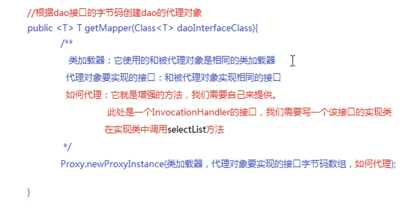

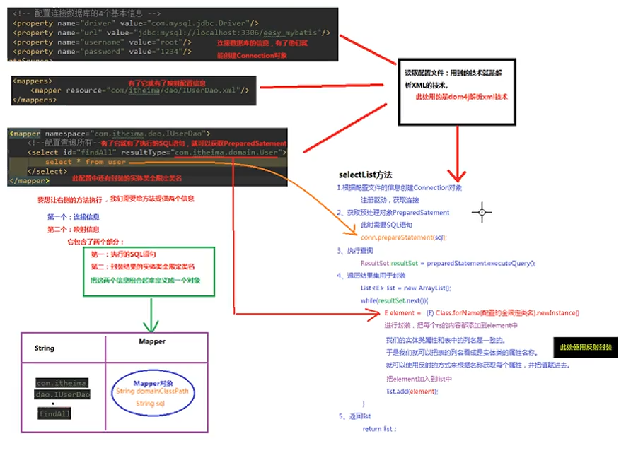

