# 1 Spring学习

# 今日大纲

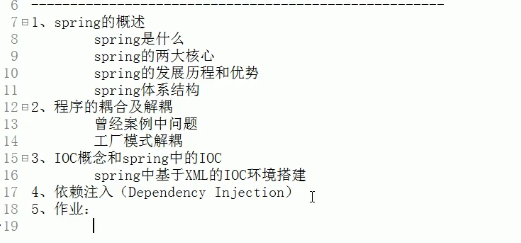

# 一 Spring概述

## 1 spring是什么

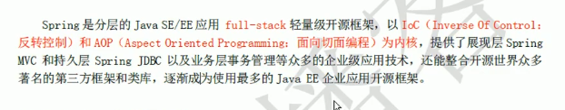

## 2 发展历程和优势

### 2.1 发展历程

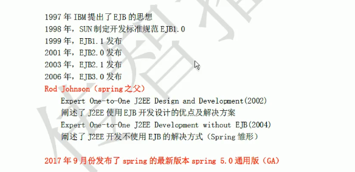

### 2.2 优势

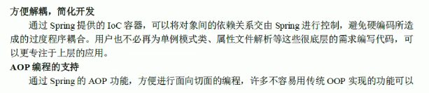

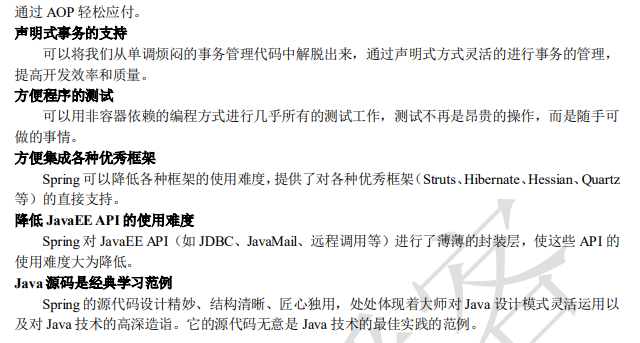

## 3 体系结构

可以在spring的开发包下查看文档以及源代码。spring任何框架的运行都需要核心容器的支持。

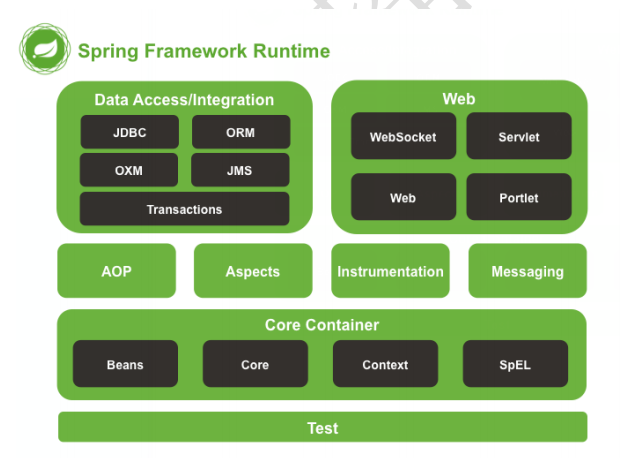

# 二 程序的耦合与解耦

## 1 解耦的基本概念

实际开发中应该做到，编译器不依赖，运行时才依赖。

解耦的思路：

1. 使用反射来创建对象，而避免使用new关键字
2. 通过读取配置文件来获取要创建的对象全限定类名

曾经的代码中表现层调用业务层的方法，业务层调用持久层中的类。导致程序的耦合性极高，那么我们如何降低程序的耦合性呢？

## 2 工厂模式解耦

### 2.1 什么是Bean?

在之前的代码中，我们的业务层强烈依赖持久层中的类的实现，如果我们把实现类的.java文件删除，就会报错。接下来我们用工厂模式解耦解决这个问题。

我们创建个BeamFactory class，在计算机术语中bean有`可重用组件`的意思。

在这里我们要解释一下JavaBean：

- **误区：**有的人把JavaBean和实体类划上等号
- 其实二者是不等的，在java语言中JavaBean是指用java语言编写的可重用组件，他不仅包含实体类，还可以是持久层、业务层等等。


### 2.2 工厂的前期准备

工厂就是创建我们的service和dao对象的。

需求：

1. 需要一个配置文件来配置我们的service和dao。配置的内容：唯一标识=全限定类名(key=value)
2. 通过配置文件中的配置内容，反射创建对象


我们的配置文件可以是**xml(spring所用)**也可以是**properties(通过键值对思想书写，配置简单)**

现在展示我们的bean.properties的配置内容如下：

```java
accountService = com.itheima.service.impl.AccountServiceImpl
accountDao = com.itheima.dao.impl.AccountDaoImpl
```


###  2.3 读取properties文件

在idea中写代码具有完善的异常处理机制，如果不添加必要的异常处理，编译将不会通过。

我们的bean.properties是在工程的resources文件夹下的，这时候一定要注意，我们不能通过一下的方式来获得`InputStream`：

```
IputSteam in = new FileInputStream(path);
```

因为我们永远也不能保证工程的绝对路径和相对路径不会发生改变，最佳办法应该是把properties放在resources文件夹，然后直接读取工程的resources文件夹。

读取配置文件以后，我们就能新建一个函数getBean，用户只需要传进来类的名字，函数就可以从properties文件中读取到相应的全限定类名，然后我们就可以给它返回一个类的对象。

```java
public class BeanFactory {
    //定义一个properties对象
    private static Properties props;
    static {
        //实例化
        try {
        props = new Properties();
        //获取properties文件的流对象
        InputStream in = BeanFactory.class.getClassLoader().getResourceAsStream("bean.properties");
        props.load(in);
        } catch (IOException e) {
            throw new ExceptionInInitializerError("初始化properties失败");
        }
    }

    // 根据bean的名称获取bean对象
    public static Object getBean(String beanName){
        Object bean = null;
        try {
        String beanPath = props.getProperty(beanName);
        bean = Class.forName(beanPath).newInstance();
        }
        catch (Exception e){
            e.printStackTrace();
        }
        return bean;
    }
}
```

### 2.4 工厂生产bean

现在我们就可以通过工厂来根据类名获得相应的类对象了。

```java
package com.itheima.service.impl;

import com.itheima.dao.IAccountDao;
import com.itheima.factory.BeanFactory;
import com.itheima.service.IAccountService;
/*
业务层实现类
调用持久层
 */
public class AccountServiceImpl implements IAccountService {
    private IAccountDao accountDao = (IAccountDao) BeanFactory.getBean("accountDao");
    public void saveAccount(){
        accountDao.saveAccount();
    }
}

```

```java
package com.itheima.ui;

import com.itheima.factory.BeanFactory;
import com.itheima.service.IAccountService;

/*
* 模拟一个表现层，用于调用业务层
 */
public class Client {
    public static void main(String[] args){
        IAccountService as = (IAccountService) BeanFactory.getBean("accountService");
        as.saveAccount();
    }
}

```

### 2.5 依然存在的问题

目前通过工厂解耦创建的对象的内存地址都是不一样的，这样我们每次创建一次对象就要花费一定的内存。此时的对象就是`多例`。

#### 1 单例与多例的对比

单例只被创建一次，从而类中的成员也就只会被初始化一次。

多例对象被创建多次，执行效率没有单例对象高。

#### 2 单例创建对象

这里的单例对象思想是创建一个容器Map在静态属性中，相应的对象只被创建了一次放进了该容器，但外部需要使用对象的时候就将该对象从容器中取出来就可以了。

```java
package com.itheima.factory;

import java.io.IOException;
import java.io.InputStream;
import java.util.Enumeration;
import java.util.HashMap;
import java.util.Map;
import java.util.Properties;

/*
Bean在计算机英语中，有可重用组件的含义
JavaBean:
 javabean不等于实体类
 */
public class BeanFactory {
    //定义一个properties对象
    private static Properties props;
    private static Map<String,Object> beans;
    static {
        //实例化
        try {
            props = new Properties();
            //获取properties文件的流对象
            InputStream in = BeanFactory.class.getClassLoader().getResourceAsStream("bean.properties");
            props.load(in);
            //实例化容器
            beans = new HashMap<String,Object>();
            //去除配置文件中所有的key
            Enumeration keys = props.keys();
            //遍历枚举
            while (keys.hasMoreElements()){
                // 取出每个key
                String key = keys.nextElement().toString();
                //根据Key获取value
                String beanpath = props.getProperty(key);
                //反射创建对象
                Object value  = Class.forName(beanpath).newInstance();
                //把key和value放进容器
                beans.put(key,value);
            }

        } catch (IOException e) {
            throw new ExceptionInInitializerError("初始化properties失败");
        } catch (IllegalAccessException e) {
            e.printStackTrace();
        } catch (InstantiationException e) {
            e.printStackTrace();
        } catch (ClassNotFoundException e) {
            e.printStackTrace();
        }
    }

    /**
     * 根据bean的名称获取对象
     *
     */
    public static Object getBean(String beanName){
        return beans.get(beanName);
    }
}
```

## 3 反转控制IOC

在工厂模式中就体现得非常明显，原来我们是直接在一个java class写new创建bean对象，原本app有完全自主得权力找到想要得bean对象。但现在我们写了BeanFactory后，权力转移到了工厂手中，工厂究竟返回一个怎样得类对象是根据工厂的配置，再也不是该类自身能够控制的了。

**把创建对象的能力交给框架或交给工厂来降低耦合。**

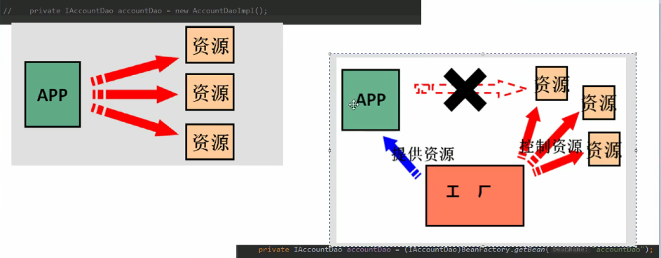

## 4 Spring中的IOC

### 4.1 导入xml

在resources文件夹下创建一个xx.xml，我们的叫bean.xml

在文档中找依赖

```
<?xml version="1.0" encoding="UTF-8"?>
<beans xmlns="http://www.springframework.org/schema/beans"
    xmlns:xsi="http://www.w3.org/2001/XMLSchema-instance"
    xsi:schemaLocation="http://www.springframework.org/schema/beans
        http://www.springframework.org/schema/beans/spring-beans.xsd">
    <!--对象的创建叫给spring来管理-->
    <bean id="accountService" class="com.itheima.service.impl.AccountServiceImpl"></bean>
    <bean id="accountDao" class="com.itheima.dao.impl.AccountDaoImpl"></bean>
</beans>
```

对象的强转的两种方式：

- 声明类型
- 作为参数传入

```java
IAccountService as = (IAccountService)ac.getBean("accountService");
IAccountDao adao = (IAccountDao)ac.getBean("accountDao", IAccountDao.class);
```

### 4.2 ApplicationContext

在实际开发过程中第一种context更加常用。

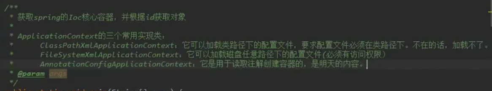

需要注意的是context方法和beanfactory方法创建对象的时间点是不一样的。context是立即创建，factory是延迟创建。factory只有在文件需要被使用的时候才创建对象。工厂模式适合多例对象创建，context模式适合创建单例对象。

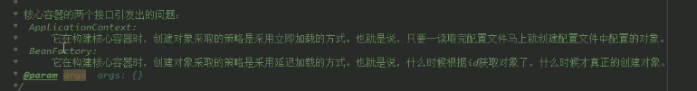

使用spring后在client.java文件中创建对象的代码如下，创建一个ApplicationContext对象，该对象读取配置文件，context在读取配置文件后立即会创建好配置文件中指定好了的类对象：

```java
//
// Source code recreated from a .class file by IntelliJ IDEA
// (powered by FernFlower decompiler)
//

package com.itheima.ui;

import com.itheima.dao.IAccountDao;
import com.itheima.service.IAccountService;
import org.springframework.context.ApplicationContext;
import org.springframework.context.support.ClassPathXmlApplicationContext;

public class Client {
    public Client() {
    }

    public static void main(String[] args) {
        ApplicationContext ac = new ClassPathXmlApplicationContext("bean.xml"); // 读取配置好的xml文件
        IAccountService as = (IAccountService)ac.getBean("accountService"); // 获取id为"accountService"的bean
        IAccountDao adao = (IAccountDao)ac.getBean("accountDao", IAccountDao.class);
        System.out.println(as);
        System.out.println(adao);
        as.saveAccount();
    }
}

```

## 5 Spring对bean的管理细节

介绍：

- 创建bean的三种方式
- bean对象的作用范围
- bean对象的生命周期


### 5.1 创建bean的三种方式

- 第一种：使用默认构造函数创建,配置bean.xml

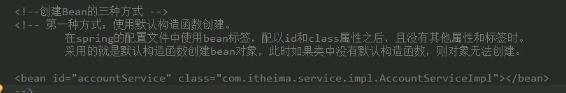

- 第二种：使用普通工厂中的方法创建对象(使用某个类中的方法创建对象，并存入spring容器)

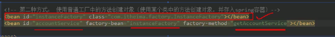

​	工厂代码如下：

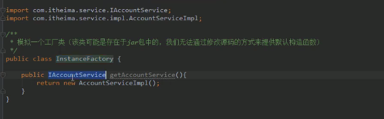

我们先用bean指定一个工厂对象，然后再要使用工厂生产的组件的时候用id指定一个比如"accountService"，然后用factory-bean指定生产该bean的工厂id，用factory-meathod指定生产该对象的工厂方法。

- 第三种：使用工厂种的静态方法创建对象(使用某个类中的静态方法创建对象，并存入spring容器)

  只需要把工厂类的方法声明为静态，并修改xml

  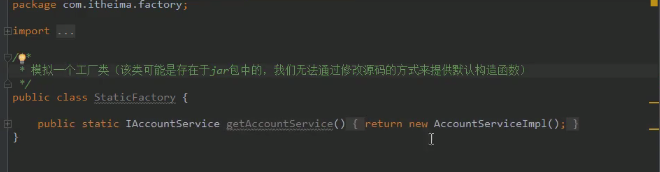

  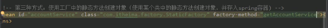

### 5.2 bean对象的作用范围

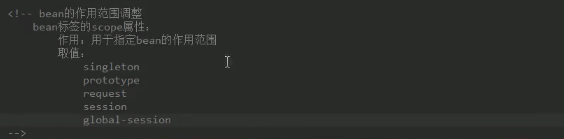

singleton指单例对象，prototype指创建多例对象，下例为使用scope属性创建多例：

**在这里我们发现spring的一个强大的地方**，那就是如果我们指定scope属性为单例，那么ApplicationContext就是在读取配置文件后立即创建文件，但是我们将scope改成多礼prototype的时候，spring就能够感知到多例的情况，这时候即使使用ApplicationContext，因为ApplicationContext不知道要使用多少个对象，所以不会在读取配置文件后就立即创建对象，而是变得像工厂一样，但我们使用一个对象的时候他才进行创建。


总结：

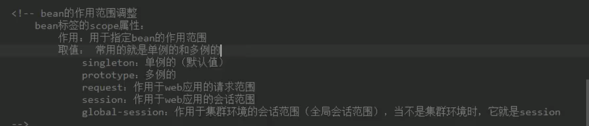

### 5.3 bean对象的生命周期

#### 1 单例

出生：容器创建时对象创建

活着：容器活着

死亡：容器销毁，对象消亡

为了不让单例对象不与容易同死活，可以创建初始化以及销毁方法，在xml文件中进行配置。

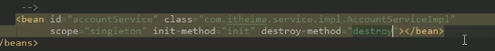

在AccountServiceImpl类中创建相应名称的方法，本例中init-method指定的方法名称为init()，destroy-method指定的方法名称为destroy()：

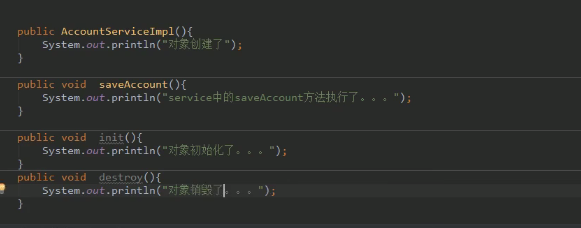

#### 2 多例

出生：当我们使用对象时spring框架为我们创建

或者：对象在使用过程中一直活着

死亡：当对象长时间不用，且没有别的对象引用时，由Java的垃圾回收器回收。

# 三 依赖注入Dependency Injection

## 1 概述

依赖注入：Dependency Injection

IoC的作用：降低程序间的耦合(依赖关系)

依赖关系的管理：以后都叫给spring来维护(在当前类需要用到其他类的对象，由spring为我们提供，我们只需要在配置文件中说明依赖关系的维护)


**依赖关系的维护就称为依赖注入DI**

依赖注入能注入的数据有三类：

1. 基本类型和String
2. 其他bean类型(在配置文件或者注解配置过的bean)
3. 复杂类型/集合类型


注入的方式有三种：

1. 使用构造函数提供
2. 使用set方法提供
3. 使用注解提供(spring day2)


如果是经常变化的数据，并不适用于注入的方式，写在xml文件中的数据应该是不怎么变化的。

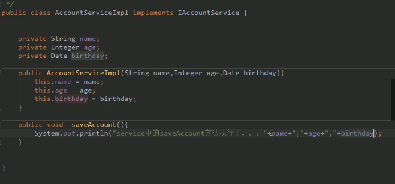

## 2 使用构造函数注入(不常用)

例:构造函数

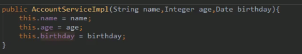

```
使用的标签：constructor-arg

标签出现的位置：bean标签的内部

标签中的属性：

1. type：用于指定要注入的数据的数据类型，该数据类型也是构造函数中某个或某些参数的类型。
2. index：指定要注入的数据给构造函数中指定索引位置的参数赋值，索引位置从0开始。
3. name：用于指定给构造函数中指定名称的参数赋值。
4. value：用于提供基本类型和String类型的数据
5. ref：用于指定其他的bean类型数据，他指的是在spring的IoC核心容器中出现过的bean对象。

优势：
1. 在获取bean对象时，注入数据是必须的操作，否则对象无法被创建成功。

弊端：
1. 改变了bean对象的实例化方式，使我们在创建对象时，如果用不到这些数据也必须提供。
因为这个弊端太大，所以我们一般在实际开发中除非避无可避，否则不使用。
```


例子：给构造函数的name和age,birthday赋值。

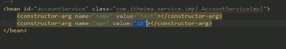

需要注意的是在xml中一切value都是字符串，spring能够自动地将这些字符串转换成java地基本类型，但是对于其他bean类型，比如Date类，我们就要用别的方法解决。

**解决方法如下：**

创建一个bean对象，类型是java.util.Date使用ref引用创建的bean对象。

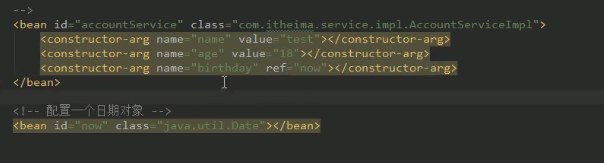

## 3 set方法注入(更常用)

在class中邮件->generate生成set函数：

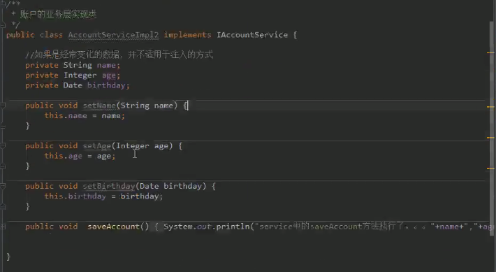

```
涉及的标签：property
出现的位置：bean标签的内部
标签的属性：
1. name：用于指定注入时所调用的set方法的名称。
2. value：用于提供基本类型和String类型的数据
3. ref：用于指定其他的bean类型数据，他指的是在spring的IoC核心容器中出现过的bean对象。

优势：
创建对象时没有明确的限制，可以直接使用默认构造函数

弊端：
如果有某个成员必须有值，则获取对象时有可能set方法没有执行。
```

例子：和构造函数注入十分相似，只不过标签变成了property，构造函数也被我们删除掉了。

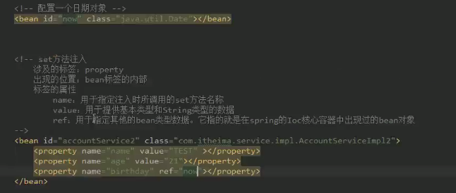

## 4 复杂类型的注入

**注意：用于给List结构集合注入的标签有：**

1. list
2. array
3. set

**用于给Map结构集合注入的标签有：**

1. map
2. props

**结构相同，标签可以互换**

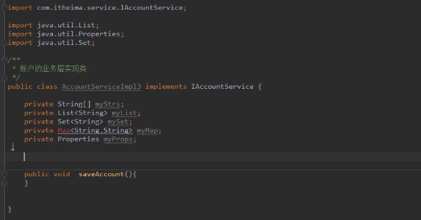

生成set方法：

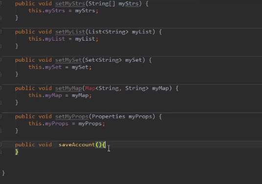

在saveAccount方法中打印信息：

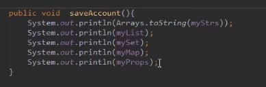


配置xml：

例1 设置myStrs：

由于myStrs时一个数组对象，所以要用<array>标签，然后在value中输入想要的值。

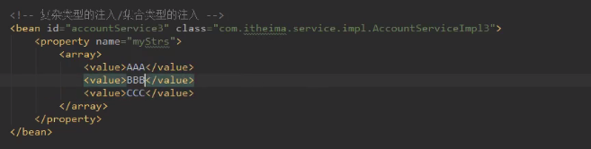

例2 配置myList:

由于myList时一个list对象，所以要用<list>标签，然后在value中输入想要的值。

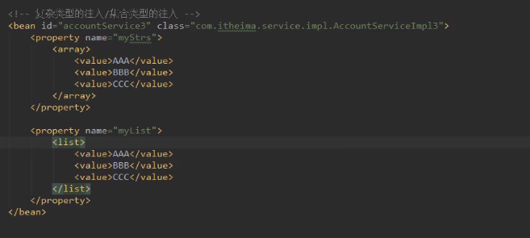

例3 配置myMap：

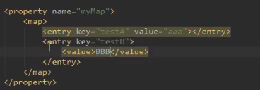

例4 list，array，set的标签写反也不会影响list，array，set之间正常的计算：

我们发现即使标签敲错，也不会导致任何错误，比如mySet的标签写成<list>


