# 3 Mybatis

# 今日大纲

①Mybatis中的连接池以及事务控制			**原理部分了解，应用部分会用**

​		mybatis中连接池的使用及分析

​		mybatis中事务控制的分析

②Mybatis中基于XML配置的动态SQL语句使用		**会用即可**

​		mappers配置文件中的几个标签

​				<if>

​				<where>

​				<foreach>

​				<sql>

③Mybatis中的多表操作				**掌握应用**

​		一对多

​		一对一

​		多对多


# 一 Mybatis的连接池以及事务控制

## 1 连接池

- 我们在实际开发中都会使用连接池。
- 因为它可以减少我们获取连接所消耗的时间。


**连接池其实就是用于存储连接的一个容器，容器其实就是一个集合对象。**

**该集合必须是线程安全的，不能两个线程拿到统一连接，该集合还必须实现队列的特性：先进先出。**

类似于以下的图，假设我们的连接池有8个连接：

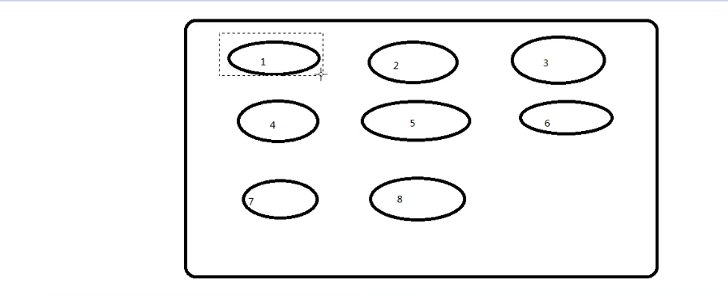

那么当有人取出一个连接后，连接池的顺序也会发生动态调整。

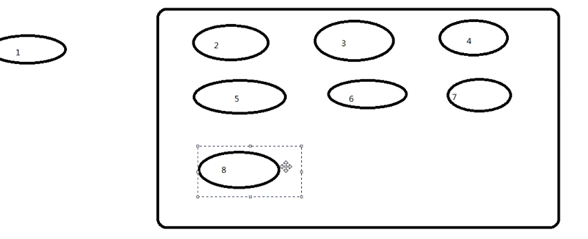

再取出一个线程2也是同理：

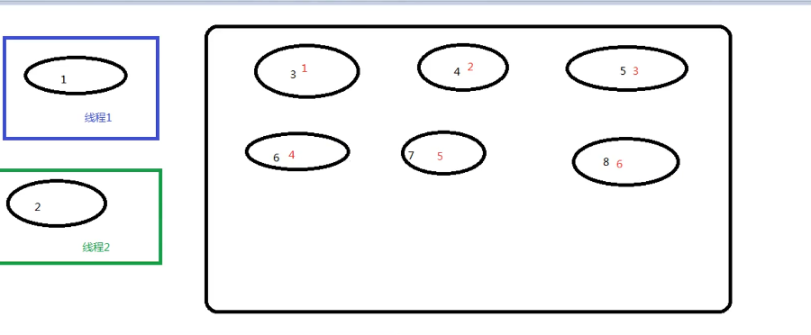

这时候假如我们的线程2用完了，那么用完的线程会放到顺序的末端，变成7，线程1再用完了就会再放到末端，变成8。

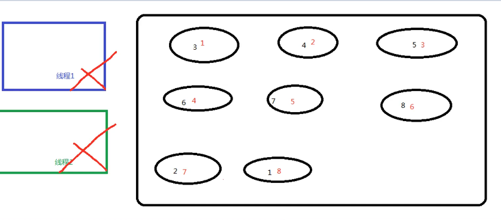


## 2 mybatis中的连接池

mybatis连接池提供了3种方式的配置：

​		配置的位置：

​				主配置文件SqlMapConfig.xml种的dataSource标签，type属性就是表示采用何种连接池方式。

​		type属性的取值：

​				POOLED：采用传统的javax.sql.DataSource规范的连接池 Mybatis种有针对规范的实现。

​				UNPOOLED： 采用传统的获取连接的方式，虽然也实现Javax.sql.DataSource接口，但是没有使用池的思想。

​				JNDI：采用服务器提供的JNDI技术实现，来获取DataSource对象，不同的服务器所能拿到的DataSource是不一样的。**注意：如果不是web或者maven的war工程，是不能使用的。我们课程中使用的是tomcat服务器，采用连接池就是dbcp连接池。**

接下来看一看各种方式执行testFindAll方法的输出

- POOLED

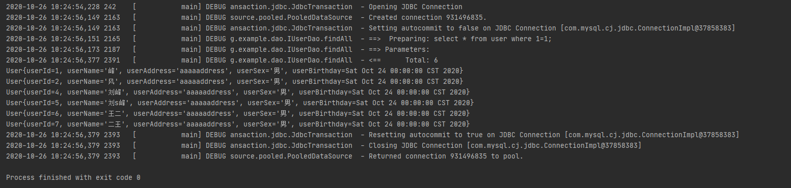

- UNPOOLED

  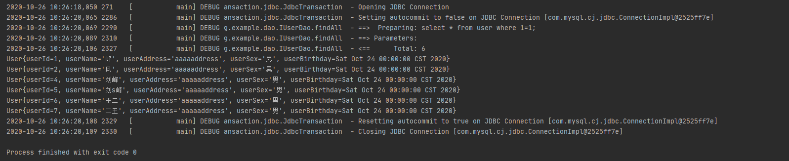

通过以上输出对比我们可以看到，POOLED模式下会有create connection和return connection的过程，而UNPOOLED没有。**这就意味着UNPOOLED方法是每次创建一个新的连接来用，而POOLED是从池中取一个连接来用。**


为了观察代码原理，我们可以按Ctrl+N，输入UnpooledDataSource就可以查看mybatis对该类的实现，我们发现其获取连接的方法如下，即其每次都会new一个新的properties获取用户名密码，注册新的驱动来获取连接：

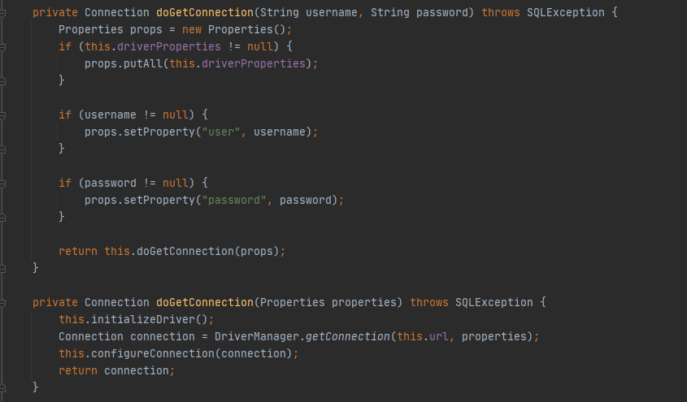

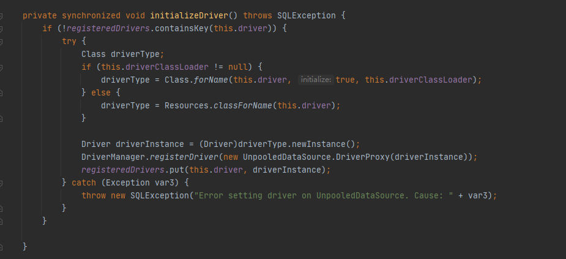


在PooledDataSource类中，其获取连接的代码是通过调用popConnection实现的。

```java
    public Connection getConnection() throws SQLException {
        return this.popConnection(this.dataSource.getUsername(), this.dataSource.getPassword()).getProxyConnection();
    }

    public Connection getConnection(String username, String password) throws SQLException {
        return this.popConnection(username, password).getProxyConnection();
    }
```


```java
    private PooledConnection popConnection(String username, String password) throws SQLException {
        boolean countedWait = false;
        PooledConnection conn = null;
        long t = System.currentTimeMillis();
        int localBadConnectionCount = 0;

        while(conn == null) {
            synchronized(this.state) {
                PoolState var10000;
                if (!this.state.idleConnections.isEmpty()) {
                    // 如果还有空闲的connection
                    // idleConnections是一个集合，是在PoolState类中的属性定义如下：
                    //     protected final List<PooledConnection> idleConnections = new ArrayList();
                    conn = (PooledConnection)this.state.idleConnections.remove(0);
                    if (log.isDebugEnabled()) {
                        log.debug("Checked out connection " + conn.getRealHashCode() + " from pool.");
                    }
                } else if (this.state.activeConnections.size() < this.poolMaximumActiveConnections) {
                    // 如果没有空闲连接了，就查看活动中的连接中是否有空闲空间，如果有就创建个新的并激活它。
                    conn = new PooledConnection(this.dataSource.getConnection(), this);
                    if (log.isDebugEnabled()) {
                        log.debug("Created connection " + conn.getRealHashCode() + ".");
                    }
                } else {
                    // 如果活动中的连接也没空闲了
                    // 那么就把最早激活的连接进行一系列清理操作拿出来给我们用
                    PooledConnection oldestActiveConnection = (PooledConnection)this.state.activeConnections.get(0);
                    long longestCheckoutTime = oldestActiveConnection.getCheckoutTime();
                    if (longestCheckoutTime > (long)this.poolMaximumCheckoutTime) {
                        ++this.state.claimedOverdueConnectionCount;
                        var10000 = this.state;
                        var10000.accumulatedCheckoutTimeOfOverdueConnections += longestCheckoutTime;
                        var10000 = this.state;
                        var10000.accumulatedCheckoutTime += longestCheckoutTime;
                        this.state.activeConnections.remove(oldestActiveConnection);
                        if (!oldestActiveConnection.getRealConnection().getAutoCommit()) {
                            try {
                                oldestActiveConnection.getRealConnection().rollback();
                            } catch (SQLException var16) {
                                log.debug("Bad connection. Could not roll back");
                            }
                        }

                        conn = new PooledConnection(oldestActiveConnection.getRealConnection(), this);
                        conn.setCreatedTimestamp(oldestActiveConnection.getCreatedTimestamp());
                        conn.setLastUsedTimestamp(oldestActiveConnection.getLastUsedTimestamp());
                        oldestActiveConnection.invalidate();
                        if (log.isDebugEnabled()) {
                            log.debug("Claimed overdue connection " + conn.getRealHashCode() + ".");
                        }
                    } else {
                        try {
                            if (!countedWait) {
                                ++this.state.hadToWaitCount;
                                countedWait = true;
                            }

                            if (log.isDebugEnabled()) {
                                log.debug("Waiting as long as " + this.poolTimeToWait + " milliseconds for connection.");
                            }

                            long wt = System.currentTimeMillis();
                            this.state.wait((long)this.poolTimeToWait);
                            var10000 = this.state;
                            var10000.accumulatedWaitTime += System.currentTimeMillis() - wt;
                        } catch (InterruptedException var17) {
                            break;
                        }
                    }
                }

                if (conn != null) {
                    if (conn.isValid()) {
                        if (!conn.getRealConnection().getAutoCommit()) {
                            conn.getRealConnection().rollback();
                        }

                        conn.setConnectionTypeCode(this.assembleConnectionTypeCode(this.dataSource.getUrl(), username, password));
                        conn.setCheckoutTimestamp(System.currentTimeMillis());
                        conn.setLastUsedTimestamp(System.currentTimeMillis());
                        this.state.activeConnections.add(conn);
                        ++this.state.requestCount;
                        var10000 = this.state;
                        var10000.accumulatedRequestTime += System.currentTimeMillis() - t;
                    } else {
                        if (log.isDebugEnabled()) {
                            log.debug("A bad connection (" + conn.getRealHashCode() + ") was returned from the pool, getting another connection.");
                        }

                        ++this.state.badConnectionCount;
                        ++localBadConnectionCount;
                        conn = null;
                        if (localBadConnectionCount > this.poolMaximumIdleConnections + this.poolMaximumLocalBadConnectionTolerance) {
                            if (log.isDebugEnabled()) {
                                log.debug("PooledDataSource: Could not get a good connection to the database.");
                            }

                            throw new SQLException("PooledDataSource: Could not get a good connection to the database.");
                        }
                    }
                }
            }
        }

        if (conn == null) {
            if (log.isDebugEnabled()) {
                log.debug("PooledDataSource: Unknown severe error condition.  The connection pool returned a null connection.");
            }

            throw new SQLException("PooledDataSource: Unknown severe error condition.  The connection pool returned a null connection.");
        } else {
            return conn;
        }
    }
```

其实POOLED获取连接的逻辑就总结如下：

1. 先看空闲池，空闲池有连接就拿一个出来用。
2. 如果没有空闲的连接了，就看看活动池中是否到了承载的最大数量，如果没有就新建一个连接并激活放进活动池。
3. 如果活动池也达到了承载的最大数量，那么就找到活动的连接中最老的，然后把它返回获取，并对其进行一系列清理设置以保证其安全地变成一个全新的可用的连接给我们使用。

**在实际开发中我们一般都选择POOLED方法**

## 3 mybatis中的事务

什么是事务？(面试必看)

事务的四大特性ACID

不考虑隔离性会产生的3个问题

解决方法：四种隔离级别

↑面试考点↑

**那么什么是Mybatis中的事务呢？**它是通过sqlsession对象的commit方法和rollback方法实现事务的提交和回滚。之前我们只用过事务的提交，没有用过回滚。回滚在Mybatis的事务提交中其实都已经设置好了。

在这里提到的一个新用法就是openSession方法，我们可以给一个true参数，这样就能打开事务的自动提交，不必要我们在@After方法中再手动写提交了。

```java
    @Before//用于在测试方法执行之前执行
    public void init()throws Exception{
        //1.读取配置文件，生成字节输入流
        in = Resources.getResourceAsStream("SqlMapConfig.xml");
        //2.获取SqlSessionFactory
        SqlSessionFactory factory = new SqlSessionFactoryBuilder().build(in);
        //3.获取SqlSession对象
        sqlSession = factory.openSession(true);
        //4.获取dao的代理对象
        userDao = sqlSession.getMapper(IUserDao.class);
    }

    @After//用于在测试方法执行之后执行
    public void destroy()throws Exception{
        //提交事务
        //sqlSession.commit();
        //6.释放资源
        sqlSession.close();
        in.close();
    }
```

不过需要注意的是这种方法我们并不常用，我们只有一个事务提交OK，但是如果在如转账一般的数据库操作中，我们让每一个事务都独立的进行事务提交，一旦发生异常，就不会回滚到该到的位置，这样事务是控制不住的。

# 二 Mybatis映射文件的SQL深入

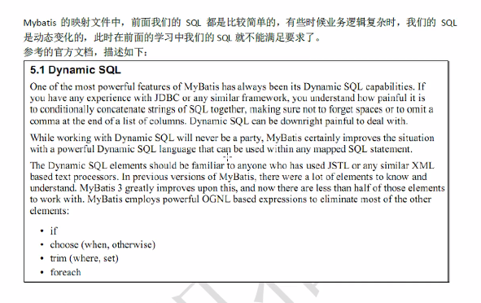

## 1 if标签

if标签让我们能够实现根据条件查询，首先跟以前的步骤相似，先在持久层接口类中添加方法`findUserByCondition`

```java
    /**
     * 根据传入的参数条件查询
     * @param user：有可能由用户名，有可能有性别，有可能有地址，还有可能都有
     * @return
     */
    List<User> findUserByCondition(User user);
```

然后就是配置IUserDao.xml，在这里就轮到我们的if标签登场了。我们在if标签的test属性中进行检查，如果检查通过则在sql语句后面附加标签内包含的内容。

```xml
    <!--根据条件查询-->
    <select id="findUserByCondition" parameterType="org.example.domain.User" resultType="org.example.domain.User">
        select * from user where 1=1
        <if test="username!= null">
           and username = #{username}
        </if>
        <if test="userSex != null">
            and sex = #{userSex}
        </if>
    </select>
```

**注意：sql语句是不区分大小写的，但是#{}中的内容是区分大小写的**

在这里不要和[第二天取别名的内容](2 Mybatis.md)搞混了：

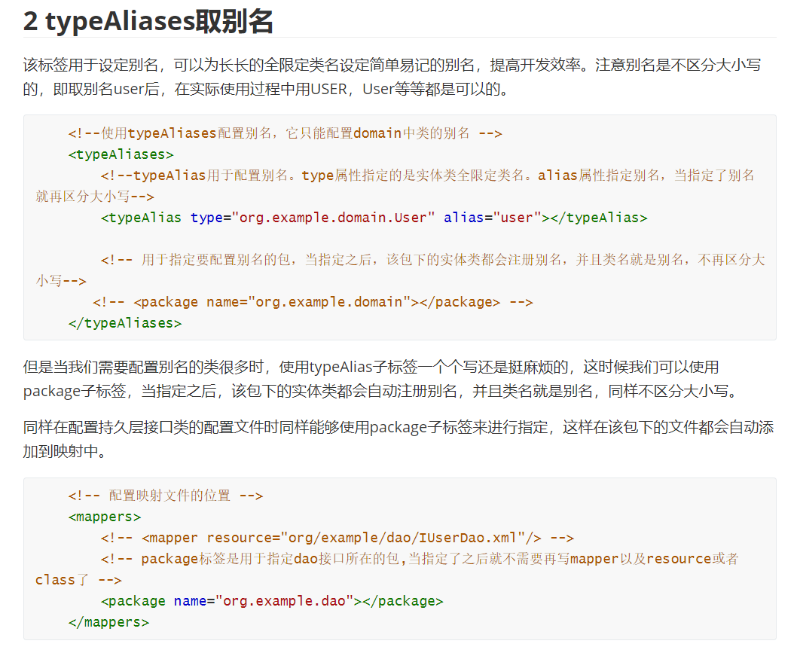

## 2 where标签

加上where标签以后，在sql语句中后面加`where 1=1`就没有必要了。

```xml
    <!--根据条件查询-->
    <select id="findUserByCondition" parameterType="org.example.domain.User" resultType="org.example.domain.User">
        select * from user
        <where>
            <if test="username!= null">
               and username = #{username}
            </if>
            <if test="userSex != null">
                and sex = #{userSex}
            </if>
        </where>
    </select>
```

## 3 foreach标签

用collection代表要遍历的集合的集合名称。注意#{}中写的是id还是什么，是由item属性的命名决定的。


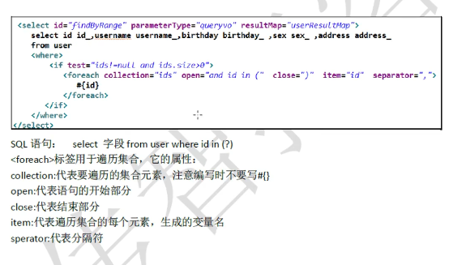

假如我们想实现一个按条件查询用户的功能，这个查询有一个限制，那就是查询的用户Id必须在某个列表中。

这里我们借助自写的专门查询类QueryVo来帮助我们实现这个功能：

```java
package org.example.domain;

import java.util.ArrayList;
import java.util.List;

public class QueryVo {
    User user;
    List<Integer> ids = new ArrayList<Integer>();

    public User getUser() {
        return user;
    }

    public void setUser(User user) {
        this.user = user;
    }

    public List<Integer> getIds() {
        return ids;
    }

    public void setIds(List<Integer> ids) {
        this.ids = ids;
    }
}

```

```xml
    <!--根据queryVo中的id集合实现查询用户列表-->
    <select id="findUserInIds" resultType="org.example.domain.User" parameterType="org.example.domain.QueryVo">
        select * from user
        <where>
            <if test="ids!= null  and ids.size()>0" >
                <foreach collection="ids" open="and id in (" close=")" item="uid" separator=",">
                    #{uid}
                </foreach>
            </if>
        </where>
    </select>
```

## 4 sql标签抽取重复的sql语句(了解)

我们发现在IUserDao.xml的配置中，我们的很多sql语句都是`selec * from user ****`，这个标签可以帮助我节省些重复sql语句的时间。

这里我用取一个`defaultUser`来表示`select * from user`语句。

```xml
<sql id="defaultUser">
	select * from user
</sql>
```

之后我们想使用，就可以用refid来代替sql语句，比如：

```xml
    <!--根据queryVo中的id集合实现查询用户列表-->
    <select id="findUserInIds" resultType="org.example.domain.User" parameterType="org.example.domain.QueryVo">
        <include refid="defaultUser"></include>
        <where>
            <if test="ids!= null  and ids.size()>0" >
                <foreach collection="ids" open="and id in (" close=")" item="uid" separator=",">
                    #{uid}
                </foreach>
            </if>
        </where>
    </select>
```

# 三 Mybatis的多表关联查询

## 1 简介

表之间的关系有4种：

1. 一对多
2. 多对一
3. 一对一
4. 多对多

举例：

​		用户和订单是一对多

​		订单和用户就是多对一

​					一个用户可以下多个订单

​					多个订单属于同一个用户

​		任何身份证号就是一对一

​					一个人只能有一个身份证

​					一个身份证号只能属于一个人

​		老师和学术之间就是多对多

​					一个学生可以被多个老师教过

​					一个老师可以教多个学生


特例：

​		如果拿出每一个订单，它都只能属于一个用户。

​		所以Mybatis中就把多对一看成了一对一。


## 2 mybatis中的多表查询

### 2.1 简介

示例：用户和账户

​					一个用户可以有多个账户

​					一个账户只能属于一个用户(多个账户也可以属于一个用户)

步骤：

1. 建立两张表：**用户表、账户表**

   ​								让用户表和账户表之间具备一对多的关系：需要使用外键在账户表中添加

2. 建立两个实体类：用户实体类和账户实体类

   ​								让用户和账户的实体类都能体现出一对多的关系

3. 建立两个配置文件：

   ​								用户的配置文件

   ​								账户的配置文件

4. 实现配置：

   ​					当我们查询用户时，可以同时得到用户下所包含的账户信息。

   ​					当我们查询账户时，可以同时得到账户的所属用户信息。

   


### 2.2 环境配置

### 配置pom.xml导入依赖

```xml
<?xml version="1.0" encoding="UTF-8"?>
<project xmlns="http://maven.apache.org/POM/4.0.0"
         xmlns:xsi="http://www.w3.org/2001/XMLSchema-instance"
         xsi:schemaLocation="http://maven.apache.org/POM/4.0.0 http://maven.apache.org/xsd/maven-4.0.0.xsd">
    <modelVersion>4.0.0</modelVersion>

    <groupId>org.example</groupId>
    <artifactId>Mybatis_P2_01_ToyExample</artifactId>
    <version>1.0-SNAPSHOT</version>

    <packaging>jar</packaging>

    <dependencies>
        <dependency>
            <groupId>org.mybatis</groupId>
            <artifactId>mybatis</artifactId>
            <version>3.4.5</version>
        </dependency>
        <dependency>
            <groupId>mysql</groupId>
            <artifactId>mysql-connector-java</artifactId>
            <version>5.1.6</version>
        </dependency>
        <dependency>
            <groupId>log4j</groupId>
            <artifactId>log4j</artifactId>
            <version>1.2.12</version>
        </dependency>
        <dependency>
            <groupId>junit</groupId>
            <artifactId>junit</artifactId>
            <version>4.10</version>
        </dependency>
    </dependencies>


</project>
```

###  编写实体类接口

```java
package org.example.dao;

import org.example.domain.Account;
import org.example.domain.AccountUser;
import org.example.domain.User;

import java.util.List;

public interface IAccountDao {
    /**
     * 查询所有用户
     * @return
     */
    List<Account> findAll();


    /**
     * 根据ID查询用户
     * @param integer
     * @return
     */
    IAccountDao findByID(Integer integer);

    /**
     * 输出每个用户及用户的账户信息
     * @return
     */
    List<AccountUser> findAllAccount();

}

```

然后依照老套路编写实体类，保持实体类的属性名和数据库表的字段名一致并配置数据库SqlConfig.xml，编写IUserDao.xml。

**因为这时候我们数据库还有第二张account表，我们就还有Account实体类及其接口**

```java
package org.example.domain;

import java.io.Serializable;
import java.net.IDN;
import java.rmi.server.UID;

public class Account implements Serializable {
    private Integer ID;
    private Integer UID;
    private Double MONEY;

    public Integer getID() {
        return ID;
    }

    public void setID(Integer ID) {
        this.ID = ID;
    }

    public Integer getUID() {
        return UID;
    }

    public void setUID(Integer UID) {
        this.UID = UID;
    }

    public Double getMONEY() {
        return MONEY;
    }

    public void setMONEY(Double MONEY) {
        this.MONEY = MONEY;
    }

    @Override
    public String toString() {
        return "Account{" +
                "ID=" + ID +
                ", UID=" + UID +
                ", MONEY=" + MONEY +
                '}';
    }
}

```


```java
package org.example.dao;

import org.example.domain.Account;
import org.example.domain.AccountUser;
import org.example.domain.User;

import java.util.List;

public interface IAccountDao {
    /**
     * 查询所有用户
     * @return
     */
    List<Account> findAll();


    /**
     * 根据ID查询用户
     * @param integer
     * @return
     */
    IAccountDao findByID(Integer integer);

    /**
     * 输出每个用户及用户的账户信息
     * @return
     */
    List<AccountUser> findAllAccount();

}

```

然后编写junit测试类测试方法

```java
package org.example;

import org.apache.ibatis.io.Resources;
import org.apache.ibatis.session.SqlSession;
import org.apache.ibatis.session.SqlSessionFactory;
import org.apache.ibatis.session.SqlSessionFactoryBuilder;
import org.example.dao.IAccountDao;
import org.example.domain.Account;
import org.example.domain.AccountUser;
import org.junit.After;
import org.junit.Before;
import org.junit.Test;

import java.io.InputStream;
import java.util.List;

public class AccountTest {
    InputStream inputStream = null;
    SqlSession sqlSession = null;
    private IAccountDao accountDao;

    @Before
    public void init() throws Exception{
        //1.读取配置文件，生成字节输入流
         inputStream = Resources.getResourceAsStream("SqlConfig.xml");
        //2.获取SqlSessionFactory
        SqlSessionFactory sqlSessionFactory = new SqlSessionFactoryBuilder().build(inputStream);

        //3.SqlSession对象
         sqlSession = sqlSessionFactory.openSession();

        //4.获取dao的代理对象
        accountDao = (IAccountDao) sqlSession.getMapper(IAccountDao.class);

    }

    @After
    public void destroy() throws Exception{
        //6. 提交事务
        sqlSession.commit();

        //7.释放资源
        sqlSession.close();
        inputStream.close();
    }
    @Test
   public void findAll()  {

        //5.执行查询所有方法
        List<Account> accounts = accountDao.findAll();
        for(Account account : accounts){
            System.out.println(account);
        }
   }

    @Test
    public void findAllAccount()  {

        //5.执行查询所有方法
        List<AccountUser> accounts = accountDao.findAllAccount();
        for(AccountUser account : accounts){
            System.out.println(account);
        }
    }


    @Test
    public void findByID()  {

        //5.执行查询所有方法
        IAccountDao account = accountDao.findByID(3);
         System.out.println(account);
    }

}

```

## 3 完成account的一对一操作

查询出account以及与该account对应的用户信息。

对应的sql语句应该是

```sql
select * from account a ,user u where u.id = a.uid
```

如果要避免重名，可以手动取查询信息的别名。这里将user的id的列名取别名为aid。

```sql
select u.*, a.id as aid, a.uid, a.money from account a ,user u where u.id = a.uid
```

数据库查询效果如图：

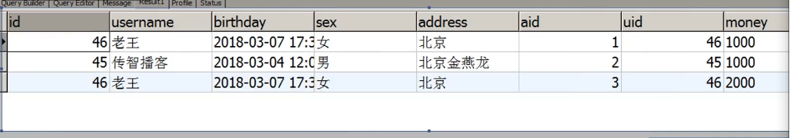

那么我们在代码中应该如何进行查询呢？

### 3.1 方法一：写account字类(不常用)

方法一建立为account和user提供多表查询功能的专门实体类，在实体类中改写toString()方法，实现自定义展示功能。这里选择继承Account类，并且在IAccountDao.java和IAccountDao.xml中添加一个相应的多表查询方法。

```java
package org.example.domain;

public class AccountUser extends Account {
    private String username;
    private String address;

    public String getUsername() {
        return username;
    }

    public void setUsername(String username) {
        this.username = username;
    }

    public String getAddress() {
        return address;
    }

    public void setAddress(String address) {
        this.address = address;
    }

    @Override
    public String toString() {
        return super.toString()+"AccountUser{" +
                "username='" + username + '\'' +
                ", address='" + address + '\'' +
                '}';
    }
}


```


```java
package org.example.dao;

import org.example.domain.Account;
import org.example.domain.AccountUser;
import org.example.domain.User;

import java.util.List;

public interface IAccountDao {
    /**
     * 查询所有用户
     * @return
     */
    List<Account> findAll();


    /**
     * 根据ID查询用户
     * @param integer
     * @return
     */
    IAccountDao findByID(Integer integer);

    /**
     * 输出每个用户及用户的账户信息
     * @return
     */
    List<AccountUser> findAllAccount();

}

```


```xml
<?xml version="1.0" encoding="UTF-8" ?>
<!DOCTYPE mapper
        PUBLIC "-//mybatis.org//DTD Mapper 3.0//EN"
        "http://mybatis.org/dtd/mybatis-3-mapper.dtd">
<mapper namespace="org.example.dao.IAccountDao">
    <!--查询所有-->
    <select id="findAll" resultType="org.example.domain.Account">
        select * from account;
    </select>

    <!--根据ID查询-->
    <select id="findByID" resultType="org.example.domain.Account">
        select * from account where ID = #{uid};
    </select>

    <!--查询所有账户同事包含用户名-->
    <select id="findAllAccount" resultType="org.example.domain.AccountUser">
        select a.*,u.username,u.address from account a,user u where u.id = a.uid
    </select>

</mapper>
```

### 3.2 方法二 association标签(常用)

我们在之前说过实体类应该体现出数据库中表之间的关系。方法一显然是不明显的。

我们现在在account实体类中编码体现出account与user之间多对一的关系，注意：**mybatis是将多对一关系作为一对一处理的，所以在实体类中我们只需要添加一个User对象属性即可。**

```java
package org.example.domain;

import java.io.Serializable;
import java.net.IDN;
import java.rmi.server.UID;

public class Account implements Serializable {
    private Integer ID;
    private Integer UID;
    private Double MONEY;
    private User user;

    public User getUser() {
        return user;
    }

    public void setUser(User user) {
        this.user = user;
    }

    public Integer getID() {
        return ID;
    }

    public void setID(Integer ID) {
        this.ID = ID;
    }

    public Integer getUID() {
        return UID;
    }

    public void setUID(Integer UID) {
        this.UID = UID;
    }

    public Double getMONEY() {
        return MONEY;
    }

    public void setMONEY(Double MONEY) {
        this.MONEY = MONEY;
    }

    @Override
    public String toString() {
        return "Account{" +
                "ID=" + ID +
                ", UID=" + UID +
                ", MONEY=" + MONEY +
                ", user=" + user +
                '}';
    }
}

```

接下来我们需要在xml定义封装account和user的resultMap。

**子标签中的column属性对应数据库表的字段名，如果sql语句中对应地取了别名，那么column属性也应该是sql语句中的别名。**property对应实体类的属性名。然后就是我们的association标签登场了，首先在association标签的column属性中我们要指定与account绑定的user是通过什么字段来获取的，然后将用户实体类属性名与表字段名对应写。

**再次注意!!!如果我们定义了resultMap，要进行使用的时候，我们就应该在对应的方法，将resultType属性更换成resultMap指定我们编写的resultMap的id**

```xml
<?xml version="1.0" encoding="UTF-8" ?>
<!DOCTYPE mapper
        PUBLIC "-//mybatis.org//DTD Mapper 3.0//EN"
        "http://mybatis.org/dtd/mybatis-3-mapper.dtd">
<mapper namespace="org.example.dao.IAccountDao">

    <!-- 定义封装account和user的resultMap -->
    <resultMap id="accountUserMap" type="Account">
        <id property="ID" column="aid"></id>
        <result property="UID" column="uid"></result>
        <result property="MONEY" column="money"></result>
        <!-- 一对一的关系映射：配置封装user的内容-->
        <association property="user" column="uid" javaType="user">
            <id property="id" column="id"></id>
            <result column="username" property="username"></result>
            <result column="address" property="address"></result>
            <result column="sex" property="sex"></result>
            <result column="birthday" property="birthday"></result>
        </association>
    </resultMap>


    <!--查询所有-->
    <select id="findAll" resultType="org.example.domain.Account">
        select * from account;
    </select>

    <!--根据ID查询-->
    <select id="findByID" resultType="org.example.domain.Account">
        select * from account where ID = #{uid};
    </select>

    <!--查询所有账户同事包含用户名-->
    <select id="findAllAccount" resultMap="accountUserMap">
        select u.*,a.id as aid,a.uid,money from account a,user u where u.id = a.uid
    </select>


</mapper>
```

## 4 完成user的一对多查询

现在我们想查询用户信息，并且返回所有和用户绑定的账户

现在我们在User实体类中体现和account的一对多关系，就是建立列表List。

```java
package org.example.domain;

import java.io.Serializable;
import java.util.Date;
import java.util.List;

public class User implements Serializable {

    private Integer id;
    private String username;
    private Date birthday;
    private String sex;
    private String address;

    private List<Account> accounts;

    public User() {
        this(-1,null,null,null,null);
    }

    public User(Integer id, String username, Date birthday, String sex, String address) {
        this.id = id;
        this.username = username;
        this.birthday = birthday;
        this.sex = sex;
        this.address = address;
    }

    public Integer getId() {
        return id;
    }

    public void setId(Integer id) {
        this.id = id;
    }

    public String getUsername() {
        return username;
    }

    public void setUsername(String username) {
        this.username = username;
    }

    public Date getBirthday() {
        return birthday;
    }

    public void setBirthday(Date birthday) {
        this.birthday = birthday;
    }

    public String getSex() {
        return sex;
    }

    public void setSex(String sex) {
        this.sex = sex;
    }

    public String getAddress() {
        return address;
    }

    public void setAddress(String address) {
        this.address = address;
    }

    public List<Account> getAccounts() {
        return accounts;
    }

    public void setAccounts(List<Account> accounts) {
        this.accounts = accounts;
    }

    @Override
    public String toString() {
        return "User{" +
                "id=" + id +
                ", username='" + username + '\'' +
                ", birthday=" + birthday +
                ", sex='" + sex + '\'' +
                ", address='" + address + '\'' +
                '}';
    }
}
```


```java
package org.example.dao;

import org.example.domain.User;

import java.util.List;

public interface IUserDao {
    /**
     * 查询所有用户，并获取每个用户的所有账户信息
     * @return
     */
    List<User> findAll();


    /**
     * 根据ID查询用户
     * @param integer
     * @return
     */
    User findByID(Integer integer);

}

```

接下来我们配置接口类的xml配置文件。由于accounts属性是个Account对象的集合，所以用`ofType=Account`来表示列表中对象的类型。

```xml
<?xml version="1.0" encoding="UTF-8" ?>
<!DOCTYPE mapper
        PUBLIC "-//mybatis.org//DTD Mapper 3.0//EN"
        "http://mybatis.org/dtd/mybatis-3-mapper.dtd">
<mapper namespace="org.example.dao.IUserDao">

    <resultMap id="userAccount" type="User">
        <id property="id" column="id"></id>
        <result property="username" column="username"></result>
        <result property="birthday" column="birthday"></result>
        <result property="sex" column="sex"></result>
        <result property="address" column="address"></result>
        <!--user对象中account集合-->
        <collection property="accounts"  ofType="Account">
            <id property="ID" column="aID"></id>
            <result property="UID" column="aUID"></result>
            <result property="MONEY" column="aMONEY"></result>
        </collection>
    </resultMap>

    <!--查询所有,一对多关系，只显示内链接信息-->
    <!--
    <select id="findAll" resultMap="userAccount">
        select u.*, a.ID as aID, a.UID as aUID, a.MONEY as aMONEY from user u,account a where u.id = a.UID
    </select>
    -->

    <!--查询所有,一对多关系，显示外链接信息-->
    <select id="findAll" resultMap="userAccount">
        select u.*,a.ID as aID, a.UID as aUID, a.MONEY as aMONEY from user u left outer join account a on u.id = a.UID
    </select>

    <!--根据ID查询-->
    <select id="findByID" resultType="org.example.domain.User">
        select * from user where id = #{uid};
    </select>


</mapper>
```

##### mybatis会自动删除重复信息

在mysql中执行该查询，我们发现有多个相同的用户重复显示。但是mybatis会自动识别到这样的信息，它不会输出多个用户，而是将多个账户归到同一用户的list中。

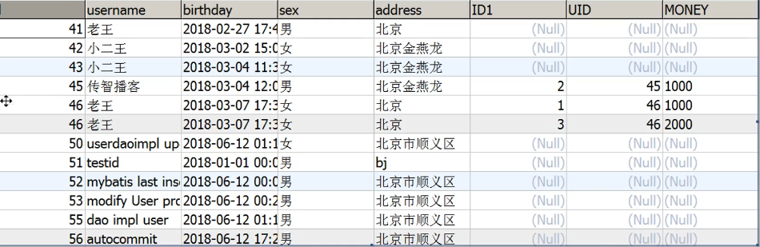

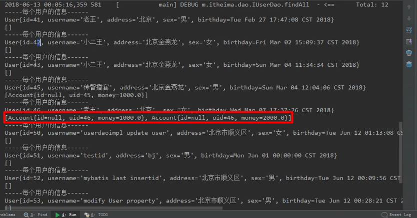

## 5 分析Mybatis多对多的步骤及环境搭建

示例：用户和角色(身份)

一个用户可以有多个角色，比如学生，程序员，子女。

一个角色也可以赋予多个用户，比如所有人都可以是子女。

### 5.1 步骤

1. 建立两张表：用户表，角色表。让用户表和角色表具有多对多的关系。需要使用中间表，中间表中包含各自的主键，在中间表中是外键。
2. 建立两个实体类：用户类和角色类。各自包含对方的一个集合引用。
3. 建立两个配置文件：用户的配置文件、角色的配置文件。
4. 实现配置：当我们查询用户是，可以同时得到用户所包含的角色信息，当我们查询角色时，可以同时得到角色所包含的用户信息。


### 5.2 环境配置

#### 1 建立数据库表

```sql
create database if not exists eesy;
use eesy;

create table if not exists user(id integer,username varchar(20),birthday date,sex varchar(10),address varchar(100));
show tables;
select * from account;
select * from user;
create table if not exists role(id int(11) not null, role_name varchar(30) default null, role_desc varchar(60) default null,primary key(id))engine=InnoDB default charset=utf8;
#insert into role(id,role_name,role_desc) values(1,'院长','管理整个学院'),(2,'总裁','管理整个公司'),(3,'校长','管理整个学校');
select * from role;
create table if not exists user_role(uid int(11) not null, rid int(11),primary key(uid,rid),key FK_Reference10(rid),constraint Fk_Reference_10 foreign key(rid)references role(id),constraint FK_Refernce_9 foreign key(uid)references user(id));
insert into user_role(uid,rid) values(1,1),(2,1),(1,2);


```

#### 2 导入jar包，配置pom.xml

pom.xml还是一样的，使用mysql，mybatis，log4j，junit四个库。

```xml
<?xml version="1.0" encoding="UTF-8"?>
<project xmlns="http://maven.apache.org/POM/4.0.0"
         xmlns:xsi="http://www.w3.org/2001/XMLSchema-instance"
         xsi:schemaLocation="http://maven.apache.org/POM/4.0.0 http://maven.apache.org/xsd/maven-4.0.0.xsd">
    <modelVersion>4.0.0</modelVersion>

    <groupId>org.example</groupId>
    <artifactId>Mybatis_P3_04_Many2Many</artifactId>
    <version>1.0-SNAPSHOT</version>

    <packaging>jar</packaging>

    <dependencies>
        <dependency>
            <groupId>org.mybatis</groupId>
            <artifactId>mybatis</artifactId>
            <version>3.4.5</version>
        </dependency>
        <dependency>
            <groupId>mysql</groupId>
            <artifactId>mysql-connector-java</artifactId>
            <version>5.1.6</version>
        </dependency>
        <dependency>
            <groupId>log4j</groupId>
            <artifactId>log4j</artifactId>
            <version>1.2.12</version>
        </dependency>
        <dependency>
            <groupId>junit</groupId>
            <artifactId>junit</artifactId>
            <version>4.10</version>
        </dependency>
    </dependencies>


</project>
```

#### 3 创建实体类

**注意：**在这里我们的实体类role的属性名是按照java的驼峰命名规范。第一个单词首字母小写，其余单词首字母大写，这样我们的属性名和数据库的字段名就不一致了，因为数据库的字段名是用下划线区分单词的，这时候我们就避免不了自己声明Map。

```java
package org.example.domain;

import java.io.Serializable;
import java.util.Date;
import java.util.List;

public class User implements Serializable {

    private Integer id;
    private String username;
    private Date birthday;
    private String sex;
    private String address;

    List<Role> roles;

    public User() {
        this(-1,null,null,null,null);
    }

    public User(Integer id, String username, Date birthday, String sex, String address) {
        this.id = id;
        this.username = username;
        this.birthday = birthday;
        this.sex = sex;
        this.address = address;
    }

    public List<Role> getRoles() {
        return roles;
    }

    public void setRoles(List<Role> roles) {
        this.roles = roles;
    }

    public Integer getId() {
        return id;
    }

    public void setId(Integer id) {
        this.id = id;
    }

    public String getUsername() {
        return username;
    }

    public void setUsername(String username) {
        this.username = username;
    }

    public Date getBirthday() {
        return birthday;
    }

    public void setBirthday(Date birthday) {
        this.birthday = birthday;
    }

    public String getSex() {
        return sex;
    }

    public void setSex(String sex) {
        this.sex = sex;
    }

    public String getAddress() {
        return address;
    }

    public void setAddress(String address) {
        this.address = address;
    }

    @Override
    public String toString() {
        return "User{" +
                "id=" + id +
                ", username='" + username + '\'' +
                ", birthday=" + birthday +
                ", sex='" + sex + '\'' +
                ", address='" + address + '\'' +
                '}';
    }
}
```

```java
package org.example.domain;

import java.io.Serializable;
import java.util.List;

public class Role implements Serializable {

    private Integer roleId;
    private String roleName;
    private String roleDesc;

    List<User> users;

    public List<User> getUsers() {
        return users;
    }

    public void setUsers(List<User> users) {
        this.users = users;
    }

    public Integer getRoleId() {
        return roleId;
    }

    public void setRoleId(Integer roleId) {
        this.roleId = roleId;
    }

    public String getRoleName() {
        return roleName;
    }

    public void setRoleName(String roleName) {
        this.roleName = roleName;
    }

    public String getRoleDesc() {
        return roleDesc;
    }

    public void setRoleDesc(String roleDesc) {
        this.roleDesc = roleDesc;
    }

    @Override
    public String toString() {
        return "Role{" +
                "roleId=" + roleId +
                ", roleName='" + roleName + '\'' +
                ", roleDesc='" + roleDesc + '\'' +
                '}';
    }
}
```

#### 4 配置接口类的xml

```xml
<?xml version="1.0" encoding="UTF-8" ?>
<!DOCTYPE mapper
        PUBLIC "-//mybatis.org//DTD Mapper 3.0//EN"
        "http://mybatis.org/dtd/mybatis-3-mapper.dtd">
<mapper namespace="org.example.dao.IRole">

    <!--根据role构建多对多的resultMap-->
    <resultMap id="roleUser" type="Role">
        <id property="roleId" column="RID"></id>
        <result property="roleName" column="ROLE_NAME"></result>
        <result property="roleDesc" column="ROLE_DESC"></result>
        <collection property="users" ofType="User">
            <id property="id" column="id"></id>
            <result property="username" column="username"></result>
            <result property="sex" column="sex"></result>
            <result property="birthday" column="birthday"></result>
            <result property="address" column="address"></result>
        </collection>
    </resultMap>

    <!--查询所有，显示所有-->
    <select id="findAll" resultMap="roleUser">
        select role.ID as RID, role.ROLE_NAME as ROLE_NAME, role.ROLE_DESC as ROLE_DESC, user.* from role
           left outer  join user_role on user_role.RID=role.ID
           left outer join user on user.id = user_role.UID
    </select>

    <!--查询所有，显示有用户的角色-->
    <select id="findAll2" resultMap="roleUser">
        select role.ID as RID, role.ROLE_NAME as ROLE_NAME, role.ROLE_DESC as ROLE_DESC, user.*
            from user,user_role, role where user.id = user_role.UID and user_role.RID=role.ID
    </select>

    <!--根据ID查询-->
    <select id="findByID" resultType="org.example.domain.User">
        select * from role where ID = #{uid};
    </select>


</mapper>
```

```xml
<?xml version="1.0" encoding="UTF-8" ?>
<!DOCTYPE mapper
        PUBLIC "-//mybatis.org//DTD Mapper 3.0//EN"
        "http://mybatis.org/dtd/mybatis-3-mapper.dtd">
<mapper namespace="org.example.dao.IUserDao">

    <!--根据user构建多对多的resultMap-->
    <resultMap id="userRole" type="User">
        <id property="id" column="id"></id>
        <result property="username" column="username"></result>
        <result property="sex" column="sex"></result>
        <result property="birthday" column="birthday"></result>
        <result property="address" column="address"></result>
        <collection property="roles" ofType="Role">
            <id property="roleId" column="RID"></id>
            <result property="roleName" column="ROLE_NAME"></result>
            <result property="roleDesc" column="ROLE_DESC"></result>
        </collection>
    </resultMap>

    <!--查询所有--> <!--根据user查找多对多,用户全部显示-->
    <select id="findAll" resultMap="userRole">
        select user.*, role.ID as RID, role.ROLE_NAME as ROLE_NAME, role.ROLE_DESC as ROLE_DESC from user left outer join user_role on user.id = user_role.UID
          left outer  join role on user_role.RID=role.ID
    </select>

    <!--查询所有--> <!--根据user查找多对多,有角色的用户显示-->
    <select id="findAll2" resultMap="userRole">
        select user.*, role.ID as RID, role.ROLE_NAME as ROLE_NAME, role.ROLE_DESC as ROLE_DESC
            from user,user_role, role where user.id = user_role.UID and user_role.RID=role.ID
    </select>

    <!--根据ID查询-->
    <select id="findByID" resultType="org.example.domain.User">
        select * from user where id = #{uid};
    </select>


</mapper>
```

### 5.3 查询角色获取角色下所属用户的信息

我们的目的是查询角色的时候同时获得用户的信息。

所以我们要在角色实体类中增加一个多对多的属性关系映射。生成它的get、set方法。

然后想出应该执行的sql语句

```xml
    <!--查询所有，显示所有-->
    <select id="findAll" resultMap="roleUser">
        select role.ID as RID, role.ROLE_NAME as ROLE_NAME, role.ROLE_DESC as ROLE_DESC, user.* from role
           left outer  join user_role on user_role.RID=role.ID
           left outer join user on user.id = user_role.UID
    </select>
```

执行后的类似效果如图所示：

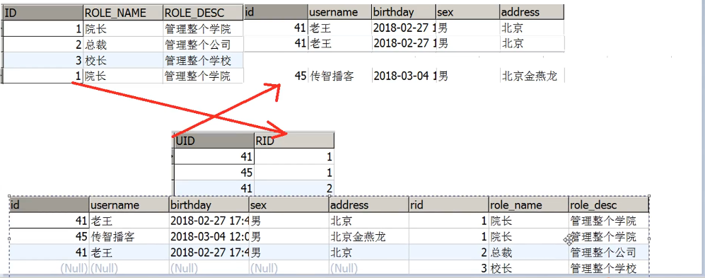

然后就是接口类及其xml的修改了，这都是老话了。之后我们写个junit测试一下就OK。

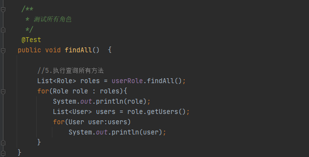

### 5.4 查询用户获取用户包含的角色信息

对应的sql语句如下:

- 返回所有用户及其角色信息，如果角色为空仍旧返回用户，但是其角色信息列表为空。(因为用的是左外连接)

```xml
    <!--查询所有--> <!--根据user查找多对多,用户全部显示-->
    <select id="findAll" resultMap="userRole">
        select user.*, role.ID as RID, role.ROLE_NAME as ROLE_NAME, role.ROLE_DESC as ROLE_DESC from user left outer join user_role on user.id = user_role.UID
          left outer  join role on user_role.RID=role.ID
    </select>
```

- 只返回有角色信息的用户及其角色信息。(因为用的是自然连接)

```xml
    <!--查询所有--> <!--根据user查找多对多,有角色的用户显示-->
    <select id="findAll2" resultMap="userRole">
        select user.*, role.ID as RID, role.ROLE_NAME as ROLE_NAME, role.ROLE_DESC as ROLE_DESC
            from user,user_role, role where user.id = user_role.UID and user_role.RID=role.ID
    </select>
```

# 四 (补充知识) JNDI

## 1 简介

[介绍JNDI的博客](https://www.cnblogs.com/study-everyday/p/6723313.html)

JNDI模拟的是windows的注册表，如下：Key存的是路径+名称，value中存的就是对象。

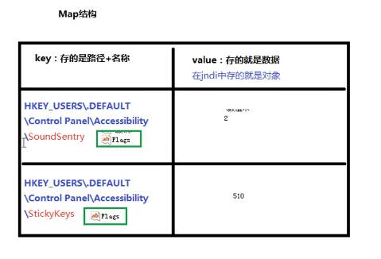

当我们的tomcat服务器一启动，效果说明如下:

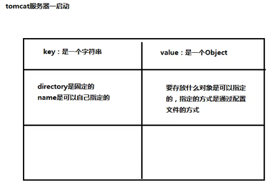

## 2 JNDI搭建maven的war工程

①选择新建工程，在maven工厂创建界面，勾选`Create from archetype`

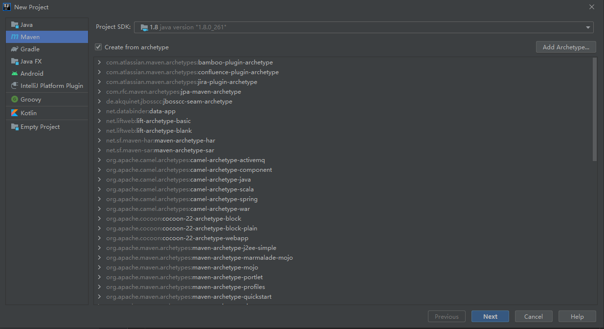

②选择webapp，点击下一步

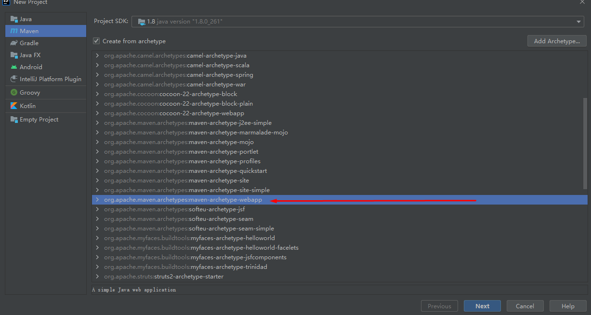

③取好工厂名，设置好自己的groupID即可。

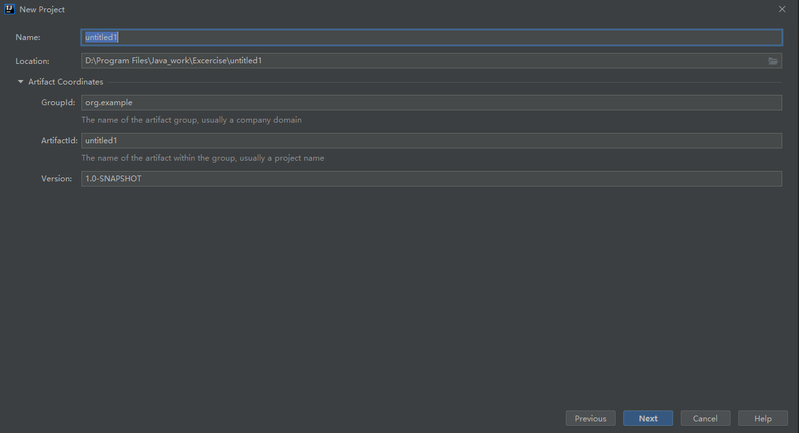

④创建完毕以后我们的工厂中是除了.idea文件夹以外没有别的文件夹的。

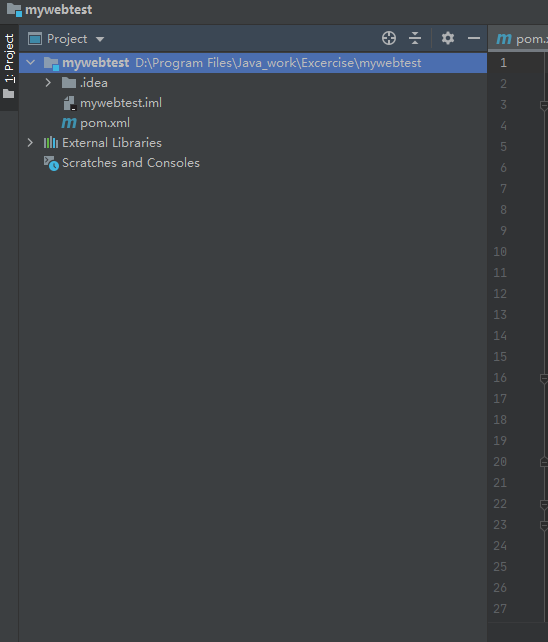

⑤所以我们要自己创建文件夹，不过所辛，idea会自动给我们一些提示 ，免得一些常用问价夹也要自己敲名字。我们全选创建。

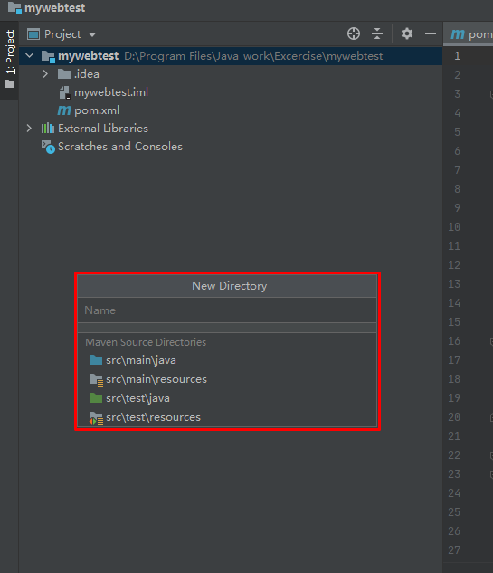

**注意：**自己手敲命名创建出来的文件夹并不在source root，我们要将test以及main下的java文件夹设置为`Sources Root`，resources文件夹设置为`Resources Root`，test的java则要设置为test的`Sources Root`。这和pycharm的配置是十分类似的。

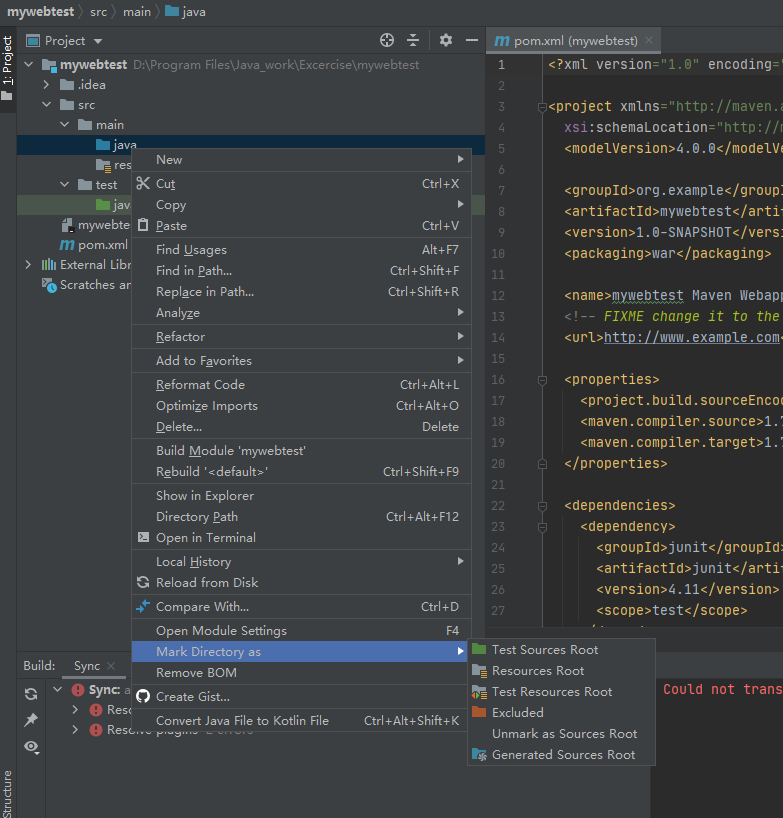