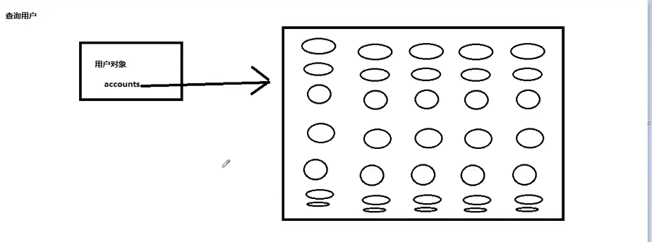
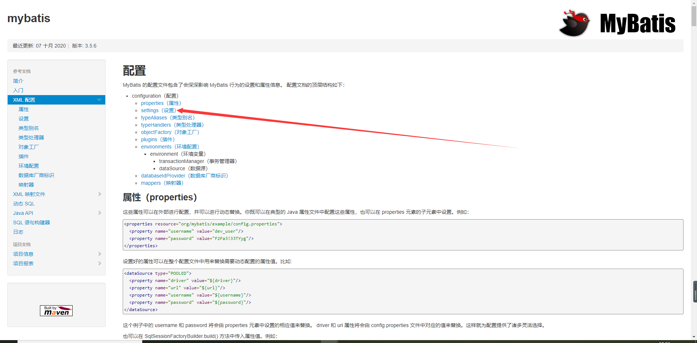
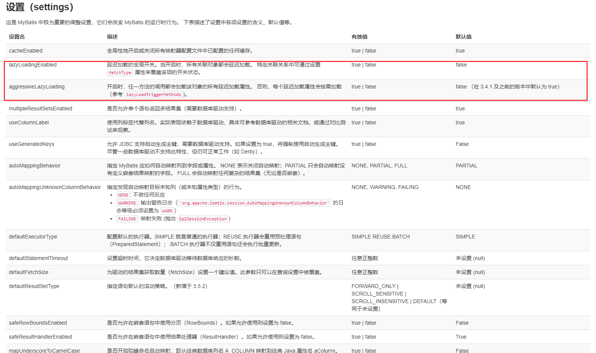
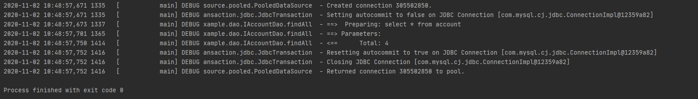
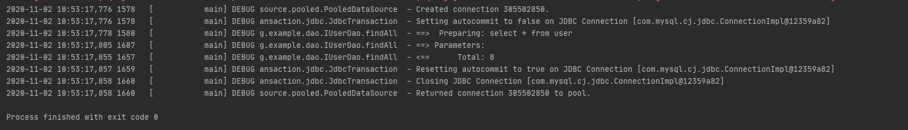

# 4 Mybatis

# 今日大纲

- Mybatis中的延迟加载
  - 什么是延迟加载
  - 什么是立即加载
- Mybatis中的缓存
  - 什么是缓存
  - 为什么使用缓存
  - 什么样的数据能使用缓存，什么样的数据不能使用
  - Mybatis中的一级缓存和二级缓存
- Mybatis中的注解开发
  - 环境搭建
  - 单表CRUD操作(代理Dao方式)
  - 多表查询操作
  - 缓存的配置


# 一 Mybatis中的延迟加载

## 问题引出

问题：在一对多中，当我们有一个用户，它有100账户，在查询用户的时候，要不要把关联的账户查出来？在查询账户的时候要不要把关联的用户查出来？

假如我们查询一个用户，一个用户有100各账户，如果在查询的时候就全部查出来，是对内存非常大的开销。但如果我们都不查出来，想用的时候就用不了了。

**所以在查询用户的时候，我们应该决定账户信息应在什么时候查询出来，什么时候不查询出来。**



## 1 定义

**延迟加载**就是真正使用数据时才发起查询，不用的时候不查询，按需加载(懒加载)。

**立即加载**就是不管用不用，只要一调用方法，马上发起查询。


一般策略：

一对多，多对多：采用延迟加载

多对一，一对一：采用立即加载


## 2 一对一的延迟查询

需要的pom.xml的jar包还是一样的，但是在我们些resultMap时发生了变化。

```xml
<?xml version="1.0" encoding="UTF-8" ?>
<!DOCTYPE mapper
        PUBLIC "-//mybatis.org//DTD Mapper 3.0//EN"
        "http://mybatis.org/dtd/mybatis-3-mapper.dtd">
<mapper namespace="org.example.dao.IAccountDao">

    <resultMap id="userAccount" type="Account">
            <id property="ID" column="ID"></id>
            <result property="UID" column="UID"></result>
            <result property="MONEY" column="MONEY"></result>

        <!-- 一对一的关系映射 封装user的容器
          select属性指定的内容，查询用户的唯一标识
          column属性指定的内容，用户根据id查询时，所需要的参数的值，这里的UID是字段名
        -->
        <association property="user" column="UID" javaType="User" select="org.example.dao.IUserDao.findByID">
        </association>
    </resultMap>


    <!--查询所有-->
    <select id="findAll" resultMap="userAccount">
        select * from account
    </select>

    <!--根据ID查询-->
    <select id="findByID" parameterType="int" resultType="Account">
        select * from account where UID = #{id}
    </select>

</mapper>
```

但是现在延迟效果还没有实现。

接下来我们去看[Mybatis的官方文档](https://mybatis.org/mybatis-3/zh/index.html)，我们查看configuration下的settings



我们可以找到lazyloading的设置。



接下来我们就要在数据库的配置文件SqlConfig.xml进行延迟加载的配置。

```xml
<?xml version="1.0" encoding="UTF-8" ?>
<!DOCTYPE configuration
        PUBLIC "-//mybatis.org//DTD Config 3.0//EN"
        "http://mybatis.org/dtd/mybatis-3-config.dtd">
<!-- 配置properties
       可以在标签内部配置连接数据库的信息。也可以通过属性引用外部配置文件信息
       resource属性： 常用的
           用于指定配置文件的位置，是按照类路径的写法来写，并且必须存在于类路径下。
       url属性：
           是要求按照Url的写法来写地址
           URL：Uniform Resource Locator 统一资源定位符。它是可以唯一标识一个资源的位置。
           它的写法：
               http://localhost:8080/mybatisserver/demo1Servlet
               协议      主机     端口       URI

           URI:Uniform Resource Identifier 统一资源标识符。它是在应用中可以唯一定位一个资源的。
   -->
<configuration>

    <!--配置Lazy查询参数-->
    <settings>
        <setting name="lazyLoadingEnabled" value="true"/>
        <setting name="aggressiveLazyLoading" value="false"/>
    </settings>

    <!--使用typeAliases配置别名，它只能配置domain中类的别名 -->
    <typeAliases>
        <package name="org.example.domain"></package>
    </typeAliases>

    <environments default="development">
        <environment id="development">
            <transactionManager type="JDBC"/>
            <dataSource type="POOLED">
                <property name="driver" value="com.mysql.jdbc.Driver"/>
                <property name="url" value="jdbc:mysql://localhost:3306/eesy?useUnicode=true&amp;characterEncoding=UTF-8"/>
                <property name="username" value="root"/>
                <property name="password" value="root"/>
            </dataSource>
        </environment>
    </environments>
    <!-- 配置映射文件的位置 -->
    <mappers>
        <package name="org.example.dao"/>
    </mappers>

</configuration>
```

之后我们再执行account的查询所有方法，我们就会发现，如果我们不调用它的getuser方法，也不打印它的信息(在打印时会查询类对象的属性信息)那么查询相应的用户的select语句在过程中就没有被执行。

```java
    @Test
   public void findAll()  {

        //5.执行查询所有方法
        List<Account> accounts = accountDao.findAll();
//        for(Account account : accounts){
//            System.out.println(account);
//
//            User user = account.getUser();
//            System.out.println(user);
//        }
   }

```

具体输出信息如下：



## 3 一对多的延迟查询

用户与账户是一对多关系，IUserDao.xml的配置文件如下：

```xml
<?xml version="1.0" encoding="UTF-8" ?>
<!DOCTYPE mapper
        PUBLIC "-//mybatis.org//DTD Mapper 3.0//EN"
        "http://mybatis.org/dtd/mybatis-3-mapper.dtd">
<mapper namespace="org.example.dao.IUserDao">

    <resultMap id="userAccount" type="User">
        <id property="id" column="id"></id>
        <result property="username" column="username"></result>
        <result property="birthday" column="birthday"></result>
        <result property="sex" column="sex"></result>
        <result property="address" column="address"></result>

        <association property="accounts" column="id" select="org.example.dao.IAccountDao.findByID"></association>
    </resultMap>

    <!--查询所有,一对多关系，只显示内链接信息-->
    <!--
    <select id="findAll" resultMap="userAccount">
        select u.*, a.ID as aID, a.UID as aUID, a.MONEY as aMONEY from user u,account a where u.id = a.UID
    </select>
    -->

    <!--查询所有-->
    <select id="findAll" resultMap="userAccount">
        select * from user
    </select>

    <!--根据ID查询-->
    <select id="findByID" parameterType="int" resultType="User">
        select * from user where id = #{uid}
    </select>

</mapper>
```

此时，当我们把打印信息，getAccounts方法都不调用以后，就可以看到延迟查询的效果了。

```java
    @Test
   public void findAll()  {

        //5.执行查询所有方法
        List<User> users = userDao.findAll();
//        for(User user : users){
//            System.out.println(user);
//        }
   }
```



# 二 Mybatis中的缓存

