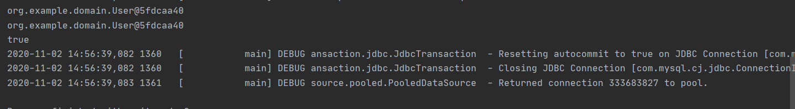
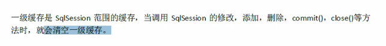
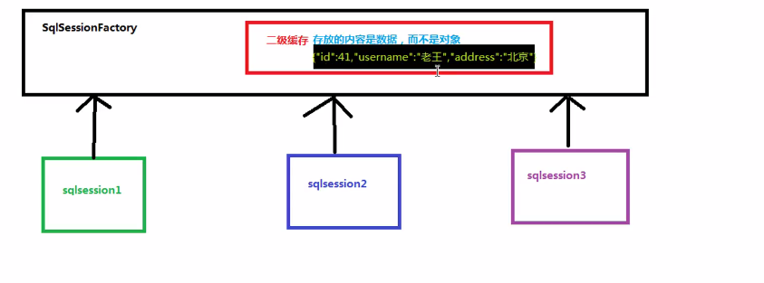

# 4 Mybatis

# 今日大纲

- Mybatis中的延迟加载
  - 什么是延迟加载
  - 什么是立即加载
- Mybatis中的缓存
  - 什么是缓存
  - 为什么使用缓存
  - 什么样的数据能使用缓存，什么样的数据不能使用
  - Mybatis中的一级缓存和二级缓存
- Mybatis中的注解开发
  - 环境搭建
  - 单表CRUD操作(代理Dao方式)
  - 多表查询操作
  - 缓存的配置


# 一 Mybatis中的延迟加载

## 问题引出

问题：在一对多中，当我们有一个用户，它有100账户，在查询用户的时候，要不要把关联的账户查出来？在查询账户的时候要不要把关联的用户查出来？

假如我们查询一个用户，一个用户有100各账户，如果在查询的时候就全部查出来，是对内存非常大的开销。但如果我们都不查出来，想用的时候就用不了了。

**所以在查询用户的时候，我们应该决定账户信息应在什么时候查询出来，什么时候不查询出来。**


## 1 定义

**延迟加载**就是真正使用数据时才发起查询，不用的时候不查询，按需加载(懒加载)。

**立即加载**就是不管用不用，只要一调用方法，马上发起查询。


一般策略：

一对多，多对多：采用延迟加载

多对一，一对一：采用立即加载


## 2 一对一的延迟查询

需要的pom.xml的jar包还是一样的，但是在我们些resultMap时发生了变化。

```xml
<?xml version="1.0" encoding="UTF-8" ?>
<!DOCTYPE mapper
        PUBLIC "-//mybatis.org//DTD Mapper 3.0//EN"
        "http://mybatis.org/dtd/mybatis-3-mapper.dtd">
<mapper namespace="org.example.dao.IAccountDao">

    <resultMap id="userAccount" type="Account">
            <id property="ID" column="ID"></id>
            <result property="UID" column="UID"></result>
            <result property="MONEY" column="MONEY"></result>

        <!-- 一对一的关系映射 封装user的容器
          select属性指定的内容，查询用户的唯一标识
          column属性指定的内容，用户根据id查询时，所需要的参数的值，这里的UID是字段名
        -->
        <association property="user" column="UID" javaType="User" select="org.example.dao.IUserDao.findByID">
        </association>
    </resultMap>


    <!--查询所有-->
    <select id="findAll" resultMap="userAccount">
        select * from account
    </select>

    <!--根据ID查询-->
    <select id="findByID" parameterType="int" resultType="Account">
        select * from account where UID = #{id}
    </select>

</mapper>
```

但是现在延迟效果还没有实现。

接下来我们去看[Mybatis的官方文档](https://mybatis.org/mybatis-3/zh/index.html)，我们查看configuration下的settings


我们可以找到lazyloading的设置。


接下来我们就要在数据库的配置文件SqlConfig.xml进行延迟加载的配置。

```xml
<?xml version="1.0" encoding="UTF-8" ?>
<!DOCTYPE configuration
        PUBLIC "-//mybatis.org//DTD Config 3.0//EN"
        "http://mybatis.org/dtd/mybatis-3-config.dtd">
<!-- 配置properties
       可以在标签内部配置连接数据库的信息。也可以通过属性引用外部配置文件信息
       resource属性： 常用的
           用于指定配置文件的位置，是按照类路径的写法来写，并且必须存在于类路径下。
       url属性：
           是要求按照Url的写法来写地址
           URL：Uniform Resource Locator 统一资源定位符。它是可以唯一标识一个资源的位置。
           它的写法：
               http://localhost:8080/mybatisserver/demo1Servlet
               协议      主机     端口       URI

           URI:Uniform Resource Identifier 统一资源标识符。它是在应用中可以唯一定位一个资源的。
   -->
<configuration>

    <!--配置Lazy查询参数-->
    <settings>
        <setting name="lazyLoadingEnabled" value="true"/>
        <setting name="aggressiveLazyLoading" value="false"/>
    </settings>

    <!--使用typeAliases配置别名，它只能配置domain中类的别名 -->
    <typeAliases>
        <package name="org.example.domain"></package>
    </typeAliases>

    <environments default="development">
        <environment id="development">
            <transactionManager type="JDBC"/>
            <dataSource type="POOLED">
                <property name="driver" value="com.mysql.jdbc.Driver"/>
                <property name="url" value="jdbc:mysql://localhost:3306/eesy?useUnicode=true&amp;characterEncoding=UTF-8"/>
                <property name="username" value="root"/>
                <property name="password" value="root"/>
            </dataSource>
        </environment>
    </environments>
    <!-- 配置映射文件的位置 -->
    <mappers>
        <package name="org.example.dao"/>
    </mappers>

</configuration>
```

之后我们再执行account的查询所有方法，我们就会发现，如果我们不调用它的getuser方法，也不打印它的信息(在打印时会查询类对象的属性信息)那么查询相应的用户的select语句在过程中就没有被执行。

```java
    @Test
   public void findAll()  {

        //5.执行查询所有方法
        List<Account> accounts = accountDao.findAll();
//        for(Account account : accounts){
//            System.out.println(account);
//
//            User user = account.getUser();
//            System.out.println(user);
//        }
   }

```

具体输出信息如下：


## 3 一对多的延迟查询

用户与账户是一对多关系，IUserDao.xml的配置文件如下：

```xml
<?xml version="1.0" encoding="UTF-8" ?>
<!DOCTYPE mapper
        PUBLIC "-//mybatis.org//DTD Mapper 3.0//EN"
        "http://mybatis.org/dtd/mybatis-3-mapper.dtd">
<mapper namespace="org.example.dao.IUserDao">

    <resultMap id="userAccount" type="User">
        <id property="id" column="id"></id>
        <result property="username" column="username"></result>
        <result property="birthday" column="birthday"></result>
        <result property="sex" column="sex"></result>
        <result property="address" column="address"></result>

        <association property="accounts" column="id" select="org.example.dao.IAccountDao.findByID"></association>
    </resultMap>

    <!--查询所有,一对多关系，只显示内链接信息-->
    <!--
    <select id="findAll" resultMap="userAccount">
        select u.*, a.ID as aID, a.UID as aUID, a.MONEY as aMONEY from user u,account a where u.id = a.UID
    </select>
    -->

    <!--查询所有-->
    <select id="findAll" resultMap="userAccount">
        select * from user
    </select>

    <!--根据ID查询-->
    <select id="findByID" parameterType="int" resultType="User">
        select * from user where id = #{uid}
    </select>

</mapper>
```

此时，当我们把打印信息，getAccounts方法都不调用以后，就可以看到延迟查询的效果了。

```java
    @Test
   public void findAll()  {

        //5.执行查询所有方法
        List<User> users = userDao.findAll();
//        for(User user : users){
//            System.out.println(user);
//        }
   }
```


# 二 Mybatis中的缓存

## 1 缓存的概念

缓存是存在于内存中的临时数据。


## 2 为什么使用缓存

减少和数据库的交互次数，提高执行效率。


## 3 什么样的数据能使用缓存，什么样的数据不能使用

**适用于缓存：**经常查询并且不经常改变的。数据的正确与否对最终结果影响不大的。

**不适用于缓存的：**经常改变的数据，数据的正确与否对最终结果影响很大的。例如：商品的库存，银行的汇率，股市的牌价。


## 4 一级缓存

### 4.1 一级缓存分析

概念：它值得是Mybatis中SqlSession对象的缓存。当我们执行查询之后，查询的集过会同时存入到SqlSession为我们提供一块取于中。该取于的结构是一个Map。当我们再次查询同样的数据，mybatis会先去sqlsession中查询是否有，有的话直接拿出来用。

**注意：当sqlsession对象消失时，mybatis的一级缓存也就消失了**

我们来写一个junit测试一下：

```java
    @Test
    public void testFisrtLevelCache(){
        User user1 = userDao.findByID(1);
        System.out.println(user1);

//        sqlSession.close();
//        sqlSession = sqlSessionFactory.openSession();
//
//        userDao = (IUserDao) sqlSession.getMapper(IUserDao.class);

        User user2 = userDao.findByID(1);
        System.out.println(user2);
        System.out.println(user1==user2);
    }
```

此时我们观察到输出结果如图：

这意味着，两次查询到的user是从缓存取出来的同一个对象。

如果我们将注释取消，或者执行sqlSession.clearCahce()方法，那么缓存将会被释放，这样再次查询出来的user2因为内存地址与user1不同，结果就会是false。




### 4.2 如果数据库的信息和缓存中的用户信息不一样了，那么mybatis是如何处理的呢？

为了得知效果，我们写了以下junit测试方法。最后我们的输出结果市false。

```java
    @Test
    public void testFisrtLevelCache(){
        // 先查询用户
        User user1 = userDao.findByID(1);
        System.out.println(user1);
        // 更新用户信息
        user1.setUsername("帅气潇洒哥");
        user1.setAddress("上海市");
        userDao.updateUser(user1);
        // 再次取出用户
        User user2 = userDao.findByID(1);
        System.out.println(user2);
        System.out.println(user1==user2);
    }
```


这说明在数据库信息发生了更改以后，mybatis并没有从一级缓存再次进行查询，而是从数据库中进行了查询。原因如图所示：




## 5 二级缓存

概念：它指的是Mybatis中SqlSessionFactory对象的缓存。由同一个SqlSessionFactory对象创建的SqlSession共享其缓存。其原理如图所示：



二级缓存的使用步骤：

1. 让Mybatis框架支持二级缓存(在SqlMapConfig.xml中配置)。使用settings标签打开`cacheEnabled`

   ```xml
   <?xml version="1.0" encoding="UTF-8" ?>
   <!DOCTYPE configuration
           PUBLIC "-//mybatis.org//DTD Config 3.0//EN"
           "http://mybatis.org/dtd/mybatis-3-config.dtd">
   <!-- 配置properties
          可以在标签内部配置连接数据库的信息。也可以通过属性引用外部配置文件信息
          resource属性： 常用的
              用于指定配置文件的位置，是按照类路径的写法来写，并且必须存在于类路径下。
          url属性：
              是要求按照Url的写法来写地址
              URL：Uniform Resource Locator 统一资源定位符。它是可以唯一标识一个资源的位置。
              它的写法：
                  http://localhost:8080/mybatisserver/demo1Servlet
                  协议      主机     端口       URI
   
              URI:Uniform Resource Identifier 统一资源标识符。它是在应用中可以唯一定位一个资源的。
      -->
   <configuration>
   
       <!--配置Lazy查询参数-->
       <settings>
           <setting name="cacheEnabled" value="true"/>
   
       </settings>
   
       <!--使用typeAliases配置别名，它只能配置domain中类的别名 -->
       <typeAliases>
           <package name="org.example.domain"></package>
       </typeAliases>
   
       <environments default="development">
           <environment id="development">
               <transactionManager type="JDBC"/>
               <dataSource type="POOLED">
                   <property name="driver" value="com.mysql.jdbc.Driver"/>
                   <property name="url" value="jdbc:mysql://localhost:3306/eesy?useUnicode=true&amp;characterEncoding=UTF-8"/>
                   <property name="username" value="root"/>
                   <property name="password" value="root"/>
               </dataSource>
           </environment>
       </environments>
       <!-- 配置映射文件的位置 -->
       <mappers>
           <package name="org.example.dao"/>
       </mappers>
   
   </configuration>
   ```

   

2. 让当前的映射文件支持二级缓存(在IUserDao.xml中配置)，增加`<cache/>`标签。

   ```xml
   <?xml version="1.0" encoding="UTF-8" ?>
   <!DOCTYPE mapper
           PUBLIC "-//mybatis.org//DTD Mapper 3.0//EN"
           "http://mybatis.org/dtd/mybatis-3-mapper.dtd">
   <mapper namespace="org.example.dao.IUserDao">
   
       <!-- 开启user支持二级缓存-->
       <cache/>
   
       <!--查询所有-->
       <select id="findAll" resultType="User">
           select * from user
       </select>
   
       <!--根据ID查询-->
       <select id="findByID" parameterType="int" resultType="User" useCache="true">
           select * from user where id = #{uid}
       </select>
   
   </mapper>
   ```

3. 让当前的操作支持二级缓存(在select标签中配置)，增加属性`userCache=true`。

   ```xml
       <!--根据ID查询-->
       <select id="findByID" parameterType="int" resultType="User" useCache="true">
           select * from user where id = #{uid}
       </select>
   
   </mapper>
   ```

   


我们的测试代码如下：

```java
    @Test
    public void testSecondLevelCache(){
        SqlSession sqlSession1 = sqlSessionFactory.openSession();
        IUserDao dao1 = sqlSession1.getMapper(IUserDao.class);
        User user1 = dao1.findByID(41);
        System.out.println(user1);
        sqlSession1.close(); //一级缓存消失

        SqlSession sqlSession2 = sqlSessionFactory.openSession();
        IUserDao dao2 = sqlSession2.getMapper(IUserDao.class);
        User user2 = dao2.findByID(41);
        System.out.println(user2);
        sqlSession2.close(); //一级缓存消失
    }
```

我们发现查询处理的user1和user2的内存地址并不一致，这是因为sqlSessionFactory中存放的是数据而不是对象，当我们需要创建一个sqlSession时，sqlSessionFactory只是查询到了数据存放到二级缓存中，并将数据传入sqlSession，创建一个全新的对象。所以我们用不同的sqlSession查询出来的同一id的user是不同的对象。


# 三 Mybatis注解开发

## 问题引出

使用xml配置IUserDao.xml并不一定方便，我们的Mybatis注解开发主要就是针对接口类的注解开发。


## 1 环境搭建

**注意如果我们选择了注解开发，那么我们就不能创建IUserDao.xml配置文件，否则只要resources文件夹的相同路径下存在该文件，不管我们在mapper中是否指定用它，mybatis都会报错**

1. 创建一个空的maven工程

2. 然后使用之前的mybatis工程的pom.xml文件。导入mybatis，log4j，junit，mysql四个jar包。

3. 创建实体类，属性名与字段名一致，实现Serializable接口，并且生成Get，Set和toString方法。

4. 创建接口类IUserDao。

5. 创建SqlMapConfig.xml

   ```xml
   <?xml version="1.0" encoding="UTF-8" ?>
   <!DOCTYPE configuration
           PUBLIC "-//mybatis.org//DTD Config 3.0//EN"
           "http://mybatis.org/dtd/mybatis-3-config.dtd">
   
   <configuration>
       <!--使用typeAliases配置别名，它只能配置domain中类的别名 -->
       <typeAliases>
           <package name="org.example.domain"></package>
       </typeAliases>
   
       <environments default="development">
           <environment id="development">
               <transactionManager type="JDBC"/>
               <dataSource type="POOLED">
                   <property name="driver" value="com.mysql.jdbc.Driver"/>
                   <property name="url" value="jdbc:mysql://localhost:3306/eesy?useUnicode=true&amp;characterEncoding=UTF-8"/>
                   <property name="username" value="root"/>
                   <property name="password" value="20000912"/>
               </dataSource>
           </environment>
       </environments>
       <!-- 指定带有注解的dao接口的所在位置 -->
       <mappers>
           <package name="org.example.dao"/>
       </mappers>
   
   </configuration>
   ```

6. 在接口类中添加方法，并在方法上添加要执行的sql语句的注解。如此我们就不需要再写IUserDao.xml了。

   ```java
   package org.example.dao;
   
   import org.apache.ibatis.annotations.Delete;
   import org.apache.ibatis.annotations.Insert;
   import org.apache.ibatis.annotations.Select;
   import org.apache.ibatis.annotations.Update;
   import org.example.domain.User;
   
   import java.util.List;
   
   /**
    * @author 黑马程序员
    * @Company http://www.ithiema.com
    * 在mybatis中针对,CRUD一共有四个注解
    *  @Select @Insert @Update @Delete
    */
   
   public interface IUserDao {
       /**
        * 查询所有用户
        * @return
        */
       @Select(value = "select * from user")
       List<User> findAll();
   
   
       /**
        * 根据ID查询用户
        * @param integer
        * @return
        */
       @Select("select * from user where id = #{userID}")
       User findByID(Integer integer);
   
       /**
        * 保存用户
        * @param user
        */
       @Insert("insert into user(username,address,sex,birthday) values(#{username},#{address},#{sex},#{birthday})")
       void saveUser(User user);
   
       /**
        * 通过注解，更新数据
        * @param user
        */
       @Update("update user set username=#{username},sex=#{sex},birthday = #{birthday}, address= #{address} where id = #{id}")
       void updateUser(User user);
   
       /**
        * 删除用户
        * @param uid
        */
       @Delete("delete from user where id = #{userId}")
       void deleteUser(Integer uid);
   
       /**
        * 通过名称查找
        * @param name
        * @return
        */
       @Select("select * from user where username like #{name}")
       List<User> findByName(String name);
   
       /**
        * count
        * @return
        */
       @Select("select count(*) from user")
       int countTotal();
   }
   
   ```

7. 编写junit测试方法。


## 2 保存更新操作的注解

保存使用@Insert

更新使用@Update

```java
    /**
     * 保存用户
     * @param user
     */
    @Insert("insert into user(username,address,sex,birthday) values(#{username},#{address},#{sex},#{birthday})")
    void saveUser(User user);

    /**
     * 通过注解，更新数据
     * @param user
     */
    @Update("update user set username=#{username},sex=#{sex},birthday = #{birthday}, address= #{address} where id = #{id}")
    void updateUser(User user);
```


## 3 删除操作的注解

删除使用@Delete注解

```java
    /**
     * 删除用户
     * @param uid
     */
    @Delete("delete from user where id = #{userId}")
    void deleteUser(Integer uid);
```


## 4 模糊查询

方法由两种

①使用#{}

```java
    /**
     * 通过名称查找
     * @param name
     * @return
     */
    @Select("select * from user where username like #{name}")
    List<User> findByName(String name);
```

使用该方法在使用时，需要传入百分号%

```java
    @Test
    public void testFindByName(){

        List<User> users = userDao.findByName("%en%");
        for (User user:users)
            System.out.println(user);
    }
```

②使用''${value}''并且手敲百分号％。注意`value`是固定写法

```java
    /**
     * 通过名称查找
     * @param name
     * @return
     */
    @Select("select * from user where username like '%${value}%'")
    List<User> findByName(String name);
```

这样在使用时就不用手敲百分号了

```java
    @Test
    public void testFindByName(){

        List<User> users = userDao.findByName("en");
        for (User user:users)
            System.out.println(user);
    }
```


## 5 Mybatis中注解建立实体类属性名和字段名的对应关系

### 5.1 问题引出

当我们不希望让实体类的属性名和字段名必须保持一致时。(在实际开发中因为数据库和java命名规范不一样，常常需要这样做)。使用xml我们可以用resultMap进行配置，该功能我们用注解其实也可以完成。


### 5.2 @Results注解

#### 1 注解源码浅析

我们可以按住`Ctrl`，左键Results去查看Results注解的实现。首先我们看到的是以下代码，我们发现Results接口包含了一个Result数组，还有一个id属性(提供Map的唯一标识，以便在他处引用）。

```java
//
// Source code recreated from a .class file by IntelliJ IDEA
// (powered by FernFlower decompiler)
//

package org.apache.ibatis.annotations;

import java.lang.annotation.Documented;
import java.lang.annotation.ElementType;
import java.lang.annotation.Retention;
import java.lang.annotation.RetentionPolicy;
import java.lang.annotation.Target;

@Documented
@Retention(RetentionPolicy.RUNTIME)
@Target({ElementType.METHOD})
public @interface Results {
    String id() default "";

    Result[] value() default {};
}

```

然后我们去查看Result的实现，发现这也是个接口，其包含的属性就和resultMap标签中的属性十分相似了。

```java
//
// Source code recreated from a .class file by IntelliJ IDEA
// (powered by FernFlower decompiler)
//

package org.apache.ibatis.annotations;

import java.lang.annotation.Documented;
import java.lang.annotation.Retention;
import java.lang.annotation.RetentionPolicy;
import java.lang.annotation.Target;
import org.apache.ibatis.type.JdbcType;
import org.apache.ibatis.type.TypeHandler;
import org.apache.ibatis.type.UnknownTypeHandler;

@Documented
@Retention(RetentionPolicy.RUNTIME)
@Target({})
public @interface Result {
    boolean id() default false;

    String column() default "";

    String property() default "";

    Class<?> javaType() default void.class;

    JdbcType jdbcType() default JdbcType.UNDEFINED;

    Class<? extends TypeHandler> typeHandler() default UnknownTypeHandler.class;

    One one() default @One;

    Many many() default @Many;
}

```

#### 2 使用

于是我们就不难联想到其使用方法，我们只需要在相应的方法上面添加@Results注解，配置映射即可。

```java
    /**
     * 查询所有用户
     * @return
     */
    @Select(value = "select * from user")
    @Results(id="userMap", value={
            @Result(id=true,column = "id",property = "userId"),
            @Result(column = "username",property = "userName"),
            @Result(column = "address",property = "userAddress"),
            @Result(column = "sex",property = "userSex"),
            @Result(column = "birthday",property = "userBirthday"), }
    )
    List<User> findAll();
```

但是我们发现该map只被该方法使用，为了能够在其他地方使用，也避免重复定义，我们可以使用`@ResultMap`注解引用已经写好的@Results注解

```java
    /**
     * 根据ID查询用户
     * @param integer
     * @return
     */
    @Select("select * from user where id = #{userID}")
    @ResultMap("userMap")
    User findByID(Integer integer);

```


## 6 一对多的查询配置

我们知道一个用户可能有多个账户，那么我们如何用注解实现查询所有用户并且返回其素有账户信息呢？

我们依旧在实体类中添加账户对象集合体现一对多的关系。

```java
package org.example.domain;

import java.io.Serializable;
import java.util.Date;
import java.util.List;

public class User implements Serializable {

    private Integer userId;
    private String userName;
    private Date userBirthday;
    private String userSex;
    private String userAddress;

    private List<Account> accounts;

    public Integer getUserId() {
        return userId;
    }

    public void setUserId(Integer userId) {
        this.userId = userId;
    }

    public String getUserName() {
        return userName;
    }

    public void setUserName(String username) {
        this.userName = username;
    }

    public Date getUserBirthday() {
        return userBirthday;
    }

    public void setUserBirthday(Date userBirthday) {
        this.userBirthday = userBirthday;
    }

    public String getUserSex() {
        return userSex;
    }

    public void setUserSex(String userSex) {
        this.userSex = userSex;
    }

    public String getUserAddress() {
        return userAddress;
    }

    public void setUserAddress(String userAddress) {
        this.userAddress = userAddress;
    }

    public List<Account> getAccounts() {
        return accounts;
    }

    public void setAccounts(List<Account> accounts) {
        this.accounts = accounts;
    }

    @Override
    public String toString() {
        return "User{" +
                "userId=" + userId +
                ", username='" + userName + '\'' +
                ", userBirthday=" + userBirthday +
                ", userSex='" + userSex + '\'' +
                ", userAddress='" + userAddress + '\'' +
                '}';
    }
}
```

然后在对@Results注解进行修改。添加时有一个many属性=@Many，在其中select指定查询账户的方法，fetchType指定是使用延迟加载还是延迟加载，因为在对多查询中我们通常使用延迟加载，所以这里`fetchType=FetchType.LAZY`。

```java
    /**
     * 查询所有用户
     * @return
     */
    @Select(value = "select * from user")
    @Results(id="userMap", value={
            @Result(id=true,column = "id",property = "userId"),
            @Result(column = "username",property = "userName"),
            @Result(column = "address",property = "userAddress"),
            @Result(column = "sex",property = "userSex"),
            @Result(column = "birthday",property = "userBirthday"),
            @Result(property = "accounts",column = "id", many = @Many(select = "org.example.dao.IAccountDao.findByUserID",fetchType = FetchType.LAZY))
    }
    )
    List<User> findAll();
```

## 7  一对一的查询配置

道理是相同的，但是一对一使用的属性名和内部注解不同。

不管是一对一还是一对多，我们需要关注的就是@Many和@One中的select一级fetchType。

```java
    /**
     * 查询所有用户
     * @return
     */
    @Select("select * from account")
    @Results( id="accountResultMap",value = {
            @Result(id = true,column ="ID" ,property ="ID" ),
            @Result(column = "UID" ,property = "UID"),
            @Result(column = "MONEY" ,property = "MONEY" ),
            @Result(property = "user",column = "UID",one = @One(select = "org.example.dao.IUserDao.findByID",fetchType = FetchType.LAZY))
    }
    )
    List<Account> findAll();
```


## 8 使用二级缓存

使用一级缓存是我们不需要配置的，它本身就在使用了。即每次查询到的数据都会自动保存在sqlSession中，当发生修改，保存，删除，close，commit等操作时一级缓存会自动清空。

那么在mybatis中我们想用二级缓存应该怎么去用呢？


首先在SqlMapConfig.xml中我们配置打开缓存开关，打开Dao的支持。

```xml
    <!--配置开启二级缓存-->
    <settings>
        <setting name="cacheEnabled" value="true"/>
    </settings>
```

然后在接口类上添加`@CacheNamespace(blocking = true)`即可打开接口类所有方法对二级缓存的支持。

```java
package com.itheima.dao;

import com.itheima.domain.User;
import org.apache.ibatis.annotations.*;
import org.apache.ibatis.mapping.FetchType;

import java.util.List;

/**
 * @author 黑马程序员
 * @Company http://www.ithiema.com
 * 在mybatis中针对,CRUD一共有四个注解
 *  @Select @Insert @Update @Delete
 */
@CacheNamespace(blocking = true)
public interface IUserDao {

    /**
     * 查询所有用户
     * @return
     */
    @Select("select * from user")
    @Results(id="userMap",value={
            @Result(id=true,column = "id",property = "userId"),
            @Result(column = "username",property = "userName"),
            @Result(column = "address",property = "userAddress"),
            @Result(column = "sex",property = "userSex"),
            @Result(column = "birthday",property = "userBirthday"),
            @Result(property = "accounts",column = "id",
                    many = @Many(select = "com.itheima.dao.IAccountDao.findAccountByUid",
                                fetchType = FetchType.LAZY))
    })
    List<User> findAll();

    /**
     * 根据id查询用户
     * @param userId
     * @return
     */
    @Select("select * from user  where id=#{id} ")
    @ResultMap("userMap")
    User findById(Integer userId);

    /**
     * 根据用户名称模糊查询
     * @param username
     * @return
     */
    @Select("select * from user where username like #{username} ")
    @ResultMap("userMap")
    List<User> findUserByName(String username);


}

```

