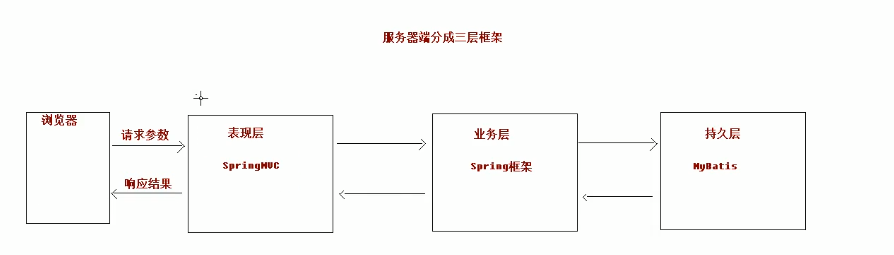

[TOC]


# 1 SpringMVC

# 一 SpringMVC的基本概念

## 1 三层架构和MVC

### 1.1 三层架构

我们使用

SpringMVC开发表现层

Spring开发业务层

Mybatis开发持久层





### 1.2 MVC模型

MVC是Model，View，Controller的缩写，是我们**开发表现层的常用设计模型**。

[点击打开资料](D:\WHU\JavaEE\Javaspring_mybatis_springmvc\SpringMVC\SpringMVC-01\资料)

我们用Model封装数据，View展示数据，Controller用于处理数据。


## 2 SpringMVC概述

### 2.1 概念

SpringMVC是Java的实现MVC设计模型的请求驱动类型的轻量级Web框架。是现在的主流web开发框架。


### 2.2 SpringMVC在三层架构中的位置


### 2.3 优势

模块开发极好，支持扩展。

[点击打开资料](D:\WHU\JavaEE\Javaspring_mybatis_springmvc\SpringMVC\SpringMVC-01\资料)


### 

### 2.4 SpringMVC和Struts2的优劣分析

该部分面试可能考到，但我们只要大概了解即可，不需要掌握Struts2


# 二 SpringMVC的入门案例

## 1 入门需求

用户发送一个请求，如果请求成功了，则返回一个请求成功的页面。


## 2 搭建环境

1. 创建Webapp工程

   

2. 在创建项目的时候添加一组键值对 archetypeCatalog=internal。可以解决项目创建过慢的问题。不过我们创建项目由于配置了阿里云的maven仓库，就没有这个问题了。

   

3. 创建完以后工程的文件夹目录如下，和黑马老师的是不一样的，我们自动配置了很多需要收到配置的文件目录结构：

   

4. 一键复制粘贴导入pom.xml的Jar包，其实在我们创建工程的时候就自动配置好了，但是黑马提供的这个pom.xml更好，它提供了spring框架的jar包绑定，以后我们需要更换spring版本的时候，只需要更改`spring.version`标签中指定的版本即可。

   ```xml
   <?xml version="1.0" encoding="UTF-8"?>
   
   <project xmlns="http://maven.apache.org/POM/4.0.0" xmlns:xsi="http://www.w3.org/2001/XMLSchema-instance"
     xsi:schemaLocation="http://maven.apache.org/POM/4.0.0 http://maven.apache.org/xsd/maven-4.0.0.xsd">
     <modelVersion>4.0.0</modelVersion>
   
     <groupId>cn.itcast</groupId>
     <artifactId>springmvc_day01_01_start</artifactId>
     <version>1.0-SNAPSHOT</version>
     <packaging>war</packaging>
   
     <name>springmvc_day01_01_start Maven Webapp</name>
     <!-- FIXME change it to the project's website -->
     <url>http://www.example.com</url>
   
     <properties>
       <project.build.sourceEncoding>UTF-8</project.build.sourceEncoding>
       <maven.compiler.source>1.8</maven.compiler.source>
       <maven.compiler.target>1.8</maven.compiler.target>
       <spring.version>5.0.2.RELEASE</spring.version>
     </properties>
   
     <dependencies>
       <dependency>
         <groupId>org.springframework</groupId>
         <artifactId>spring-context</artifactId>
         <version>${spring.version}</version>
       </dependency>
   
       <dependency>
         <groupId>org.springframework</groupId>
         <artifactId>spring-web</artifactId>
         <version>${spring.version}</version>
       </dependency>
   
       <dependency>
         <groupId>org.springframework</groupId>
         <artifactId>spring-webmvc</artifactId>
         <version>${spring.version}</version>
       </dependency>
   
       <dependency>
         <groupId>javax.servlet</groupId>
         <artifactId>servlet-api</artifactId>
         <version>2.5</version>
         <scope>provided</scope>
       </dependency>
   
       <dependency>
         <groupId>javax.servlet.jsp</groupId>
         <artifactId>jsp-api</artifactId>
         <version>2.0</version>
         <scope>provided</scope>
       </dependency>
   
     </dependencies>
   
     <build>
       <finalName>springmvc_day01_01_start</finalName>
       <pluginManagement><!-- lock down plugins versions to avoid using Maven defaults (may be moved to parent pom) -->
         <plugins>
           <plugin>
             <artifactId>maven-clean-plugin</artifactId>
             <version>3.0.0</version>
           </plugin>
           <!-- see http://maven.apache.org/ref/current/maven-core/default-bindings.html#Plugin_bindings_for_war_packaging -->
           <plugin>
             <artifactId>maven-resources-plugin</artifactId>
             <version>3.0.2</version>
           </plugin>
           <plugin>
             <artifactId>maven-compiler-plugin</artifactId>
             <version>3.7.0</version>
           </plugin>
           <plugin>
             <artifactId>maven-surefire-plugin</artifactId>
             <version>2.20.1</version>
           </plugin>
           <plugin>
             <artifactId>maven-war-plugin</artifactId>
             <version>3.2.0</version>
           </plugin>
           <plugin>
             <artifactId>maven-install-plugin</artifactId>
             <version>2.5.2</version>
           </plugin>
           <plugin>
             <artifactId>maven-deploy-plugin</artifactId>
             <version>2.8.2</version>
           </plugin>
         </plugins>
       </pluginManagement>
     </build>
   </project>
   
   ```

5. 配置前端控制器

   ```xml
   <!DOCTYPE web-app PUBLIC
    "-//Sun Microsystems, Inc.//DTD Web Application 2.3//EN"
    "http://java.sun.com/dtd/web-app_2_3.dtd" >
   
   <web-app>
     <display-name>Archetype Created Web Application</display-name>
   
     <!--配置前端控制器-->
     <servlet>
       <servlet-name>dispatcherServlet</servlet-name>
       <servlet-class>org.springframework.web.servlet.DispatcherServlet</servlet-class>
       <init-param>
           <!--设定要加载的配置文件的路径-->
         <param-name>contextConfigLocation</param-name>
         <param-value>classpath:springmvc.xml</param-value>
       </init-param>
         <!--启动服务器时即加载配置-->
       <load-on-startup>1</load-on-startup> 
     </servlet>
     <servlet-mapping>
       <servlet-name>dispatcherServlet</servlet-name>
       <url-pattern>/</url-pattern> <!--斜杠表示所有的请求都会经过该控制器-->
     </servlet-mapping>
   
     <!--配置解决中文乱码的过滤器-->
     <filter>
       <filter-name>characterEncodingFilter</filter-name>
       <filter-class>org.springframework.web.filter.CharacterEncodingFilter</filter-class>
       <init-param>
         <param-name>encoding</param-name>
         <param-value>UTF-8</param-value>
       </init-param>
     </filter>
     <filter-mapping>
       <filter-name>characterEncodingFilter</filter-name>
       <url-pattern>/*</url-pattern>
     </filter-mapping>
   
   </web-app>
   
   ```

   

6. 将项目部署到本地服务器上，参见[本章第三小节](#3 Tomcat部署到本地)

   


## 3 Tomcat部署到本地

首先我们要安装tomcat，教程：https://www.jianshu.com/p/4d1007d1f548

我们的tomcat的保存路径如图：


然后创建服务器配置，教程参见CSDN：https://blog.csdn.net/pan_junbiao/article/details/89639004

之后接着按照视频操作即可。


## 4 工程代码编写

### 4.1 输出Hello

①首先我们先要在resources文件夹下创建一个springmvc.xml配置文件，用于导入spring框架，并且指定IOC容器需要扫描的包的位置，并开启对注解开发的支持。

在这里我们还需要配置**视图解析器**，用于指定我们编写的页面代码的存放路径以及后缀：

- prefix配置文件目录
- suffix配置文件的后缀


**注意：**开启SpringMVC框架的注解支持的同时也自动加载了注解映射器和适配器。


```xml
<?xml version="1.0" encoding="UTF-8"?>
<beans xmlns="http://www.springframework.org/schema/beans"
       xmlns:mvc="http://www.springframework.org/schema/mvc"
       xmlns:context="http://www.springframework.org/schema/context"
       xmlns:xsi="http://www.w3.org/2001/XMLSchema-instance"
       xsi:schemaLocation="
        http://www.springframework.org/schema/beans
        http://www.springframework.org/schema/beans/spring-beans.xsd
        http://www.springframework.org/schema/mvc
        http://www.springframework.org/schema/mvc/spring-mvc.xsd
        http://www.springframework.org/schema/context
        http://www.springframework.org/schema/context/spring-context.xsd">

    <!-- 开启注解扫描 -->
    <context:component-scan base-package="cn.itcast"/>

    <!-- 视图解析器对象 -->
    <bean id="internalResourceViewResolver" class="org.springframework.web.servlet.view.InternalResourceViewResolver">
        <property name="prefix" value="/WEB-INF/pages/"/>
        <property name="suffix" value=".jsp"/>
    </bean>

    <!--配置自定义类型转换器-->
    <bean id="conversionService" class="org.springframework.context.support.ConversionServiceFactoryBean">
        <property name="converters">
            <set>
                <bean class="cn.itcast.utils.StringToDateConverter"/>
            </set>
        </property>
    </bean>


    <!-- 开启SpringMVC框架注解的支持 -->
    <mvc:annotation-driven conversion-service="conversionService"/>

</beans>
```

②然后我们需要编写一个controller类，来进行输出Hello的控制。

为了告诉spring这是一个要假如到IOC容器的component，我们使用@Controller注解，@Controller专门用于指明表现层的组件。

同时为了告诉springmvc我们调用sayHello方法的请求路径，我们还需要使用@RequestMapping注解。

**注意，这里的方法时return "success"，有一个十分有趣的默认，那就是spring会默认返回一个叫做success的.jsp页面，为了找到该界面，就需要配置试图解析器。**

```java
package cn.itcast.controller;

import org.springframework.stereotype.Controller;
import org.springframework.web.bind.annotation.RequestMapping;

// 控制器类
@Controller
@RequestMapping(path="/user")
public class HelloController {

    /**
     * 入门案例
     * @return
     */
    @RequestMapping(path="/hello")
    public String sayHello(){
        System.out.println("Hello StringMVC");
        return "success";
    }

    /**
     * RequestMapping注解
     * @return
     */
    @RequestMapping(value="/testRequestMapping",params = {"username=heihei"},headers = {"Accept"})
    public String testRequestMapping(){
        System.out.println("测试RequestMapping注解...");
        return "success";
    }

}

```

href是一个相对路径的写法。[a href标签的作用讲解](https://www.w3school.com.cn/tags/att_a_href.asp)

```jsp
<%--
  Created by IntelliJ IDEA.
  User: Administrator
  Date: 2018/4/29
  Time: 0:53
  To change this template use File | Settings | File Templates.
--%>
<%@ page contentType="text/html;charset=UTF-8" language="java" %>
<html>
<head>
    <title>Title</title>
</head>
<body>

    <h3>入门程序</h3>
    <%--
        <a href="hello">入门程序</a>
    <%--href="hello"的意思是如果一会发请求，就会执行path为/hello的方法--%>
    --%>

    <a href="user/testRequestMapping?username=heihei">RequestMapping注解</a>

</body>
</html>

```

咱们的入门成功的返回界面的代码如下：

```jsp
<%--
  Created by IntelliJ IDEA.
  User: Administrator
  Date: 2018/4/29
  Time: 1:02
  To change this template use File | Settings | File Templates.
--%>
<%@ page contentType="text/html;charset=UTF-8" language="java" isELIgnored="false" %>
<html>
<head>
    <title>Title</title>
</head>
<body>

    <h3>入门成功</h3>

    ${ msg }

    ${sessionScope}

</body>
</html>

```


## 5 入门案例的流程总结

其实这可以理解为开发一个简单web项目的通用流程

- 启动服务器，加载一些配置文件。**(创建对象，让注解生效)**
  - DispatcherServlet对象被创建
  - springmvc.xml被加载了
  - Hellocontroller被创建成了对象放入IOC容器中

- 发送请求，后端处理请求，然后根据返回的页面在试图解析器中解析找到页面返回给前端显示。


[详细springmvc执行流程原理图，请点击！](images/springmvc执行流程原理.jpg)


## 6 ResultMapping注解(重点)

### 6.1 简介

`@ResultMapping`是一个配置路由的注解，配置在Controller类的上方则每个需要改controller类响应的请求，都必须要经过该路由，加在类方法的上方，则需要在满足类的路由（如有)的前提下再满足方法的路由配置才可以被方法响应。

```java
// 控制器类
@Controller
@RequestMapping(path="/user")
public class HelloController {

    /**
     * 入门案例
     * @return
     */
    @RequestMapping(path="/hello")
    public String sayHello(){
        System.out.println("Hello StringMVC");
        return "success";
    }

    /**
     * RequestMapping注解
     * @return
     */
    @RequestMapping(value="/testRequestMapping",params = {"username=heihei"},headers = {"Accept"})
    public String testRequestMapping(){
        System.out.println("测试RequestMapping注解...");
        return "success";
    }

}
```

### 6.2 注解的属性

- value的别名是path，二者作用是相同的：用于指定请求的URL。只有一个属性时，value可省略不写。即@RequestMapping(value="/hello")和@RequestMapping("/hello")的作用是一样的。

- method：用于指定请求的方法是get还是post，put，delete。是一个RequestMethod枚举类对象的数组。

  写法如(前端的默认请求是GET)：

  ```java
  @RequestMapping(value="/testRequestMapping",method={RequestMethod.GET})
  ```

  

- params

  


- headers：用于指定限制消息头的条件。(不常用)


**补充：**POST请求的Jsp代码如下：

```jsp
<!-- 请求方式的示例 -->
<a href="account/saveAccount">保存账户，get 请求</a>
<br/>
<form action="account/saveAccount" method="post">
<input type="submit" value="保存账户，post 请求">
</form>
```


# 三 请求参数的绑定(重点)

## 1 绑定机制

即将请求的表单中的参数自动传入到方法的参数中调用方法。

[绑定机制说明图](images/image-20201104193213658.png)

## 2 支持的数据类型


## 3 Get请求的参数绑定

```jsp
<a href="user/testRequestMapping?username=heihei">RequestMapping注解</a>
```

```java
    /**
     * RequestMapping注解
     * @return
     */
    @RequestMapping(value="/testRequestMapping",headers = {"Accept"})
    public String testRequestMapping(String username){
        System.out.println("测试RequestMapping注解...");
        return "success";
    }

```


## 4 Post请求的参数绑定

### 4.1 简单POST

注意提交的表单对象的属性名必须与需要解析的java类对象的属性名相同。

```jsp
<%--
  Created by IntelliJ IDEA.
  User: Administrator
  Date: 2018/4/29
  Time: 22:10
  To change this template use File | Settings | File Templates.
--%>
<%@ page contentType="text/html;charset=UTF-8" language="java" %>
<html>
<head>
    <title>Title</title>
</head>
<body>


    <%--把数据封装Account类中，类中存在list和map的集合 --%>  
    <form action="param/saveAccount" method="post">
        姓名：<input type="text" name="username" /><br/>
        密码：<input type="text" name="password" /><br/>
        金额：<input type="text" name="money" /><br/>
        <input type="submit" value="提交" />
    </form>
	

    <a href="param/testServlet">Servlet原生的API</a>

</body>
</html>

```

我们的前端界面这时就是一个表单，我们只需要输入数据提交即可:


### 4.2 传递为类对象的属性

如果我们的Account类对象中有一个User类对象属性呢？我们该如何在表单传递User类对象呢？这时候我们只需要传user.xxxx，把user的xxxx属性都传过来即可写法如下:

```jsp
<%--
  Created by IntelliJ IDEA.
  User: Administrator
  Date: 2018/4/29
  Time: 22:10
  To change this template use File | Settings | File Templates.
--%>
<%@ page contentType="text/html;charset=UTF-8" language="java" %>
<html>
<head>
    <title>Title</title>
</head>
<body>

    <%--请求参数绑定--%>

    把数据封装Account类中
    <form action="param/saveAccount" method="post">
        姓名：<input type="text" name="username" /><br/>
        密码：<input type="text" name="password" /><br/>
        金额：<input type="text" name="money" /><br/>
        用户姓名：<input type="text" name="user.uname" /><br/>
        用户年龄：<input type="text" name="user.age" /><br/>
        <input type="submit" value="提交" />
    </form>

    <a href="param/testServlet">Servlet原生的API</a>

</body>
</html>

```


### 4.3 传递集合类属性

如果我们的Account类对象的User是一个集合，而且有别的集合怎么办？

```java
package cn.itcast.domain;

import java.io.Serializable;
import java.util.List;
import java.util.Map;

public class Account implements Serializable{

    private String username;
    private String password;
    private Double money;

   // private User user;

    private List<User> list;
    private Map<String,User> map;

    public String getUsername() {
        return username;
    }

    public void setUsername(String username) {
        this.username = username;
    }

    public String getPassword() {
        return password;
    }

    public void setPassword(String password) {
        this.password = password;
    }

    public Double getMoney() {
        return money;
    }

    public void setMoney(Double money) {
        this.money = money;
    }

    public List<User> getList() {
        return list;
    }

    public void setList(List<User> list) {
        this.list = list;
    }

    public Map<String, User> getMap() {
        return map;
    }

    public void setMap(Map<String, User> map) {
        this.map = map;
    }

    /*

    public User getUser() {
        return user;
    }

    public void setUser(User user) {
        this.user = user;
    }
*/

    @Override
    public String toString() {
        return "Account{" +
                "username='" + username + '\'' +
                ", password='" + password + '\'' +
                ", money=" + money +
                ", list=" + list +
                ", map=" + map +
                '}';
    }
}

```

传表单的方法:

list[0].umane的意思是将uname封装到list的0对象上。

```jsp
<%--
  Created by IntelliJ IDEA.
  User: Administrator
  Date: 2018/4/29
  Time: 22:10
  To change this template use File | Settings | File Templates.
--%>
<%@ page contentType="text/html;charset=UTF-8" language="java" %>
<html>
<head>
    <title>Title</title>
</head>
<body>


    <%--把数据封装Account类中，类中存在list和map的集合    --%>
    <form action="param/saveAccount" method="post">
        姓名：<input type="text" name="username" /><br/>
        密码：<input type="text" name="password" /><br/>
        金额：<input type="text" name="money" /><br/>

        用户姓名：<input type="text" name="list[0].uname" /><br/>
        用户年龄：<input type="text" name="list[0].age" /><br/>

        用户姓名：<input type="text" name="map['one'].uname" /><br/>
        用户年龄：<input type="text" name="map['one'].age" /><br/>
        <input type="submit" value="提交" />
    </form>


    <a href="param/testServlet">Servlet原生的API</a>

</body>
</html>

```


## 5 特殊情况

假如用户有一个Date属性表示生日。

```java
private Date date;
```

如果我们输入`2000/11/11`这种正常的日期格式，springmvc也能够将其从字符串封装成Date类型的日期。

当如果我们输入2000-11-11这种错误格式就会封装失败。这时候我们就要用到`自定义类型转换器`

### 5.1 自定义类型转换器

创建一个新的包叫utils，在下面创建我们的自定义类型转换器类。由于我们的转换器实现了String向Date转换的接口，所以之后的请求如果出现了将String向Date转换的案例，则会直接寻求自定义的实现是否能够满足要求，即自定义的转换会取代默认。

```java
package cn.itcast.utils;

import org.springframework.core.convert.converter.Converter;

import java.text.DateFormat;
import java.text.SimpleDateFormat;
import java.util.Date;

/**
 * 把字符串转换日期
 */
public class StringToDateConverter implements Converter<String,Date>{

    /**
     * String source    传入进来字符串
     * @param source
     * @return
     */
    public Date convert(String source) {
        // 判断
        if(source == null){
            throw new RuntimeException("请您传入数据");
        }
        // 新建支持的转换格式
        DateFormat df = new SimpleDateFormat("yyyy-MM-dd");

        try {
            // 把字符串转换日期
            return df.parse(source);
        } catch (Exception e) {
            throw new RuntimeException("数据类型转换出现错误");
        }
    }

}

```


### 5.2 在springmvc.xml中开启自定义类型转换器

class：org.springframework.context.support.ConversionServiceFactoryBean是固定的

property name是固定的

id 我们自己取

bean class是我们的自定义转换器类的全路径

```xml
    <!--配置自定义类型转换器-->
    <bean id="conversionService" class="org.springframework.context.support.ConversionServiceFactoryBean">
        <property name="converters">
            <set>
                <bean class="cn.itcast.utils.StringToDateConverter"/>
            </set>
        </property>
    </bean>
```

然后在mvc标签中开启该转换器

```xml
    <!-- 开启SpringMVC框架注解的支持 -->
    <mvc:annotation-driven conversion-service="conversionService"/>
```


## 6 获取Servelet的原生api

如果我们想获取API的原生对象，如request以及response，那么该如何获取呢？

我们只需要在方法的参数里面写就行了，如下:

```java
    /**
     * 原生的API
     * @return
     */
    @RequestMapping("/testServlet")
    public String testServlet(HttpServletRequest request, HttpServletResponse response){
        System.out.println("执行了...");
        System.out.println(request);

        HttpSession session = request.getSession();
        System.out.println(session);

        ServletContext servletContext = session.getServletContext();
        System.out.println(servletContext);

        System.out.println(response);
        return "success";
    }
```

