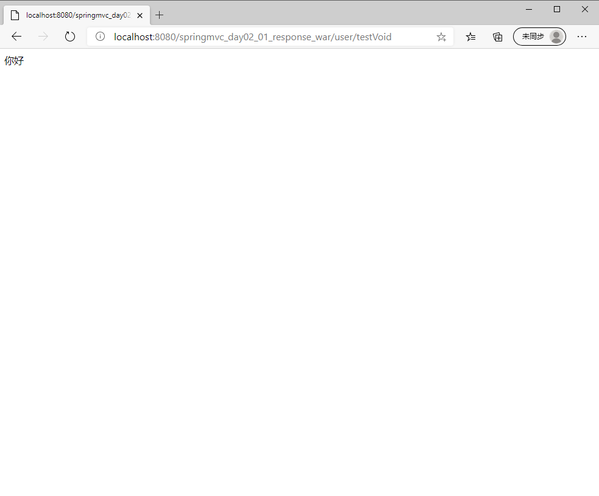
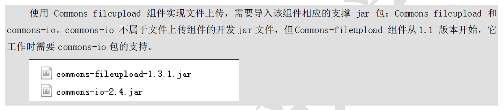
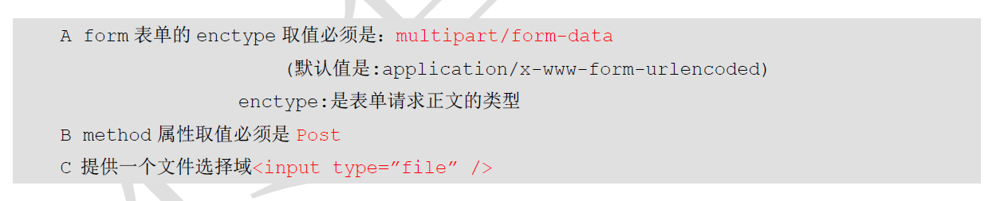
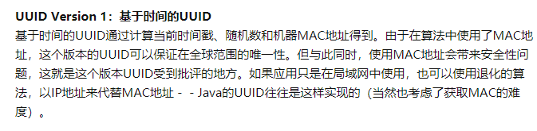
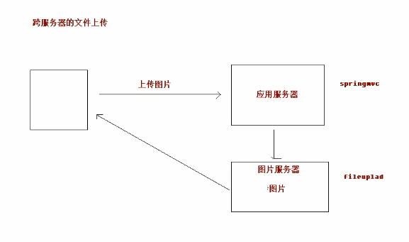
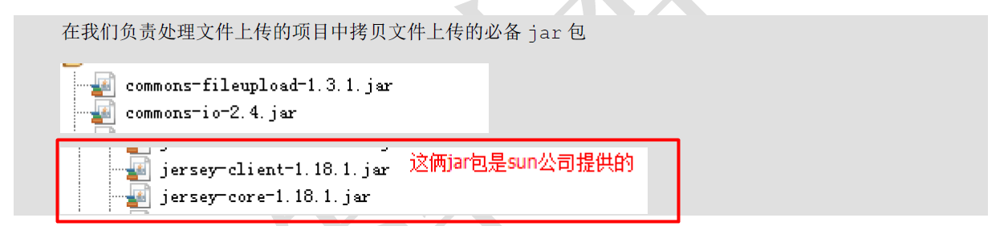
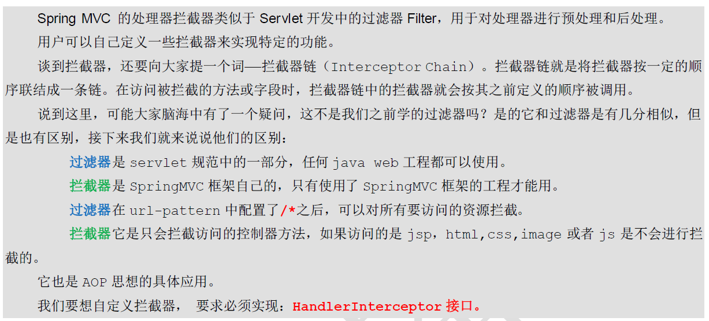
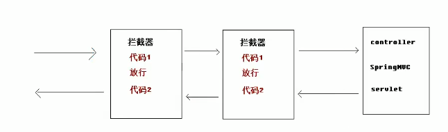

[TOC]


# 2 SpringMVC

今天我们要创建的还是一个webapp项目。

首先我们将昨天项目的web.xml还有pom.xml，springmvc.xml都复制粘贴过来。

# 一 响应数据和结果视图

## 1 返回值类型

### 1.1 字符串

以后开发的常见方式如下：

①后台查数据(此处代码为模拟)放到Map中，即放进了request域中：

```java
package cn.itcast.controller;

import cn.itcast.domain.User;
import org.springframework.stereotype.Controller;
import org.springframework.ui.Model;
import org.springframework.web.bind.annotation.RequestBody;
import org.springframework.web.bind.annotation.RequestMapping;
import org.springframework.web.bind.annotation.ResponseBody;
import org.springframework.web.servlet.ModelAndView;

import javax.servlet.http.HttpServletRequest;
import javax.servlet.http.HttpServletResponse;

@Controller
@RequestMapping("/user")
public class UserController {

    /**
     * 返回String
     * @param model
     * @return
     */
    @RequestMapping("/testString")
    public String testString(Model model){
        System.out.println("testString方法执行了...");
        // 模拟从数据库中查询出User对象
        User user = new User();
        user.setUsername("美美");
        user.setPassword("123");
        user.setAge(30);
        // model对象
        model.addAttribute("user",user);
        return "success";
    }

}

```

②前端通过${}传值展示数据，注意从Map中取值是利用放进Map时声明的键名。如果我们的存法是`model.addAttribute("user2",user)`，那么在取user的username的时候应该用`user2.username`的方式进行调用。

```jsp
<%--
  Created by IntelliJ IDEA.
  User: Administrator
  Date: 2018/5/1
  Time: 1:18
  To change this template use File | Settings | File Templates.
--%>
<%@ page contentType="text/html;charset=UTF-8" language="java" isELIgnored="false" %>
<html>
<head>
    <title>Title</title>
</head>
<body>

    <h3>执行成功</h3>

    ${user.username}
    ${user.password}

</body>
</html>

```

### 1.2 返回void

我们想要用控制器方法返回void，我们不进行return是行不通的。这样会返回一个默认界面，默认界面是根据@RequestMapping的路径来的，比如以下方法就会返回testVoid.jsp页面，如果没有这个页面就会返回错误状态码，所以我需要返回一个页面显示一些东西。

```java
    /**
     * 是void
     * 请求转发一次请求，不用编写项目的名称
     */
    @RequestMapping("/testVoid")
    public void testVoid(HttpServletRequest request, HttpServletResponse response) throws Exception {
        System.out.println("testVoid方法执行了...");

    }
```

解决方法有三种种

#### 1.2.1 编写请求转发的程序

```java
    /**
     * 是void
     * 请求转发一次请求，不用编写项目的名称
     */
    @RequestMapping("/testVoid")
    public void testVoid(HttpServletRequest request, HttpServletResponse response) throws Exception {
        System.out.println("testVoid方法执行了...");
        // 编写请求转发的程序
        request.getRequestDispatcher("/WEB-INF/pages/success.jsp").forward(request,response);


        return;
    }
```

#### 1.2.2 重定向

request.getContextPath()用于获取项目路径，即`http://localhost:8080/springmvc_day02_01_response`

```java
    /**
     * 是void
     * 请求转发一次请求，不用编写项目的名称
     */
    @RequestMapping("/testVoid")
    public void testVoid(HttpServletRequest request, HttpServletResponse response) throws Exception {
        System.out.println("testVoid方法执行了...");

        // 重定向
        response.sendRedirect(request.getContextPath()+"/index.jsp");


        return;
    }
```

#### 1.2.3  直接进行响应

由后台直接通过输出流，将字符输出给浏览器展示。

```java
    /**
     * 是void
     * 请求转发一次请求，不用编写项目的名称
     */
    @RequestMapping("/testVoid")
    public void testVoid(HttpServletRequest request, HttpServletResponse response) throws Exception {
        System.out.println("testVoid方法执行了...");

        // 设置中文乱码
        response.setCharacterEncoding("UTF-8");
        response.setContentType("text/html;charset=UTF-8");

        // 直接会进行响应
        response.getWriter().print("你好");

        return;
    }
```

效果如图所示：




### 1.3 返回ModelAndView

之前我们通过将数据放进model中，然后在jsp页面上通过${}进行调用。这里是另外一种方法。

ModelAndView底层其实也用到了ModelMap，我们可以将User对象存进去。

- mv.addObject 用于将类对象寸金ModelMap
- mv.SetViewName 设置跳转的页面


然后我们依然在跳转的页面用${}取出存在Map中的值就好了。

```java
    /**
     * 返回ModelAndView
     * @return
     */
    @RequestMapping("/testModelAndView")
    public ModelAndView testModelAndView(){
        // 创建ModelAndView对象
        ModelAndView mv = new ModelAndView();
        System.out.println("testModelAndView方法执行了...");
        // 模拟从数据库中查询出User对象
        User user = new User();
        user.setUsername("小凤");
        user.setPassword("456");
        user.setAge(30);

        // 把user对象存储到mv对象中，也会把user对象存入到request对象
        mv.addObject("user",user);

        // 跳转到哪个页面
        mv.setViewName("success");

        return mv;
    }
```


## 2 转发和重定向

转发与重定向的区别：https://blog.csdn.net/meiyalei/article/details/2129120

**主要就是转发是服务器内部操作找到别的资源直接给浏览器显示，重定向相当于告诉客户端你要请求的资源在另外一个url，客户端再根据该url发一次request获取页面**

`<br/>`标签表示在页面上进行一次换行。

讲解教程:https://www.runoob.com/tags/tag-br.html

```jsp
<%--
  Created by IntelliJ IDEA.
  User: Administrator
  Date: 2018/5/1
  Time: 1:16
  To change this template use File | Settings | File Templates.
--%>
<%@ page contentType="text/html;charset=UTF-8" language="java" %>
<html>

<body>

    <a href="user/testString" >testString</a>

    <br/>

    <a href="user/testVoid" >testVoid</a>

    <br/>

    <a href="user/testModelAndView" >testModelAndView</a>

    <br/>

    <a href="user/testForwardOrRedirect" >testForwardOrRedirect</a>

    <br/>

    <button id="btn">发送ajax的请求</button>

</body>
</html>

```

### 2.1 转发

转发使用`forward`指定要转发到的页面，注意使用了该关键字在return的字符串以后，就不能使用视图解析器到页面了，我们要写出相对于webapp文件夹目录的相对路径。

```java
    /**
     * 使用关键字的方式进行转发或者重定向
     * @return
     */
    @RequestMapping("/testForwardOrRedirect")
    public String testForwardOrRedirect(){
        System.out.println("testForwardOrRedirect方法执行了...");

        // 请求的转发
        return "forward:/WEB-INF/pages/success.jsp";
    }
```

### 2.2 重定向

重定向找返回页面的路径也是同理，框架底层实现已经加好了项目的部署路径。我们只要写相对于webapp文件夹的相对路径。

```java
    /**
     * 使用关键字的方式进行转发或者重定向
     * @return
     */
    @RequestMapping("/testForwardOrRedirect")
    public String testForwardOrRedirect(){
        System.out.println("testForwardOrRedirect方法执行了...");


        // 重定向
        return "redirect:/index.jsp";
    }
```


自我补充，如果重定向想重定向到本Module以外的页面，比如百度的查询页面或者别的Module下的页面，可以用以下写法：

```java
@RequestMapping("/redirect")
public String redirect(HttpServletResponse response) {
    System.out.println("redirect");
    return "redirect:http://www.baidu.com";
}

@RequestMapping("/redirect1")
@ResponseBody
public void redirect1(HttpServletResponse response) {
    System.out.println("redirect1");
    try 
    {
    response.sendRedirect("http://www.baidu.com");
    } 
    catch (IOException e) 
    {
    // TODO Auto-generated catch block
    e.printStackTrace();
	}
}
```


## 3 ResponseBody响应Json数据

使用到的新工具jQuery，[查阅中文文档请点击](https://www.jquery123.com/)

### 3.1 环境搭建

- 复制粘贴.js文件

查看b站视频：https://www.bilibili.com/video/BV1Sb411s7qa?p=30


- 让服务器前端控制器不拦截静态资源。典型的静态资源由.js，图片等等

```xml
<?xml version="1.0" encoding="UTF-8"?>
<beans xmlns="http://www.springframework.org/schema/beans"
       xmlns:mvc="http://www.springframework.org/schema/mvc"
       xmlns:context="http://www.springframework.org/schema/context"
       xmlns:xsi="http://www.w3.org/2001/XMLSchema-instance"
       xsi:schemaLocation="
        http://www.springframework.org/schema/beans
        http://www.springframework.org/schema/beans/spring-beans.xsd
        http://www.springframework.org/schema/mvc
        http://www.springframework.org/schema/mvc/spring-mvc.xsd
        http://www.springframework.org/schema/context
        http://www.springframework.org/schema/context/spring-context.xsd">

    <!-- 开启注解扫描 -->
    <context:component-scan base-package="cn.itcast"/>

    <!-- 视图解析器对象 -->
    <bean id="internalResourceViewResolver" class="org.springframework.web.servlet.view.InternalResourceViewResolver">
        <property name="prefix" value="/WEB-INF/pages/"/>
        <property name="suffix" value=".jsp"/>
    </bean>

    <!--前端控制器，哪些静态资源不拦截-->
    <mvc:resources location="/css/" mapping="/css/**"/>
    <mvc:resources location="/images/" mapping="/images/**"/>
    <mvc:resources location="/js/" mapping="/js/**"/>

    <!-- 开启SpringMVC框架注解的支持 -->
    <mvc:annotation-driven />

</beans>
```


### 3.2 发送ajax请求

官方中文文档说明：https://www.jquery123.com/jQuery.ajax/

- url表示请求的路由
- data表示发送的数据
- dataType指定数据的格式，我们这里是json


```jsp
<%--
  Created by IntelliJ IDEA.
  User: Administrator
  Date: 2018/5/1
  Time: 1:16
  To change this template use File | Settings | File Templates.
--%>
<%@ page contentType="text/html;charset=UTF-8" language="java" %>
<html>
<head>
    <title>Title</title>

    <script src="js/jquery.min.js"></script>

    <script>
        // 页面加载，绑定单击事件
        $(function(){
            $("#btn").click(function(){
                // alert("hello btn");
                // 发送ajax请求
                $.ajax({
                    // 编写json格式，设置属性和值
                    url:"user/testAjax",
                    contentType:"application/json;charset=UTF-8",
                    data:'{"username":"hehe","password":"123","age":30}',
                    dataType:"json",
                    type:"post",
                    success:function(data){
                        // data服务器端响应的json的数据，进行解析
                        // alert以警告框的方式展示数据
                        alert(data);
                        alert(data.username);
                        alert(data.password);
                        alert(data.age);
                    }
                });

            });
        });

    </script>

</head>
</html>

```


### 3.3 Controller方法获取请求体的内容

我们在SpringMVC第一天学了一个注解`@RequestBody`，可以以字符串的形式拿到请求体的内容。事实上如果请求发过来的Json数据的键值如果和我们IOC容器中某个Java类的属性名相同，就可以完成**自动封装**，但为了完成这一步我们**需要引用额外的jar包**，这个jar包可以完成json与类对象之间的互转。

这之后我们就可以直接指定controller方法的形参为某个需要封装的类了。这里就是User

```java
    /**
     * 模拟异步请求响应
     */
    @RequestMapping("/testAjax")
    public @ResponseBody User testAjax(@RequestBody User user){
        System.out.println("testAjax方法执行了...");
        // 客户端发送ajax的请求，传的是json字符串，后端把json字符串封装到user对象中
        System.out.println(user);
        // 做响应，模拟查询数据库
        user.setUsername("haha");
        user.setAge(40);
        // 做响应
        return user;
    }
```


- 引用jar包`jackson`

```xml
    <dependency>
      <groupId>com.fasterxml.jackson.core</groupId>
      <artifactId>jackson-databind</artifactId>
      <version>2.9.0</version>
    </dependency>
    <dependency>
      <groupId>com.fasterxml.jackson.core</groupId>
      <artifactId>jackson-core</artifactId>
      <version>2.9.0</version>
    </dependency>
    <dependency>
      <groupId>com.fasterxml.jackson.core</groupId>
      <artifactId>jackson-annotations</artifactId>
      <version>2.9.0</version>
    </dependency>
```


然后由于我们的前端是从response的data中取出数据进行展示的，所以我们要用@ResponseBody注解将方法的返回值封装到response的body中，实际上User也会在这过程中自动转换成json数据。


# 二 SpringMVC实现文件上传

## 1 导入jar包

- 我们首先在第一章的工程基础上导入支持文件上传的jar包。




```xml
    <dependency>
      <groupId>commons-fileupload</groupId>
      <artifactId>commons-fileupload</artifactId>
      <version>1.3.1</version>
    </dependency>
    <dependency>
      <groupId>commons-io</groupId>
      <artifactId>commons-io</artifactId>
      <version>2.4</version>
    </dependency>
```


- 然后需要配置form表单




## 2 传统文件上传代码

### 2.1 前端代码

```jsp
    <h3>传统文件上传</h3>

    <form action="/user/fileupload1" method="post" enctype="multipart/form-data">
        选择文件：<input type="file" name="upload" /><br/>
        <input type="submit" value="上传" />
    </form>
```

### 2.2 后端代码

UUID常用来保证文件名，数据库主键的唯一性。

UUID的简单介绍：https://blog.csdn.net/qq_22260641/article/details/72911694

UUID会重复吗?见知乎讨论：https://www.zhihu.com/question/34876910



```java
    /**
     * 文件上传
     * @return
     */
    @RequestMapping("/fileupload1")
    public String fileuoload1(HttpServletRequest request) throws Exception {
        System.out.println("文件上传...");

        // 使用fileupload组件完成文件上传
        // 上传的位置
        String path = request.getSession().getServletContext().getRealPath("/uploads/");
        // 判断，该路径是否存在
        File file = new File(path);
        if(!file.exists()){
            // 创建该文件夹
            file.mkdirs();
        }

        // 解析request对象，获取上传文件项
        DiskFileItemFactory factory = new DiskFileItemFactory(); // 磁盘文件项工厂
        ServletFileUpload upload = new ServletFileUpload(factory);
        // 解析request
        List<FileItem> items = upload.parseRequest(request);
        // 遍历
        for(FileItem item:items){
            // 进行判断，当前item对象是否是上传文件项
            if(item.isFormField()){
                // 说明普通表单向
            }else{
                // 说明上传文件项
                // 获取上传文件的名称
                String filename = item.getName();
                // 把文件的名称设置唯一值，uuid
                String uuid = UUID.randomUUID().toString().replace("-", "");
                filename = uuid+"_"+filename;
                // 完成文件上传
                item.write(new File(path,filename));
                // 删除临时文件
                item.delete();
            }
        }

        return "success";
    }
```


## 3 SpringMVC上传文件

### 3.1 环境搭建(文件解析器的bean id固定)

在springmvc.xml中配置文件解析器。**注意：这里的bean id不能改，必须是这个。**

```xml
    <!--配置文件解析器对象-->
    <bean id="multipartResolver" class="org.springframework.web.multipart.commons.CommonsMultipartResolver">
        <property name="maxUploadSize" value="10485760" />
    </bean>
```


### 3.2 原理分析

上传请求将文件信息都封装到了request里，然后经过`前端控制器`，控制器进行了过滤、配置请求等一系列操作，然后会交给`文件解析器`，得知处理请求的方法，再由controller的方法进行处理。


我们通过原理图发现，使用框架的方便之处在于可以省去写解析的代码。

### 3.3 前端代码

注意name=的属性名必须与方法的形参名相同。

当然我们也可以用第一天学的`@RequestParam注解`取形参别名。

```jsp
    <h3>Springmvc文件上传</h3>

    <form action="/user/fileupload2" method="post" enctype="multipart/form-data">
        选择文件：<input type="file" name="upload" /><br/>
        <input type="submit" value="上传" />
    </form>
```

### 3.4 后端代码

我们可以看到后端代码主要省去了传统代码解析请求的那几步：

```java
        // 解析request对象，获取上传文件项
        DiskFileItemFactory factory = new DiskFileItemFactory(); // 磁盘文件项工厂
        ServletFileUpload upload = new ServletFileUpload(factory);
        // 解析request
        List<FileItem> items = upload.parseRequest(request);
```

使用框架后的代码如下：

```java
    /**
     * SpringMVC文件上传
     * @return
     */
    @RequestMapping("/fileupload2")
    public String fileuoload2(HttpServletRequest request, MultipartFile upload) throws Exception {
        System.out.println("springmvc文件上传...");

        // 使用fileupload组件完成文件上传
        // 上传的位置
        String path = request.getSession().getServletContext().getRealPath("/uploads/");
        // 判断，该路径是否存在
        File file = new File(path);
        if(!file.exists()){
            // 创建该文件夹
            file.mkdirs();
        }

        // 说明上传文件项
        // 获取上传文件的名称
        String filename = upload.getOriginalFilename();
        // 把文件的名称设置唯一值，uuid
        String uuid = UUID.randomUUID().toString().replace("-", "");
        filename = uuid+"_"+filename;
        // 完成文件上传
        upload.transferTo(new File(path,filename));

        return "success";
    }
```


## 4 Springmvc跨服务器方式的文件上传

### 4.1 分服务器的目的

在实际开发中，我们会有很多处理不同功能的服务器。例如：

- 应用服务器：负责部署我们的
- 应用数据库服务器：运行我们的数据库
- 缓存和消息服务器：负责处理大并发访问的缓存和消息
- 文件服务器：负责存储用户上传文件的服务器。

(注意：此处说的不是服务器集群）


跨服务器上传图片：我们向应用服务器发送请求，应用服务器接受请求后将图片上传到图片服务器。


### 4.2 搭建环境

- 首先我们需要有两个tomcat服务器，分别模拟应用服务器和图片服务器。在一台电脑上运行两个tomcat服务器的教程[请点击这里](在同一台电脑上部署两个tomcat服务器.md)




- 导入支持跨服务器上传文件jersey的Jar包，之后我们要做跨服务器上传文件均使用其中的代码即可。




### 4.3 前端代码

```jsp
    <h3>跨服务器文件上传</h3>

    <form action="user/fileupload3" method="post" enctype="multipart/form-data">
        选择文件：<input type="file" name="upload" /><br/>
        <input type="submit" value="上传" />
    </form>
```


### 4.4 后端代码

我们使用jersey框架提供的客户端Client对象进行资源的上传。

```java
    /**
     * 跨服务器文件上传
     * @return
     */
    @RequestMapping("/fileupload3")
    public String fileuoload3(MultipartFile upload) throws Exception {
        System.out.println("跨服务器文件上传...");

        // 定义上传文件服务器路径
        String path = "http://localhost:9090/fileUploadServer_war/uploads/";

        // 说明上传文件项
        // 获取上传文件的名称
        String filename = upload.getOriginalFilename();
        // 把文件的名称设置唯一值，uuid
        String uuid = UUID.randomUUID().toString().replace("-", "");
        filename = uuid+"_"+filename;

        // 创建客户端的对象
        Client client = Client.create();

        // 和图片服务器进行连接
        WebResource webResource = client.resource(path + filename);

        // 上传文件
        webResource.put(upload.getBytes());

        return "success";
    }
```


# 三 SpringMVC的异常处理

## 1 异常处理思路

需求：当我们的页面请求出现异常时，应该让用户跳转到一个友好的异常页面。比如提示页面正在维护。


## 2 环境搭建

- 复制粘贴之前项目的pom.xml
- 配置springmvc.xml。注意我们这里不再配置文件解析器对象`multipartResolver`，因为这个工程中我们都没有导入springmvc上传文件需要的jar包，配置这个解析器是会报错的。

```xml
<?xml version="1.0" encoding="UTF-8"?>
<beans xmlns="http://www.springframework.org/schema/beans"
       xmlns:mvc="http://www.springframework.org/schema/mvc"
       xmlns:context="http://www.springframework.org/schema/context"
       xmlns:xsi="http://www.w3.org/2001/XMLSchema-instance"
       xsi:schemaLocation="
        http://www.springframework.org/schema/beans
        http://www.springframework.org/schema/beans/spring-beans.xsd
        http://www.springframework.org/schema/mvc
        http://www.springframework.org/schema/mvc/spring-mvc.xsd
        http://www.springframework.org/schema/context
        http://www.springframework.org/schema/context/spring-context.xsd">

    <!-- 开启注解扫描 -->
    <context:component-scan base-package="cn.itcast"/>

    <!-- 视图解析器对象 -->
    <bean id="internalResourceViewResolver" class="org.springframework.web.servlet.view.InternalResourceViewResolver">
        <property name="prefix" value="/WEB-INF/pages/"/>
        <property name="suffix" value=".jsp"/>
    </bean>

    <!--前端控制器，哪些静态资源不拦截-->
    <mvc:resources location="/css/" mapping="/css/**"/>
    <mvc:resources location="/images/" mapping="/images/**"/>
    <mvc:resources location="/js/" mapping="/js/**"/>

    <!--配置异常处理器-->
    <bean id="sysExceptionResolver" class="cn.itcast.exception.SysExceptionResolver"/>

    <!-- 开启SpringMVC框架注解的支持 -->
    <mvc:annotation-driven />

</beans>
```


### 3 前端代码

十分简单的一个超链接标题

```jsp
<%@ page contentType="text/html;charset=UTF-8" language="java" %>
<html>
<head>
    <title>Title</title>
</head>
<body>

    <h3>异常处理</h3>

    <a href="user/testException" >异常处理</a>

</body>
</html>
```


### 4 后端代码

1. 编写自定义异常类(做提示信息的)
2. 编写异常处理器类
3. 配置异常处理器类

### 4.1 编写自定义异常类

记得生成get，set以及构成函数

```java
package cn.itcast.exception;

/**
 * 自定义异常类
 */
public class SysException extends Exception{

    // 存储提示信息的
    private String message;

    public String getMessage() {
        return message;
    }

    public void setMessage(String message) {
        this.message = message;
    }

    public SysException(String message) {
        this.message = message;
    }

}

```

### 4.2 编写异常处理器的类

我们异常处理器类，在方法出问题的时候配置ModelAndView，返回一个处理异常的界面。名字设定为`error`

[ModelAndView的笔记点击这里](# 1.3 返回ModelAndView)

```java
package cn.itcast.exception;

import org.springframework.web.servlet.HandlerExceptionResolver;
import org.springframework.web.servlet.ModelAndView;

import javax.servlet.http.HttpServletRequest;
import javax.servlet.http.HttpServletResponse;

/**
 * 异常处理器
 */
public class SysExceptionResolver implements HandlerExceptionResolver{

    /**
     * 处理异常业务逻辑
     * @param request
     * @param response
     * @param handler
     * @param ex
     * @return
     */
    public ModelAndView resolveException(HttpServletRequest request, HttpServletResponse response, Object handler, Exception ex) {
        // 获取到异常对象
        SysException e = null;
        if(ex instanceof SysException){
            e = (SysException)ex;
        }else{
            e = new SysException("系统正在维护....");
        }
        // 创建ModelAndView对象
        ModelAndView mv = new ModelAndView();
        mv.addObject("errorMsg",e.getMessage());
        mv.setViewName("error");
        return mv;
    }

}
```

### 4.3 配置异常处理器

这里的bean id可以随意取。class的全路径一定要写对

```xml
    <!--配置异常处理器-->
    <bean id="sysExceptionResolver" class="cn.itcast.exception.SysExceptionResolver"/>
```

### 4.4 编写Controller方法


```java
package cn.itcast.controller;

import cn.itcast.exception.SysException;
import org.springframework.stereotype.Controller;
import org.springframework.web.bind.annotation.RequestMapping;

@Controller
@RequestMapping("/user")
public class UserController {

    @RequestMapping("/testException")
    public String testException() throws SysException{
        System.out.println("testException执行了...");

        try {
            // 模拟异常
            int a = 10/0;
        } catch (Exception e) {
            // 打印异常信息
            e.printStackTrace();
            // 抛出自定义异常信息
            throw new SysException("查询所有用户出现错误了...");
        }

        return "success";
    }

}

```


# 四 SpringMVC中的拦截器

## 1 拦截器的作用

预处理：执行controller之前进行的处理

后处理：执行controller之后进行的处理





## 2 环境搭建

复制粘贴之前的工程的web.xml，springmvc.xml，pom.xml即可

## 3 实现拦截器

步骤：

1. 编写一个普通类实现HandlerInterceptor接口
2. 配置拦截器


### 3.1 编写拦截器类

我们在`cn.itcast.controller.cn.itcast.interceptor`路径下新建拦截器类。

该类一定要实现`HandlerInterceptor`接口。

- preHandle方法：
  - 返回值：
    - true表示放行，执行下一个拦截器，如果没有，则执行controller中的方法
    - false表示不放行
  - **常用于做些预处理**
- postHandle方法：在controller执行之后，跳转jsp页面之前执行的方法。比如判断用户是否登录成功，如果成功就跳转到登录成功界面，否则跳转到错误界面。
- afterCompletion方法：在跳转jsp页面之后执行的方法。**一般用于释放资源**

```java
package cn.itcast.controller.cn.itcast.interceptor;

import org.springframework.web.servlet.HandlerInterceptor;
import org.springframework.web.servlet.ModelAndView;

import javax.servlet.http.HttpServletRequest;
import javax.servlet.http.HttpServletResponse;

/**
 * 自定义拦截器
 */
public class MyInterceptor1 implements HandlerInterceptor{

    /**
     * 预处理，controller方法执行前
     * return true 放行，执行下一个拦截器，如果没有，执行controller中的方法
     * return false不放行
     * @param request
     * @param response
     * @param handler
     * @return
     * @throws Exception
     */
    public boolean preHandle(HttpServletRequest request, HttpServletResponse response, Object handler) throws Exception {
        System.out.println("MyInterceptor1执行了...前1111");
        return true;
        // 拦截器不允许controller方法执行，直接跳转到错误页面代码如下：
        // request.getRequestDispatcher("/WEB-INF/pages/error.jsp").forward(request,response);
        // return false
    }

    /**
     * 后处理方法，controller方法执行后，success.jsp执行之前
     * @param request
     * @param response
     * @param handler
     * @param modelAndView
     * @throws Exception
     */
    public void postHandle(HttpServletRequest request, HttpServletResponse response, Object handler, ModelAndView modelAndView) throws Exception {
        System.out.println("MyInterceptor1执行了...后1111");
        // request.getRequestDispatcher("/WEB-INF/pages/error.jsp").forward(request,response);
    }

    /**
     * success.jsp页面执行后，该方法会执行
     * @param request
     * @param response
     * @param handler
     * @param ex
     * @throws Exception
     */
    public void afterCompletion(HttpServletRequest request, HttpServletResponse response, Object handler, Exception ex) throws Exception {
        System.out.println("MyInterceptor1执行了...最后1111");
    }

}
```


### 3.2 配置拦截器(链)

——————————————————————————————————————————————————

**Q:还记得我们的springmvc是如何生效的吗？**

A:这里，我们的springmvc是通过注解配置上的，我们打开了注解扫描，扫描了响应路径下所有的包，如果包中的某个bean类通过`@Component，@Controller，@Service，@Repository注解`被放入了springmvc容器中。此外为了能够让webapp工程知道我们使用了springmvc，我们需要在web.xml中告诉他我们使用的配置文件的路径。

```xml
  <display-name>Archetype Created Web Application</display-name>
  <servlet>
    <servlet-name>dispatcherServlet</servlet-name>
    <servlet-class>org.springframework.web.servlet.DispatcherServlet</servlet-class>
    <init-param>
      <param-name>contextConfigLocation</param-name>
      <param-value>classpath:springmvc.xml</param-value>
    </init-param>
    <load-on-startup>1</load-on-startup>
  </servlet>
  <servlet-mapping>
    <servlet-name>dispatcherServlet</servlet-name>
    <url-pattern>/</url-pattern>
  </servlet-mapping>

```

——————————————————————————————————————————————————

我们在springmvc中进行拦截器链的配置。指定需要拦截的方法路由，或者指定不需要拦截的方法路由。

同时用bean class指定响应的拦截器类。

配置拦截器的springmvc.xml写法如下：

```xml
    <!--配置拦截器-->
    <mvc:interceptors>
        <!--配置拦截器-->
        <mvc:interceptor>
            <!--要拦截的具体的方法-->
            <mvc:mapping path="/user/*"/>
            <!--不要拦截的方法
            <mvc:exclude-mapping path=""/>
            -->
            <!--配置拦截器对象-->
            <bean class="cn.itcast.controller.cn.itcast.interceptor.MyInterceptor1" />
        </mvc:interceptor>

        <!--配置第二个拦截器-->
        <mvc:interceptor>
            <!--要拦截的具体的方法-->
            <mvc:mapping path="/**"/>
            <!--不要拦截的方法
            <mvc:exclude-mapping path=""/>
            -->
            <!--配置拦截器对象-->
            <bean class="cn.itcast.controller.cn.itcast.interceptor.MyInterceptor2" />
        </mvc:interceptor>
    </mvc:interceptors>
```


