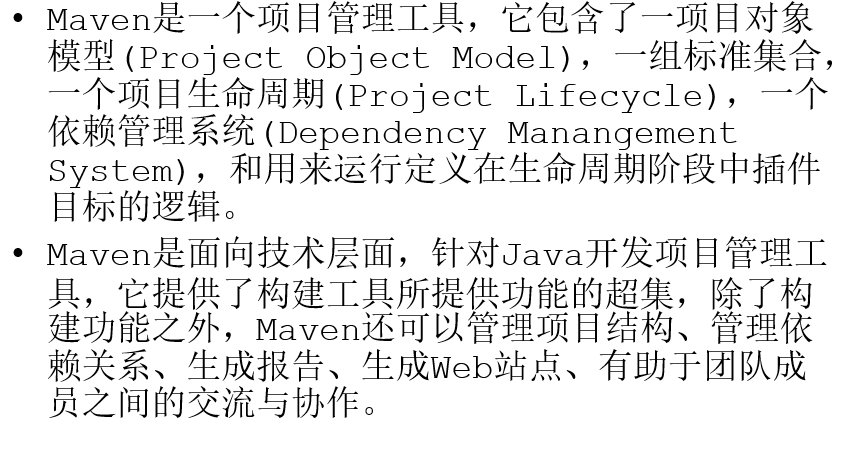

# Java EE总纲

## 1 综合项目

项目后台需要使用SSM框架。

前台使用框架可以加分。

具有优秀的开发文档。

具有软件使用说明书（用户指南）

## 2 要求

①配置好环境跑个测试

②将Maven仓库的地址换成阿里云地址，Maven的配置参考群里的教程视频。

③Maven的核心配置文件是pom.xml，很多坑都出于此处。Maven的作用是将很多的库集中到一起，供全球用户下载。

