# Spring 1

# 一 Spring概述

## 1 spring是什么

IoC：讲解：https://blog.csdn.net/GoGleTech/article/details/79557416

AOP：什么是切面?切面就是在某个关键点共同做的事情。比如我做公交车买票，别人也要买票，这个买票的事情就是一个切面，多个事情的交点就是一个切面。

持久层就是将文件以文件或者数据库的形式存在硬盘中，什么叫做持久化过程呢，就是将流动动态变化的数据放到外存中去。

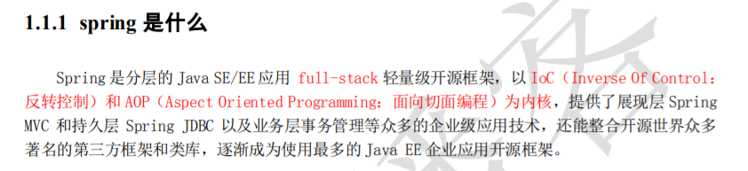

## 2 Spring的优势

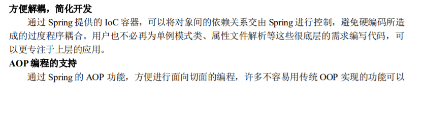

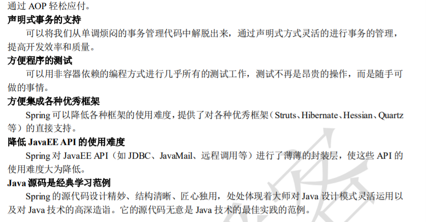

## 3 Spring家族

transaction：业务

instrumentation：仪器

AOP：面向切面编程

**对于Core Container:**

Beans：是内存分配好的对象。

Core：核心代码

Context：上下文

SpEL：Spring的语言表达式

对于SSM，我们管理数据库使用MyBatis。

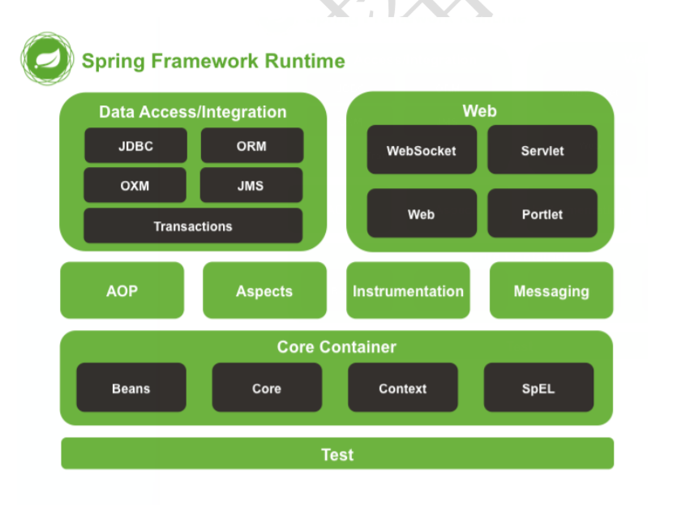

# 二 Ioc的概念和作用

## 1 什么是程序的耦合

程序的耦合度越低越好。

协议是大家普通遵守的一个规范。

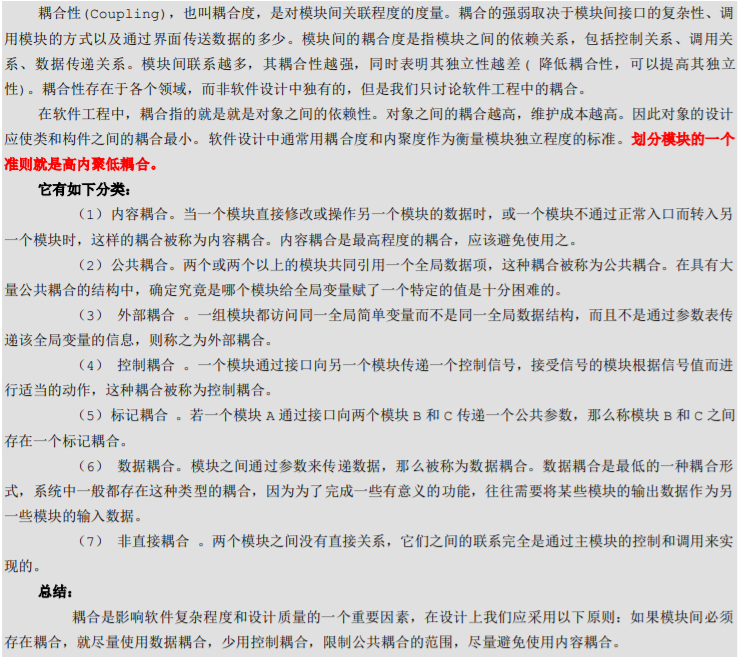

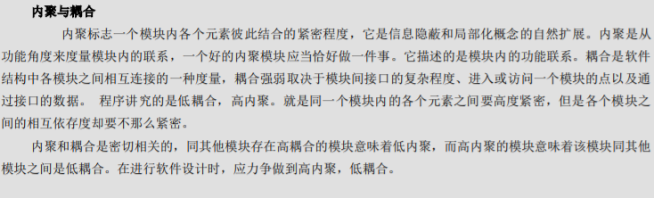

## 2 解决耦合的思路


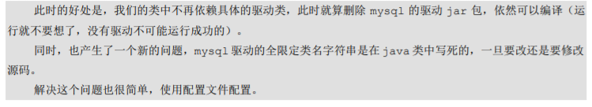

### 2.1 工厂模式解耦

accountService这里是个对象。因为开头是小写。

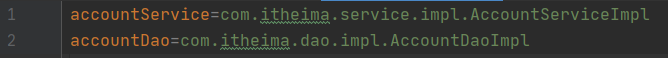

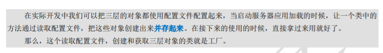

### 2.2 控制反转

原本是我们自己从内存中获取new 对象。

变成工厂模式以后由工厂产生对象。


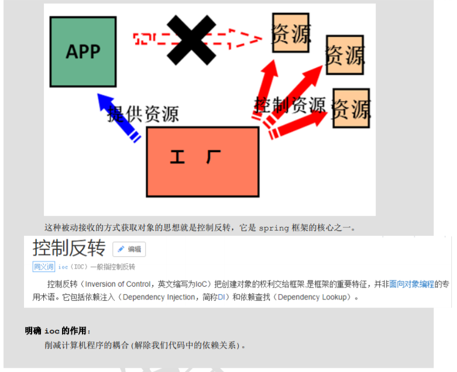

#### 2.2.1 容器

##### 1 多例

每次创建一个新对象，对象的内存地址都不同。

System.out.println表示向控制台输出信息。

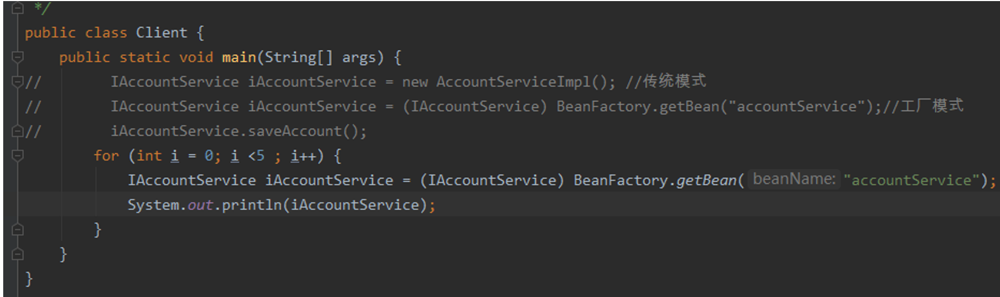

##### 2 单例

为了节省内存，我们每次创建一个对象，回收之前的对象，让新对象使用同样的内存地址。注意：在实际编程中我们不需要自己写工厂，我们可以调用第三方工厂。

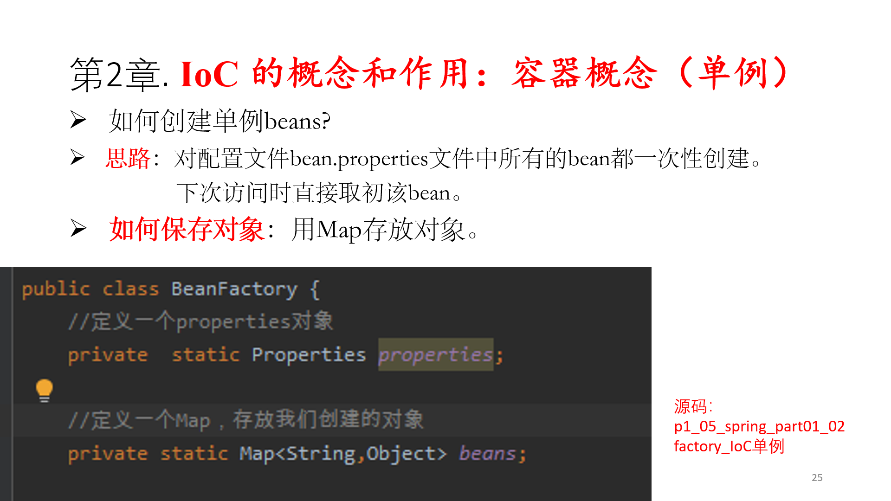

```java
package com.itheima.factory;

import java.io.InputStream;
import java.util.Enumeration;
import java.util.HashMap;
import java.util.Map;
import java.util.Properties;

/**
 * 一个创建Bean对象的工厂
 *
 * Bean：在计算机英语中，有可重用组件的含义。
 * JavaBean：用java语言编写的可重用组件。
 *      javabean >  实体类
 *
 *   它就是创建我们的service和dao对象的。
 *
 *   第一个：需要一个配置文件来配置我们的service和dao
 *           配置的内容：唯一标识=全限定类名（key=value)
 *   第二个：通过读取配置文件中配置的内容，反射创建对象
 *
 *   我的配置文件可以是xml也可以是properties
 */
public class BeanFactory {
    //定义一个Properties对象
    private static Properties props;

    //定义一个Map,用于存放我们要创建的对象。我们把它称之为容器
    private static Map<String,Object> beans;

    //使用静态代码块为Properties对象赋值
    static {
        try {
            //实例化对象
            props = new Properties();
            //获取properties文件的流对象
            InputStream in = BeanFactory.class.getClassLoader().getResourceAsStream("bean.properties");
            props.load(in);
            //实例化容器
            beans = new HashMap<String,Object>();
            //取出配置文件中所有的Key
            Enumeration keys = props.keys();
            //遍历枚举
            while (keys.hasMoreElements()){
                //取出每个Key
                String key = keys.nextElement().toString();
                //根据key获取value
                String beanPath = props.getProperty(key);
                //反射创建对象
                Object value = Class.forName(beanPath).newInstance();
                //把key和value存入容器中
                beans.put(key,value);
            }
        }catch(Exception e){
            throw new ExceptionInInitializerError("初始化properties失败！");
        }
    }

    /**
     * 根据bean的名称获取对象
     * @param beanName
     * @return
     */
    public static Object getBean(String beanName){
        return beans.get(beanName);
    }

}

```

# 三 Spring的工程

## 1 配置方法（普通工程）

PPT33页开始

jar包在下载下来的spring发行版本的libs文件夹中。

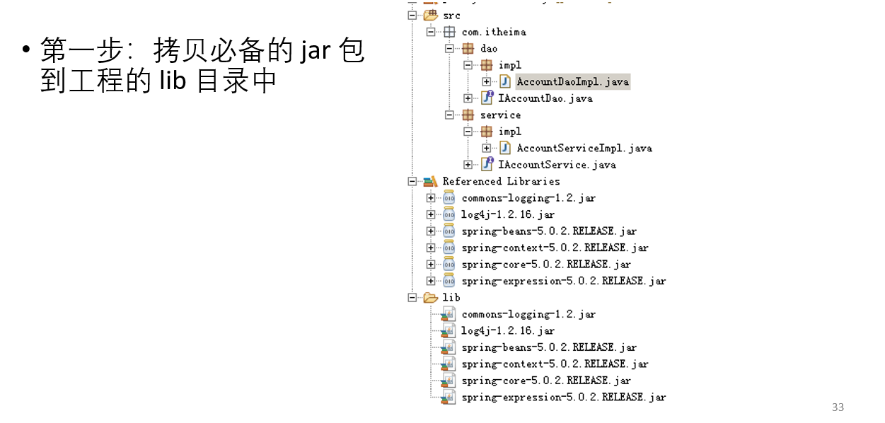

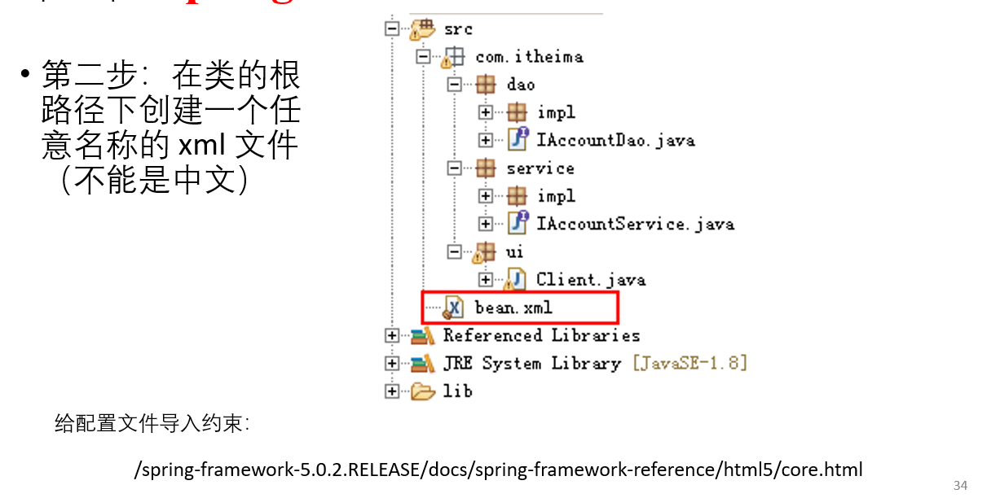

配置文件的约束方式，在Spring的docs文件夹中的references中的core.pdf中有描述。

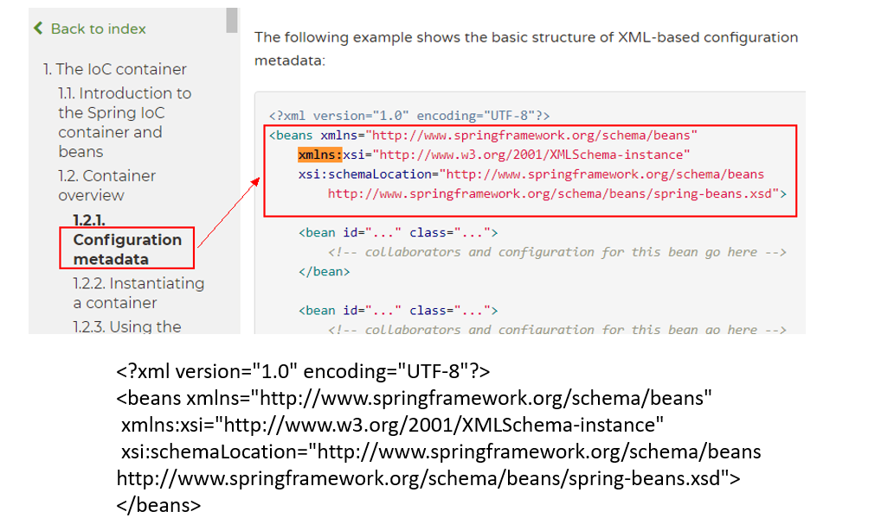

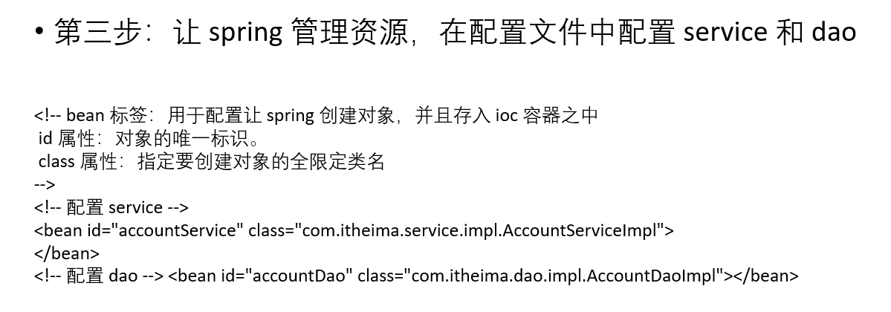