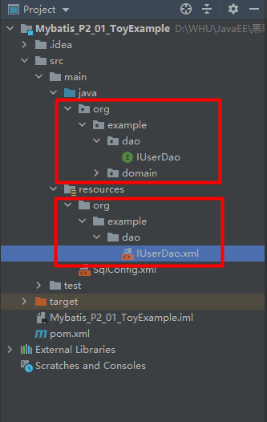
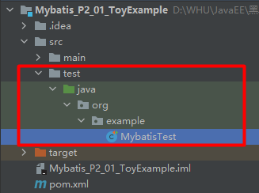
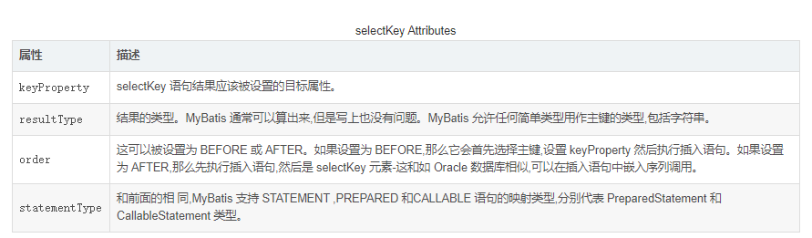
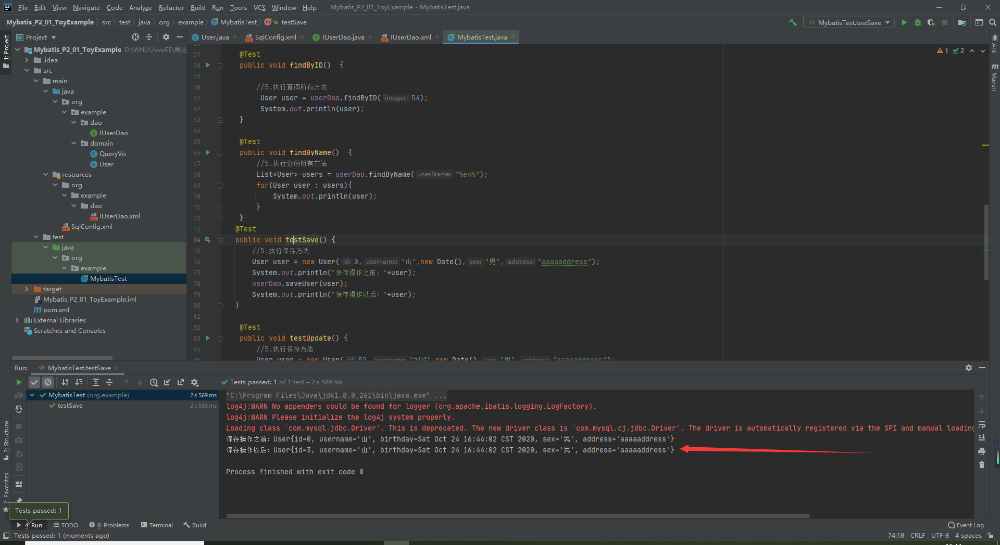
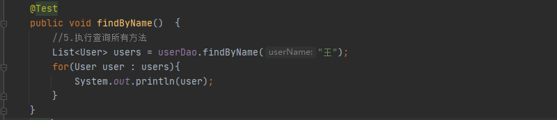
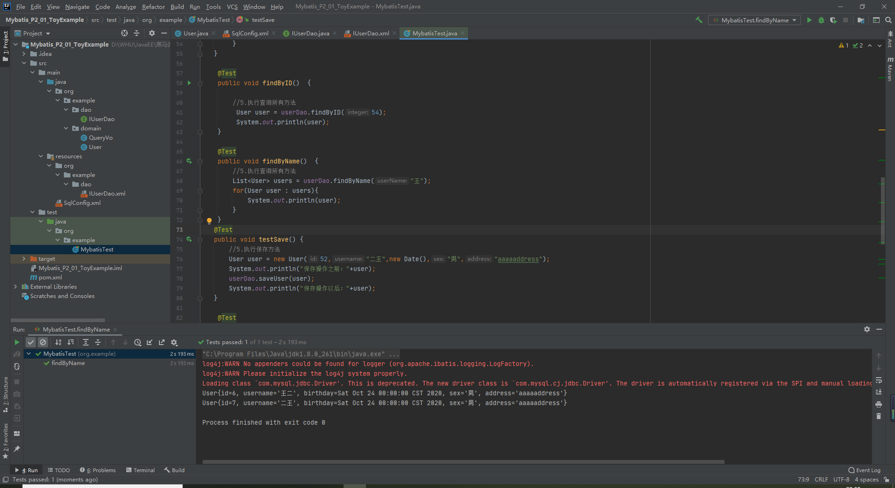
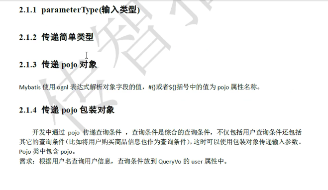
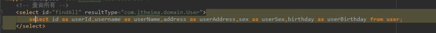
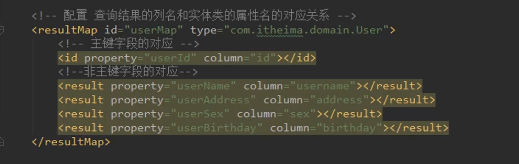
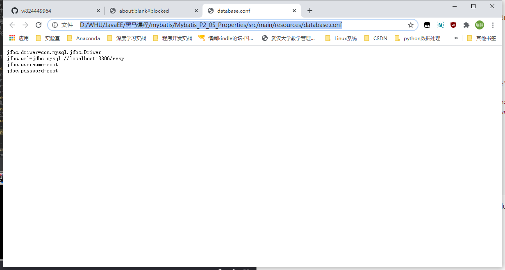

[TOC]


# 2 Mybatis

# 回归环境搭建

## 1 配置pom.xml

配置pom.xml

```xml
<?xml version="1.0" encoding="UTF-8"?>
<project xmlns="http://maven.apache.org/POM/4.0.0"
         xmlns:xsi="http://www.w3.org/2001/XMLSchema-instance"
         xsi:schemaLocation="http://maven.apache.org/POM/4.0.0 http://maven.apache.org/xsd/maven-4.0.0.xsd">
    <modelVersion>4.0.0</modelVersion>

    <groupId>com.itheima</groupId>
    <artifactId>day01_eesy_01mybatis</artifactId>
    <version>1.0-SNAPSHOT</version>
    <packaging>jar</packaging>

    <dependencies>
        <dependency>
            <groupId>org.mybatis</groupId>
            <artifactId>mybatis</artifactId>
            <version>3.4.5</version>
        </dependency>
        <dependency>
            <groupId>mysql</groupId>
            <artifactId>mysql-connector-java</artifactId>
            <version>5.1.6</version>
        </dependency>
        <dependency>
            <groupId>log4j</groupId>
            <artifactId>log4j</artifactId>
            <version>1.2.12</version>
        </dependency>
        <dependency>
            <groupId>junit</groupId>
            <artifactId>junit</artifactId>
            <version>4.10</version>
        </dependency>
    </dependencies>
</project>
```

## 2 配置实体类

实体类的属性名必须与数据库表的字段名相同。然后我们生成实体类属性的get和set方法以及toString方法。

```java
package org.example.domain;

import java.io.Serializable;
import java.util.Date;

public class User implements Serializable {

    private Integer id;
    private String username;
    private Date birthday;
    private String sex;
    private String address;

    public User() {
        this(-1,null,null,null,null);
    }

    public User(Integer id, String username, Date birthday, String sex, String address) {
        this.id = id;
        this.username = username;
        this.birthday = birthday;
        this.sex = sex;
        this.address = address;
    }

    public Integer getId() {
        return id;
    }

    public void setId(Integer id) {
        this.id = id;
    }

    public String getUsername() {
        return username;
    }

    public void setUsername(String username) {
        this.username = username;
    }

    public Date getBirthday() {
        return birthday;
    }

    public void setBirthday(Date birthday) {
        this.birthday = birthday;
    }

    public String getSex() {
        return sex;
    }

    public void setSex(String sex) {
        this.sex = sex;
    }

    public String getAddress() {
        return address;
    }

    public void setAddress(String address) {
        this.address = address;
    }

    @Override
    public String toString() {
        return "User{" +
                "id=" + id +
                ", username='" + username + '\'' +
                ", birthday=" + birthday +
                ", sex='" + sex + '\'' +
                ", address='" + address + '\'' +
                '}';
    }
}
```

## 3 配置mysql以及连接池

在resources文件夹下新建SqlMapConfig.xml配置文件。内容如下：

```xml
<?xml version="1.0" encoding="UTF-8" ?>
<!DOCTYPE configuration
        PUBLIC "-//mybatis.org//DTD Config 3.0//EN"
        "http://mybatis.org/dtd/mybatis-3-config.dtd">
<!-- 配置properties
       可以在标签内部配置连接数据库的信息。也可以通过属性引用外部配置文件信息
       resource属性： 常用的
           用于指定配置文件的位置，是按照类路径的写法来写，并且必须存在于类路径下。
       url属性：
           是要求按照Url的写法来写地址
           URL：Uniform Resource Locator 统一资源定位符。它是可以唯一标识一个资源的位置。
           它的写法：
               http://localhost:8080/mybatisserver/demo1Servlet
               协议      主机     端口       URI

           URI:Uniform Resource Identifier 统一资源标识符。它是在应用中可以唯一定位一个资源的。
   -->
<configuration>
    <environments default="development">
        <environment id="development">
            <transactionManager type="JDBC"/>
            <dataSource type="POOLED">
                <property name="driver" value="com.mysql.jdbc.Driver"/>
                <property name="url" value="jdbc:mysql://localhost:3306/eesy?useUnicode=true&amp;characterEncoding=UTF-8"/>
                <property name="username" value="root"/>
                <property name="password" value="root"/>
            </dataSource>
        </environment>
    </environments>
    <!-- 配置映射文件的位置 -->
    <mappers>
        <mapper resource="org/example/dao/IUserDao.xml"/>
    </mappers>
</configuration>
```

## 4 配置实体类持久层接口

接口中有数据库操作的方法。内容如下：

```java
package org.example.dao;

import org.example.domain.QueryVo;
import org.example.domain.User;

import java.util.List;

public interface IUserDao {
    /**
     * 查询所有用户
     * @return
     */
    List<User> findAll();

    /**
     * 更新用户
     * @param user
     */
    void updateUser(User user);


    /**
     * 保存用户
     * @param user
     */
    void saveUser(User user);

    /**
     * 根据ID查询用户
     * @param integer
     * @return
     */
    User findByID(Integer integer);

    /**
     * 模糊查询用户信息
     * @param userName
     * @return
     */
    List<User> findByName(String userName);

    /**
     * 统计记录总数
     * @return
     */

    /**
     * 删除
     * @param integer
     */
    void delete(Integer integer);

    /**
     * 使用count计数
     * @return
     */
    Integer findTotal();

    /**
     * 使用POJO对象合成查询
     * @param queryVo
     * @return
     */
    List<User> findByQueryVo(QueryVo queryVo);
}

```

## 5 创建映射配置文件

注意映射配置文件是依照接口IUserDao进行编写的，需要满足以下几点要求：

1. 映射配置文件位于resources文件夹下，文件夹接口必须和IUserDao所在的java文件夹下的结构相同

   

2. 用namespace指定持久层接口的全限定类名，用resultType指定我们的查询结果封装到哪里去。内容如下：

   ```xml
   <?xml version="1.0" encoding="UTF-8" ?>
   <!DOCTYPE mapper
           PUBLIC "-//mybatis.org//DTD Mapper 3.0//EN"
           "http://mybatis.org/dtd/mybatis-3-mapper.dtd">
   <mapper namespace="org.example.dao.IUserDao">
       <!--查询所有-->
       <select id="findAll" resultType="org.example.domain.User">
           select * from user;
       </select>
   
       <!--根据ID查询-->
       <select id="findByID" resultType="org.example.domain.User">
           select * from user where id = #{uid};
       </select>
   
       <!--update操作-->
       <update id="updateUser" parameterType="org.example.domain.User" >
           update user set username=#{username},address=#{address},sex=#{sex},birthday=#{birthday} where id=#{id}
       </update>
   
       <!--根据名称模糊查询-->
       <select id="findByName" parameterType="String" resultType="org.example.domain.User">
   <!--         select * from user where username like #{name};  调用是，需要带通配符。userDao.findByName("feng"); -->
           select * from user where username like '%${value}%';
       </select>
   
       <!--保存数据-->
       <insert id="saveUser" parameterType="org.example.domain.User" >
           <selectKey keyProperty="id" keyColumn="id" resultType="int" order="AFTER">
               select last_insert_id();
           </selectKey>
           insert into user(username,birthday,sex,address)value (#{username},#{birthday},#{sex},#{address});
       </insert>
   
       <!--删除数据-->
       <delete id="delete" parameterType="Integer">
           delete from user where id = #{id}
       </delete>
   
       <!--获取用户的总记录数-->
       <select id="findTotal" resultType="Integer" >
           select count(*) from user;
       </select>
   
       <!--根据名称模糊查询-->
       <select id="findByQueryVo" parameterType="org.example.domain.QueryVo" resultType="org.example.domain.User">
           select * from user where username like #{user.username};  <!--调用是，需要带通配符。userDao.findByName("feng");-->
       </select>
   </mapper>
   ```

   

​      

## 6 步骤总结

```
1. 创建maven工程并导入mybatis,mysql,log4j,junit的坐标
2. 创建实体类和dao的接口
3. 创建Mybatis的主配置文件：SqlMapConfig.xml
4. 创建映射配置文件：IUserDao.xml
```

  

​                                                                                                                                                      

## 7 新建test工程进行项目测试

在黑马教程中，test工程通常位于src下的test文件夹下：

- 在这里我们引入Junit的一种新写法：在我们测试mybatis时，经常需要测试写一些获取工厂，开库，关库之类的操作，如果在CRUD每个测试中都写一遍十分拉低效率，其实junit也能配置类似于前置通知，后置通知之类的方法。我们只需要在一个方法上加上==@Before==注解，那么这个方法就会在测试类的测试方法执行之前得到执行，在一个方法上加上==@After==注解，那么这个方法就会在测试类的测试方法执行完毕之后执行。我们可以将开库之类的操作写入一个专门的函数，然后添加==@Before==注解，然后将关库的操作写入一个专门的函数并添加==@After==注解，这样就避免了反复地写开关库的代码。



```java
package org.example;

import org.apache.ibatis.io.Resources;
import org.apache.ibatis.session.SqlSession;
import org.apache.ibatis.session.SqlSessionFactory;
import org.apache.ibatis.session.SqlSessionFactoryBuilder;
import org.example.dao.IUserDao;
import org.example.domain.QueryVo;
import org.example.domain.User;
import org.junit.After;
import org.junit.Before;
import org.junit.Test;

import java.io.InputStream;
import java.util.Date;
import java.util.List;

public class MybatisTest {
    InputStream inputStream = null;
    SqlSession sqlSession = null;
    private  IUserDao userDao;

    @Before
    public void init() throws Exception{
        //1.读取配置文件，生成字节输入流
         inputStream = Resources.getResourceAsStream("SqlConfig.xml");
        //2.获取SqlSessionFactory
        SqlSessionFactory sqlSessionFactory = new SqlSessionFactoryBuilder().build(inputStream);

        //3.SqlSession对象
         sqlSession = sqlSessionFactory.openSession();

        //4.获取dao的代理对象
         userDao = (IUserDao) sqlSession.getMapper(IUserDao.class);

    }

    @After
    public void destroy() throws Exception{
        //6. 提交事务
        sqlSession.commit();

        //7.释放资源
        sqlSession.close();
        inputStream.close();
    }
    @Test
   public void findAll()  {

        //5.执行查询所有方法
        List<User> users = userDao.findAll();
        for(User user : users){
            System.out.println(user);
        }
   }

    @Test
    public void findByID()  {

        //5.执行查询所有方法
         User user = userDao.findByID(54);
         System.out.println(user);
    }

    @Test
    public void findByName()  {
        //5.执行查询所有方法
        List<User> users = userDao.findByName("%en%");
        for(User user : users){
            System.out.println(user);
        }
    }
   @Test
   public void testSave() {
       //5.执行保存方法
       User user = new User(0,"峰",new Date(),"男","aaaaaddress");
       System.out.println("保存操作之前："+user);
       userDao.saveUser(user);
       System.out.println("保存操作以后："+user);
   }

    @Test
    public void testUpdate() {
        //5.执行保存方法
        User user = new User(52,"刘峰",new Date(),"男","aaaaaddress");
        userDao.updateUser(user);
    }

    @Test
    public void testDelete() {
        userDao.delete(62);
    }
   @Test
    public void testFindTotal(){
        Integer integer = userDao.findTotal();
       System.out.println(integer);
   }

    @Test
    public void testFindByQueryVo()  {
        User queryUser = new User();
        QueryVo queryVo = new QueryVo();
        queryUser.setUsername("%王%");
        queryVo.setUser(queryUser);
        //5.执行查询所有方法
        List<User> users = userDao.findByQueryVo(queryVo);
        for(User user : users){
            System.out.println(user);
        }
    }
}

```


# 一 CRUD操作

## 1 保存操作

现在IUserDao持久层实现类中增加一个保存用户的方法saveUser()

```java
    /**
     * 保存用户
     * @param user
     */
    void saveUser(User user);
```

然后我们就要在IUserDao.xml中添加相应的配置。由于保存用户方法实现的是对用户的保存，有参数，在这里我们需要用parameterType告诉xml参数的类型。之后再Inser方法中过使用"#{}"的方式将User的属性作为sql语句的参数传入。

其中**SelectKey标签用来配置插入数据时主键的生成**，对于Mysql一类支持自动增长的数据库，我们通常配置Order为After。[讲解的bolg](https://blog.csdn.net/isea533/article/details/21153791)

KeyProperty对应要设置的实体类的属性的属性名，keyColumn对应表的字段名，resultType对应id的类型，order表示获取Id的操作是在插入执行之前还是执行之后执行。



```xml
    <!--保存数据-->
    <insert id="saveUser" parameterType="org.example.domain.User" >
        <selectKey keyProperty="id" keyColumn="id" resultType="int" order="AFTER">
            select last_insert_id();
        </selectKey>
        insert into user(username,birthday,sex,address)value (#{username},#{birthday},#{sex},#{address});
    </insert>
```

接下来我们来使用junit测试一波：

```java
   @Test
   public void testSave() {
       //5.执行保存方法
       User user = new User(0,"峰",new Date(),"男","aaaaaddress");
       System.out.println("保存操作之前："+user);
       userDao.saveUser(user);
       System.out.println("保存操作以后："+user);
   }
```

通过测试结果我们也能看到selectKey的作用，在我们创建对象时Id是随意给的，但是mybatis能够帮我们在Mysql自动找到正确的Id并且返回到对象中保存。这就避免了我们在后续开发中要用到保存到了数据库的对象的id时再次到数据库查询对象的id的重复操作，避免拉低效率。**见图一**

注意：自动找到的id是表中最大的id的下一位。




## 2 修改和删除操作

依然先在持久层接口IUserDao中添加相应的方法。

```java
    /**
     * 更新用户
     * @param user
     */
    void updateUser(User user);

    /**
     * 删除
     * @param integer
     */
    void delete(Integer integer);
```

然后再配置IUserDao.xml。

这里需要注意的是delete方法的xml配置这里的#{id}的大括号中的参数名与定义方法的参数名integer不相同**，这是因为当方法有且仅有一个参数时，参数名是不重要的，**在mybatis中仅起一个占位符的作用。即可以任意命名。

```xml
    <!--update操作-->
    <update id="updateUser" parameterType="org.example.domain.User" >
        update user set username=#{username},address=#{address},sex=#{sex},birthday=#{birthday} where id=#{id}
    </update>

    <!--删除数据-->
    <delete id="delete" parameterType="Integer">
        delete from user where id = #{id}
    </delete>
```

然后编写Juint测试方法，测试update操作

```java
    @Test
    public void testUpdate() {
        //5.执行保存方法
        User user = new User(52,"刘峰",new Date(),"男","aaaaaddress");
        userDao.updateUser(user);
    }

    @Test
    public void testDelete() {
        userDao.delete(3);
    }
```

## 3 查询一个和模糊查询

写持久层实现类IUserDao中的方法:

```java
    /**
     * 根据ID查询用户
     * @param integer
     * @return
     */
    User findByID(Integer integer);

    /**
     * 模糊查询用户信息
     * @param userName
     * @return
     */
    List<User> findByName(String userName);
```

配置IUserDao.xml文件：

注意：这里些模糊匹配的参数有两种情况：

一种是依旧使用#{}，则为#{name}，这时由于参数没有带通配符，我们在调用方法的时候就需要自己写通配符，比如junit的测试传参数就应该是`%王%`。

另外一种是在xml配置时就写好通配符规则，即

```sql
select * from user where username like '%${value}%';
```


```xml
    <!--根据ID查询-->
    <select id="findByID" resultType="org.example.domain.User">
        select * from user where id = #{uid};
    </select>
    
    <!--根据名称模糊查询-->
    <select id="findByName" parameterType="String" resultType="org.example.domain.User">
<!--         select * from user where username like #{name};  调用是，需要带通配符。userDao.findByName("feng"); -->
        select * from user where username like '%${value}%';
    </select>
```

编写juint测试方法：

```java
    @Test
    public void findByID()  {

        //5.执行查询所有方法
         User user = userDao.findByID(54);
         System.out.println(user);
    }

    @Test
    public void findByName()  {
        //5.执行查询所有方法
        List<User> users = userDao.findByName("%en%"); // 提供模糊匹配的百分号
        for(User user : users){
            System.out.println(user);
        }
    }
```






## 4 查询返回一行一列

编写持久层接口IUserDao

```java
    /**
     * 使用count计数
     * @return
     */
    Integer findTotal();
```

配置IUserDao.xml

```xml
    <!--获取用户的总记录数-->
    <select id="findTotal" resultType="Integer" >
        select count(*) from user;
    </select>
```

编写Junit测试方法

```java
   @Test
    public void testFindTotal(){
        Integer integer = userDao.findTotal();
       System.out.println(integer);
   }
```

# 二 Mybatis中的参数深入



## 1 传递pojo对象

Mybatis使用Ognl表达式解析对象字段的值，#{}或者${}括号中的值为pojo属性名称

### 1.1 OGNL表达式

OGNL全称为Object Graphic Navigation Language，即对象图导航语言。

它是通过对象的取值方法来获取数据，在写法上把get给省略了。

比如：我们获取用户的名称

​	类中的写法：user.getUsername();

​	OGNL表达式写法Luser.username;

**但mybatis中为什么能直接写username,而不用user.呢？**

​	**因为在parameterType中以及提供了属性所属的类，所以此时不需要写对象名。**


为了验证上述说法，我们新写一个方法，根据queryVo的属性进行查询。

我们先新建一个QueryVo类：

```java
package org.example.domain;

public class QueryVo {
    User user;

    public User getUser() {
        return user;
    }

    public void setUser(User user) {
        this.user = user;
    }
}

```

然后在持久层接口IUserDao.java中添加相应的方法：

```java
    /**
     * 使用POJO对象合成查询
     * @param queryVo
     * @return
     */
    List<User> findByQueryVo(QueryVo queryVo);
```

那么配置IUserDao.xml中应该怎么写呢?

因为QueryVo类是没有username属性的，所以在#{}中写username是行不通的，但是QueryVo有一个User类属性user，所以我们可以通过其属性user获取username。

```xml
    <!--根据名称模糊查询-->
    <select id="findByQueryVo" parameterType="org.example.domain.QueryVo" resultType="org.example.domain.User">
        select * from user where username like #{user.username};  <!--调用是，需要带通配符。userDao.findByName("feng");-->
    </select>
```

编写Junit测试方法：

```java
    @Test
    public void testFindByQueryVo()  {
        User queryUser = new User();
        QueryVo queryVo = new QueryVo();
        queryUser.setUsername("%王%");
        queryVo.setUser(queryUser);
        //5.执行查询所有方法
        List<User> users = userDao.findByQueryVo(queryVo);
        for(User user : users){
            System.out.println(user);
        }
    }
```

==这种做法被广泛地应用于实际开发中，即用多个对象类组成一个查询对象类用于查询。==

## 2 当实体类属性名与表字段名不相同

如果我们修改了实体类属性名与表的字段名不相同，比如我们将User类的属性改成了：userId,userName,userAddress,userSex,userBirthday那么我们在执行select方法后查询到的数据库的数据无法封装到对象的属性中，这时候有两种解决方法：

1. 使用==as==声明实体类的实际属性名（取别名)，以查询所有findall的xml配置举例

   ```xml
       <!--查询所有-->
       <select id="findAll" resultType="org.example.domain.User">
           select * from user;
       </select>
   ```

   这时候以上写法是错误的，我们的正确写法如下，取了别名以后我们的数据就可以正确封装了：

   

2. **配置查询结果的列名和实体类的属性名的对应关系**。这时候我们使用一种全新的Mybatis提供的标签即resultMap。如图使用了userMap完成了取别名同样效果的操作。

   

   这时候我们的定义很清晰，但是这时候直接执行findAll方法数据封装还是不成功，这是因为我们的Map并没有被使用，为了将我们定义的resultMap使用到findAll方法中，我们需要修改resultType，告诉Mybatis这时候要按照我们定义的resultMap进行结果的类型封装。这时候的resultType就是resultMap的id。==这种做法相比于前者执行效率变低了，因为需要额外解析一次xml，但是开发效率变高了，因为我们不再需要为了配置每个方法的sql专门写别名。

   ```xml
       <!--查询所有-->
       <select id="findAll" resultType="userMap">
           select * from user;
       </select>
   ```


# 三 Mybatis编写Dao实现类

## 1 环境搭建

首先我们依照Mybatis的环境配置四步走：

- 配置pom.xml
- 配置实体类
- 配置Mysql以及连接池SqlMyConfig.xml
- 编写实体类持久层接口
- 创建映射配置文件IUserDao.xml


## 2 手写IUserDao的实现类

```java
package org.example.dao.impl;

import org.apache.ibatis.session.SqlSession;
import org.apache.ibatis.session.SqlSessionFactory;
import org.example.dao.IUserDao;
import org.example.domain.User;

import java.util.List;

public class UserDao implements IUserDao {
    private SqlSessionFactory factory;
    private SqlSession sqlSession = null;

    public UserDao(SqlSessionFactory factory) {
        this.factory = factory;
    }


    public List<User> findAll() {

        //1.获取session
        sqlSession = factory.openSession();
        //2.调用sqlsession的selectList方法
        List<User> users = sqlSession.selectList("org.example.dao.IUserDao.findAll");
        //3.释放资源
        sqlSession.close();

        return users;

    }
    
    public void updateUser(User user) {
        //1.获取session
        sqlSession = factory.openSession();
        //2.调用sqlsession的update方法
        sqlSession.update("org.example.dao.IUserDao.saveUser", user);
        //4.提交资源
        sqlSession.commit();
        //3.释放资源
        sqlSession.close();

    }

    public void saveUser(User user) {
        //1.获取session
        sqlSession = factory.openSession();
        //2.调用sqlsession的insert方法
        sqlSession.insert("org.example.dao.IUserDao.saveUser", user);
        //4.提交资源
        sqlSession.commit();
        //3.释放资源
        sqlSession.close();
    }
    
    public User findByID(Integer integer) {
        //1.获取session
        sqlSession = factory.openSession();
        //2.调用sqlsession的selectone方法
        User user = sqlSession.selectOne("org.example.dao.IUserDao.findByID", integer);
        //3.释放资源
        sqlSession.close();
        return user;
    }
    
    public List<User> findByName(String userName) {
        //1.获取session
        sqlSession = factory.openSession();
        //2.调用sqlsession的selectList方法
        List<User> users = sqlSession.selectList("org.example.dao.IUserDao.findByName", userName);
        //3.释放资源
        sqlSession.close();
        return users;
    }
    
    public void delete(Integer integer) {
        //1.获取session
        sqlSession = factory.openSession();
        //2.调用sqlsession的insert方法
        sqlSession.delete("org.example.dao.IUserDao.delete", integer);
        //4.提交资源
        sqlSession.commit();
        //3.释放资源
        sqlSession.close();

    }
    
    public Integer findTotal() {
        //1.获取session
        sqlSession = factory.openSession();
        //2.调用sqlsession的selectList方法
        Integer count = sqlSession.selectOne("org.example.dao.IUserDao.findTotal");
        //3.释放资源
        sqlSession.close();

        return count;
    }
}

```

## 3 编写Junit测试方法

经过测试我们发现mybatis是支持我们自己写实现类的，但是这样无形之中就多写了很多代码，所以为了效率，我们一般是不自己写实现类的。

```java
package org.example;

import org.apache.ibatis.io.Resources;
import org.apache.ibatis.session.SqlSession;
import org.apache.ibatis.session.SqlSessionFactory;
import org.apache.ibatis.session.SqlSessionFactoryBuilder;
import org.example.dao.IUserDao;
import org.example.dao.impl.UserDao;
import org.example.domain.User;
import org.junit.After;
import org.junit.Before;
import org.junit.Test;

import java.io.InputStream;
import java.util.Date;
import java.util.List;

public class MybatisTest {
    InputStream inputStream = null;
    SqlSession sqlSession = null;
    private  IUserDao userDao;

    @Before
    public void init() throws Exception{
        //1.读取配置文件，生成字节输入流
         inputStream = Resources.getResourceAsStream("SqlConfig.xml");
        //2.获取SqlSessionFactory
        SqlSessionFactory sqlSessionFactory = new SqlSessionFactoryBuilder().build(inputStream);
        //3.生成对象
         userDao = new UserDao(sqlSessionFactory);

    }

    @After
    public void destroy() throws Exception{
        inputStream.close();
    }
    @Test
   public void findAll()  {

        //4.执行查询所有方法
        List<User> users = userDao.findAll();
        for(User user : users){
            System.out.println(user);
        }
   }

    @Test
    public void findByID()  {

        //5.执行查询所有方法
         User user = userDao.findByID(54);
         System.out.println(user);
    }

    @Test
    public void findByName()  {
        //5.执行查询所有方法
        List<User> users = userDao.findByName("en");
        for(User user : users){
            System.out.println(user);
        }
    }
   @Test
   public void testSave() {
       //5.执行保存方法
       User user = new User(-1,"峰",new Date(),"男","aaaaaddress");
       System.out.println("保存操作之前："+user);
       userDao.saveUser(user);
       System.out.println("保存操作以后："+user);
   }

    @Test
    public void testUpdate() {
        //5.执行保存方法
        User user = new User(52,"刘峰",new Date(),"男","aaaaaddress");
        userDao.updateUser(user);
    }

    @Test
    public void testDelete() {
        //5.执行保存方法
//        User user = new User(52,"刘峰",new Date(),"男","aaaaaddress");
        userDao.delete(53);
    }
   @Test
    public void testFindTotal(){
        Integer integer = userDao.findTotal();
       System.out.println(integer);
   }

}

```


# 四 Mybatis实现类的执行过程分析

跳过。


# 五 SqlMapConfig.xml配置文件

## 1 properties(属性)

在配置数据库xml文件的时候我们除了在dataSource标签中直接配置propertiy

```xml
<?xml version="1.0" encoding="UTF-8" ?>
<!DOCTYPE configuration
        PUBLIC "-//mybatis.org//DTD Config 3.0//EN"
        "http://mybatis.org/dtd/mybatis-3-config.dtd">
<!-- 配置properties
       可以在标签内部配置连接数据库的信息。也可以通过属性引用外部配置文件信息
       resource属性： 常用的
           用于指定配置文件的位置，是按照类路径的写法来写，并且必须存在于类路径下。
       url属性：
           是要求按照Url的写法来写地址
           URL：Uniform Resource Locator 统一资源定位符。它是可以唯一标识一个资源的位置。
           它的写法：
               http://localhost:8080/mybatisserver/demo1Servlet
               协议      主机     端口       URI

           URI:Uniform Resource Identifier 统一资源标识符。它是在应用中可以唯一定位一个资源的。
   -->
<configuration>
    <environments default="development">
        <environment id="development">
            <transactionManager type="JDBC"/>
            <dataSource type="POOLED">
                <property name="driver" value="com.mysql.jdbc.Driver"/>
                <property name="url" value="jdbc:mysql://localhost:3306/eesy?useUnicode=true&amp;characterEncoding=UTF-8"/>
                <property name="username" value="root"/>
                <property name="password" value="root"/>
            </dataSource>
        </environment>
    </environments>
    <!-- 配置映射文件的位置 -->
    <mappers>
        <mapper resource="org/example/dao/IUserDao.xml"/>
    </mappers>
</configuration>
```

我们还可以用properites标签配置好property，然后在配置dataSource进行引用即可：

```xml
<?xml version="1.0" encoding="UTF-8" ?>
<!DOCTYPE configuration
        PUBLIC "-//mybatis.org//DTD Config 3.0//EN"
        "http://mybatis.org/dtd/mybatis-3-config.dtd">
<!-- 配置properties
       可以在标签内部配置连接数据库的信息。也可以通过属性引用外部配置文件信息
       resource属性： 常用的
           用于指定配置文件的位置，是按照类路径的写法来写，并且必须存在于类路径下。
       url属性：
           是要求按照Url的写法来写地址
           URL：Uniform Resource Locator 统一资源定位符。它是可以唯一标识一个资源的位置。
           它的写法：
               http://localhost:8080/mybatisserver/demo1Servlet
               协议      主机     端口       URI

           URI:Uniform Resource Identifier 统一资源标识符。它是在应用中可以唯一定位一个资源的。
   -->
<configuration>
    <properties>
         <property name="driver" value="com.mysql.jdbc.Driver"></property>
         <property name="url" value="jdbc:mysql://localhost:3306/eesy?useUnicode=true&amp;characterEncoding=UTF-8"></property>
         <property name="username" value="root"></property>
         <property name="password" value="root"></property>
    </properties>
    <environments default="development">
        <environment id="development">
            <transactionManager type="JDBC"/>
            <dataSource type="POOLED">
                <property name="driver" value=${driver}/>
                <property name="url" value=${url}/>
                <property name="username" value=${username}/>
                <property name="password" value=${password}/>
            </dataSource>
        </environment>
    </environments>
    <!-- 配置映射文件的位置 -->
    <mappers>
        <mapper resource="org/example/dao/IUserDao.xml"/>
    </mappers>
</configuration>
```

**但是这样看起来特别鸡肋，为什么要把定义挪动到上面去呢?**

其实实际的用法是为了通过属性引用外部文件的信息，我们可以在`jdbcConfig.properties`文件中定义property，然后通过属性标签引用。我们通过properties标签的resource属性引用`jdbcConfig.properties`，之后在value引用时，{}里必须填写`jdbcConfig.properties`相应的键值对的键的名称。

```xml
<?xml version="1.0" encoding="UTF-8" ?>
<!DOCTYPE configuration
        PUBLIC "-//mybatis.org//DTD Config 3.0//EN"
        "http://mybatis.org/dtd/mybatis-3-config.dtd">
<!-- 配置properties
       可以在标签内部配置连接数据库的信息。也可以通过属性引用外部配置文件信息
       resource属性： 常用的
           用于指定配置文件的位置，是按照类路径的写法来写，并且必须存在于类路径下。
       url属性：
           是要求按照Url的写法来写地址
           URL：Uniform Resource Locator 统一资源定位符。它是可以唯一标识一个资源的位置。
           它的写法：
               http://localhost:8080/mybatisserver/demo1Servlet
               协议      主机     端口       URI

           URI:Uniform Resource Identifier 统一资源标识符。它是在应用中可以唯一定位一个资源的。
   -->
<configuration>
    <properties resource="database.conf">
    <!--<properties url="file:///D:/WHU/JavaEE/%E9%BB%91%E9%A9%AC%E8%AF%BE%E7%A8%8B/mybatis/Mybatis_P2_05_Properties/src/main/resources/database.conf">-->
    </properties>
    <environments default="development">
        <environment id="development">
            <transactionManager type="JDBC"/>
            <dataSource type="POOLED">
                <property name="driver" value= "${jdbc.driver}"/>
                <property name="url" value= "${jdbc.url}"/>
                <property name="username" value= "${jdbc.username}"/>
                <property name="password" value= "${jdbc.password}"/>
            </dataSource>
        </environment>
    </environments>
    <!-- 配置映射文件的位置 -->
    <mappers>
        <mapper resource="org/example/dao/IUserDao.xml"/>
    </mappers>
</configuration>
```

要获取一个文件的url特别简单，只需要将文件拖动到浏览器就可以自动获取到url了。

但需要注意的是中文路径的url在xml中是会显示乱码的，所以我们最好用英文的路径，将图示中文路径复制到xml文件后乱码示例如下:

```xml
    <!--<properties url="file:///D:/WHU/JavaEE/%E9%BB%91%E9%A9%AC%E8%AF%BE%E7%A8%8B/mybatis/Mybatis_P2_05_Properties/src/main/resources/database.conf">-->
```



## 2 typeAliases取别名

该标签用于设定别名，可以为长长的全限定类名设定简单易记的别名，提高开发效率。注意别名是不区分大小写的，即取别名user后，在实际使用过程中用USER，User等等都是可以的。

```xml
    <!--使用typeAliases配置别名，它只能配置domain中类的别名 -->
    <typeAliases>
        <!--typeAlias用于配置别名。type属性指定的是实体类全限定类名。alias属性指定别名，当指定了别名就再区分大小写-->
        <typeAlias type="org.example.domain.User" alias="user"></typeAlias>

        <!-- 用于指定要配置别名的包，当指定之后，该包下的实体类都会注册别名，并且类名就是别名，不再区分大小写-->
       <!-- <package name="org.example.domain"></package> -->
    </typeAliases>
```

但是当我们需要配置别名的类很多时，使用typeAlias子标签一个个写还是挺麻烦的，这时候我们可以使用package子标签，当指定之后，该包下的实体类都会自动注册别名，并且类名就是别名，同样不区分大小写。

同样在配置持久层接口类的配置文件时同样能够使用package子标签来进行指定，这样在该包下的文件都会自动添加到映射中。

```xml
    <!-- 配置映射文件的位置 -->
    <mappers>
        <!-- <mapper resource="org/example/dao/IUserDao.xml"/> -->
        <!-- package标签是用于指定dao接口所在的包,当指定了之后就不需要再写mapper以及resource或者class了 -->
        <package name="org.example.dao"></package>
    </mappers>
```

