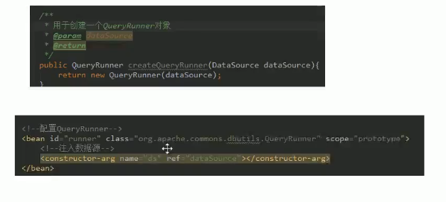
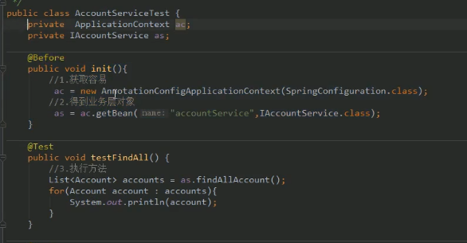

# 2 Spring学习

[TOC]


# 大纲

1. spring中的ioc的常用注解

2. 案例使用xml方式和注解方式实现单表的CRUD操作

   持久层技术选择：dbutils

3. 改造基于注解的ioc案例，使用纯注解的方式实现

   spring的一些新注解使用

4. spring和Junit整合


# 一 Spring中的ioc的常用注解

## 1 写在最前面


## 2 注解的分类

### 简介

xml的配置方式：

```xml
 <bean id="accountService" class="com.itheima.service.impl.AccountServiceImpl">
     scope="" init-method="" destroy-method="">
     <property name="" value="" | ref=""></property>
 </bean>
```


①用于创建对象的：他们的作用就和在XML配置中编写一个<bean>标签实现的功能是一样的。

②用于注入数据的：他们的作用就和在XML配置文件中的bean标签中写一个<property>标签的作用是一样的。

(peoperty标签在第一天基于set方法的注入中讲解了)

```
涉及的标签：property
出现的位置：bean标签的内部
标签的属性：
1. name：用于指定注入时所调用的set方法的名称。
2. value：用于提供基本类型和String类型的数据
3. ref：用于指定其他的bean类型数据，他指的是在spring的IoC核心容器中出现过的bean对象。

优势：
创建对象时没有明确的限制，可以直接使用默认构造函数

弊端：
如果有某个成员必须有值，则获取对象时有可能set方法没有执行。
```

例子：和构造函数注入十分相似，只不过标签变成了property，构造函数也被我们删除掉了。


③用于改变作用范围的：他们的作用就和在bean标签中使用scope属性实现的功能是一样的。


④和生命周期相关的：他们的作用就和在bean标签中使用init-method和destroy-method的作用是一样的。init-method是创建对象时调用的初始化操作，destroy-method则是销毁对象时调用的操作。


四种注解声明：

- Component：**作用**：用于把当前类对象存入spring容器中。**属性：**value：用于指定bean的id，当我们不写时，它的默认值时当前类名，且首写字母改小写。
- 还有Controller，Service，Repository三种注解，他们的作用和属性是与Component一模一样的，创建这三个注解的目的是为我们提供明确的三层使用的注解，使我们的三层对象更加清晰。其中**Controller一般用在表现层，Service一般用在业务层，Repository一般用在持久层。**

### 2.1 用于创建对象的

#### 1 前期准备

为了使用该注解注入，首先要配置xml文件：

去spring框架的docs中找到core.html，在其中搜索到xmlns:context，然后赋值以下内容：

```xml
<beans xmlns="http://www.springframework.org/schema/beans"
    xmlns:xsi="http://www.w3.org/2001/XMLSchema-instance"
    xmlns:context="http://www.springframework.org/schema/context"
    xsi:schemaLocation="http://www.springframework.org/schema/beans
        http://www.springframework.org/schema/beans/spring-beans.xsd
        http://www.springframework.org/schema/context
        http://www.springframework.org/schema/context/spring-context.xsd">
```

然后用其替换bean.xml原理的以下内容：

```xml
<beans xmlns="http://www.springframework.org/schema/beans"
       xmlns:xsi="http://www.w3.org/2001/XMLSchema-instance"
       xsi:schemaLocation="http://www.springframework.org/schema/beans
        http://www.springframework.org/schema/beans/spring-beans.xsd"
>
```

最终内容应该如下：

```xml
<?xml version="1.0" encoding="UTF-8"?>
<beans xmlns="http://www.springframework.org/schema/beans"
       xmlns:xsi="http://www.w3.org/2001/XMLSchema-instance"
       xmlns:context="http://www.springframework.org/schema/context"
       xsi:schemaLocation="http://www.springframework.org/schema/beans
        http://www.springframework.org/schema/beans/spring-beans.xsd
        http://www.springframework.org/schema/context
        http://www.springframework.org/schema/context/spring-context.xsd">
	<context:component-scan base-package="com.itheima"></context:component-scan>
</beans>
```

在初始的maven工程中一般都没有自带bean.xml，所以可以直接复制spring文档中的整个xml配置，新建bean.xml到工程的resources文件夹下，然后粘贴进去：

```xml
<?xml version="1.0" encoding="UTF-8"?>
<beans xmlns="http://www.springframework.org/schema/beans"
    xmlns:xsi="http://www.w3.org/2001/XMLSchema-instance"
    xmlns:context="http://www.springframework.org/schema/context"
    xsi:schemaLocation="http://www.springframework.org/schema/beans
        http://www.springframework.org/schema/beans/spring-beans.xsd
        http://www.springframework.org/schema/context
        http://www.springframework.org/schema/context/spring-context.xsd">

    <context:annotation-config/>

</beans>
```

然后添加需要扫描的注解的子包就行，比如我要扫描所有com.itheima的包，就如下：

```xml
<context:component-scan base-package="com.itheima"></context:component-scan>
```

#### 2 代码修改

在创建对象的工厂类上面加上以下注解：

```
@Component
作用：用于把当前类对象存入spring容器中
属性：
	value：用于指定bean的id。当我们补些时，它的默认值就是当前类名，且首字母改小写。
```

工厂类的注解代码示例如下：

```java
//如果属性只有value这一个，则value可以省略。如果有两个及以上的属性，则必须声明value。
@Component(value = "accountServiceImpl")
public class AccountServiceImpl implements IAccountService {

    private IAccountDao accountDao ;

    public AccountServiceImpl(){
        System.out.println("对象创建了");
    }

    public void  saveAccount(){
        accountDao.saveAccount();
    }
}
```

当我注解配置完以后，就可以使用spring的上下文context生产bean。client.java示例如下：

```java
public class Client {

    public static void main(String[] args) {
        //1.获取核心容器对象
        ApplicationContext ac = new ClassPathXmlApplicationContext("bean.xml");
        //2.根据id获取Bean对象
        IAccountService as  = (IAccountService)ac.getBean("accountServiceImpl");
        System.out.println(as);
        // as.saveAccount();

    }
}
```

### 2.2 用于注入数据的

#### 1 问题引出

我们在对业务层以及持久层进行注解如下：

```java
//业务层实现类
@Service("accountService")
public class AccountServiceImpl implements IAccountService {

    private IAccountDao accountDao ;

    public AccountServiceImpl(){
        System.out.println("对象创建了");
    }

    public void  saveAccount(){
        accountDao.saveAccount();
    }
}
```

```java
//持久层实现类
@Repository("accountDao")
public class AccountDaoImpl implements IAccountDao {

    public  void saveAccount(){

        System.out.println("保存了账户");
    }
}
```

在完成以上注释以后，我们运行以下client.java代码：

```java
    public static void main(String[] args) {
        //1.获取核心容器对象
        ApplicationContext ac = new ClassPathXmlApplicationContext("bean.xml");
        //2.根据id获取Bean对象
        IAccountService as  = (IAccountService)ac.getBean("accountService");
		System.out.println(as);
		IAccountDao adao = ac.getBean("accountDao",IAccountDao.class);
		System.out.println(adao);
        as.saveAccount();
    }
```

运行报错如下：


我们从代码中可以看出IAccountService对象已经被创建，为什么调用saveAccount方法会报空指针错误呢？我们去看下AccountServiceImpl类中对接口函数saveAccount的实现：

```java
@Service("accountService")
public class AccountServiceImpl implements IAccountService {

    private IAccountDao accountDao ;

    public AccountServiceImpl(){
        System.out.println("对象创建了");
    }

    public void  saveAccount(){
        accountDao.saveAccount();
    }
}
```

实现中需要用到一个IAccountDao类对象，我们创建AccountServiceImpl类对象时，却没有给该类的accountDao属性赋值，所以会报空指针异常，这就需要通过注入数据的注解来解决。

#### 2 代码

##### Autowired

**作用：**自动按照类型注入，只要容器中有唯一的一个bean对象类型和要注入的变量类型匹配，就可以注入成功。

**出现位置**可以是变量上，也可以是方法上。

**细节：**在使用注解注入时，set方法就不是必须的了。

为了解决引出的问题。可以修改Service的代码如下：

```java
@Service("accountService")
public class AccountServiceImpl implements IAccountService {
    @Autowired
    private IAccountDao accountDao ;

    public AccountServiceImpl(){
        System.out.println("对象创建了");
    }

    public void  saveAccount(){
        accountDao.saveAccount();
    }
}
```

**自动注入的原理：**我们知道Spring的IOC容器是Map结构，其键是String类型，值是Object类型。我们在业务层已经讲IAccountDao的实现类通过@Repository注解放进了Spring容器中，这样的话，当我们在AccountServiceImpl类的属性private IAccountDao accountDao上加了注解@Autowired时，spring就会去容器中是否有value为IAccountDao的value，**如果存在唯一匹配的value，那么对象就会被直接创建成功**。如果IoC容器中没有任何bean的类型和要注入的对象类型匹配，那么会注入失败。

如果有多个类型匹配：

- Spring首先会按照类型找到类型对应的key，然后会使用变量名称作为bean的id，在找到的key中继续查找，如果有key和变量名称一样，那么一样能够创建成功，如果没有一样的，那么就会报错。


**缺陷：**

当IOC容器中有多个匹配的类型时，我们就必须要有key和变量或方法名称完全匹配，否则就会创建失败，这个时候我们就要去改value或者bean的id，这不是我们想看到的。


##### Qualifier

**作用：**在按照类中注入的基础上再按照名称注入。它在给类成员注入时不能单独使用。但是在给方法参数注入时可以。

**属性：**value:用于指定注入bean的id。

示例：和Autowired结合使用，指定注入的bean id。

```java
@Service("accountService")
public class AccountServiceImpl implements IAccountService {
    @Autowired
    @Qualifier("accountDao")
    private IAccountDao accountDao ;

    public AccountServiceImpl(){
        System.out.println("对象创建了");
    }

    public void  saveAccount(){
        accountDao.saveAccount();
    }
}
```


##### Resource

**作用：**直接按照bean的id注入。它可以独立使用。

**属性：**name：用于指定bean的id。

示例：

```java
@Service("accountService")
public class AccountServiceImpl implements IAccountService {
    @Resource(name = "accountDao")
    private IAccountDao accountDao ;

    public AccountServiceImpl(){
        System.out.println("对象创建了");
    }

    public void  saveAccount(){
        accountDao.saveAccount();
    }
}

```


##### 以上三个注入的缺陷

以上三个注入都只能注入其他bean类型的数据，而基本类型和String类型都无法使用上述注解实现。

另外，集合类型的注入只能通过xml实现。


##### Value

**作用：**用于注入基本类型和String类型的数据。

**属性：**value:用于指定数据的值。它可以使用spring中的SpEL(也就是spring中的el表达式)

SpEL的写法：${表达式}


### 2.3 用于改变作用范围的Scope

他们的作用就和在bean标签中使用scope属性实现的功能是一样的。

Scope：

​	作用：用于指定bean的作用范围

​	属性：

​			value：指定范围的取值。常用取值：singleton，prototype


示例：

```java
//Spring的context中取出来的bean默认是单例的，我们通过Scope的注解可以将其改成多例。
@Service("accountService")
@Scope("prototype")
public class AccountServiceImpl implements IAccountService {
    @Resource(name = "accountDao")
    private IAccountDao accountDao ;

    public AccountServiceImpl(){
        System.out.println("对象创建了");
    }

    public void  saveAccount(){
        accountDao.saveAccount();
    }
}

```


### 2.4 和生命周期相关(仅了解)

##### PreDestroy

**作用：**用于指定销毁方法


##### PostConstruct

**作用：**用于指定初始化方法


# 二 案例分析

## 1 配置xml

配置pom.xml

```xml
<?xml version="1.0" encoding="UTF-8"?>
<project xmlns="http://maven.apache.org/POM/4.0.0"
         xmlns:xsi="http://www.w3.org/2001/XMLSchema-instance"
         xsi:schemaLocation="http://maven.apache.org/POM/4.0.0 http://maven.apache.org/xsd/maven-4.0.0.xsd">
    <modelVersion>4.0.0</modelVersion>

    <groupId>com.itheima</groupId>
    <artifactId>dat02_eesy_02account_ioc</artifactId>
    <version>1.0-SNAPSHOT</version>
    <packaging>jar</packaging>
    <dependencies>
        <dependency>
            <groupId>org.springframework</groupId>
            <artifactId>spring-context</artifactId>
            <version>5.0.2.RELEASE</version>
        </dependency>

        <dependency>
            <groupId>commons-dbutils</groupId>
            <artifactId>commons-dbutils</artifactId>
            <version>1.4</version>
        </dependency>

        <dependency>
            <groupId>mysql</groupId>
            <artifactId>mysql-connector-java</artifactId>
            <version>8.0.19</version>
        </dependency>

        <dependency>
            <groupId>c3p0</groupId>
            <artifactId>c3p0</artifactId>
            <version>0.9.1.2</version>
        </dependency>

        <dependency>
            <groupId>junit</groupId>
            <artifactId>junit</artifactId>
            <version>4.10</version>
        </dependency>
    </dependencies>
</project>
```

配置bean.xml

```xml
<?xml version="1.0" encoding="UTF-8"?>
<beans xmlns="http://www.springframework.org/schema/beans"
       xmlns:xsi="http://www.w3.org/2001/XMLSchema-instance"
       xsi:schemaLocation="http://www.springframework.org/schema/beans
        http://www.springframework.org/schema/beans/spring-beans.xsd">
    <!-- 配置Service -->
    <bean id="accountService" class="com.itheima.service.impl.AccountServiceImpl">
        <!-- 注入dao -->
        <property name="accountDao" ref="accountDao"></property>
    </bean>

    <!--配置Dao对象-->
    <bean id="accountDao" class="com.itheima.dao.impl.AccountDaoImpl">
        <!-- 注入QueryRunner -->
        <property name="runner" ref="runner"></property>
    </bean>

    <!--配置QueryRunner-->
    <bean id="runner" class="org.apache.commons.dbutils.QueryRunner" scope="prototype">
        <!--注入数据源-->
        <constructor-arg name="ds" ref="dataSource"></constructor-arg>
    </bean>

    <!-- 配置数据源 -->
    <bean id="dataSource" class="com.mchange.v2.c3p0.ComboPooledDataSource">
        <!--连接数据库的必备信息-->
        <property name="driverClass" value="com.mysql.jdbc.Driver"></property>
        <property name="jdbcUrl" value="jdbc:mysql://localhost:3306/eesy"></property>
        <property name="user" value="root"></property>
        <property name="password" value="1234"></property>
    </bean>
</beans>
```


## 2 打开别人写好的工程

重新导入jar包操作如下：


## 3 尝试拿掉xml文件

在XML文件，一部分告诉spring要扫描的包，一部分告诉spring jar包的来源。如果想要拿掉XML，那么我们就要用相同功能的注解代替他们。3.1-3.3先介绍拿掉一下配置文件中红色框框出来的部分。

```xml
<?xml version="1.0" encoding="UTF-8"?>
<beans xmlns="http://www.springframework.org/schema/beans"
       xmlns:xsi="http://www.w3.org/2001/XMLSchema-instance"
       xmlns:context="http://www.springframework.org/schema/context"
       xsi:schemaLocation="http://www.springframework.org/schema/beans
        http://www.springframework.org/schema/beans/spring-beans.xsd
        http://www.springframework.org/schema/context
        http://www.springframework.org/schema/context/spring-context.xsd">

    <!-- 告知spring在创建容器时要扫描的包 -->
    <context:component-scan base-package="com.itheima"></context:component-scan>
    <!--配置QueryRunner-->
    <bean id="runner" class="org.apache.commons.dbutils.QueryRunner" scope="prototype">
        <!--注入数据源-->
        <constructor-arg name="ds" ref="dataSource"></constructor-arg>
    </bean>

    <!-- 配置数据源 -->
    <bean id="dataSource" class="com.mchange.v2.c3p0.ComboPooledDataSource">
        <!--连接数据库的必备信息-->
        <property name="driverClass" value="com.mysql.jdbc.Driver"></property>
        <property name="jdbcUrl" value="jdbc:mysql://localhost:3306/eesy"></property>
        <property name="user" value="root"></property>
        <property name="password" value="1234"></property>
    </bean>
</beans>
```


### 3.1 新注解代码笔记

用@Configuration指定配置类。

```java
package config;

import org.springframework.context.annotation.ComponentScan;
import org.springframework.context.annotation.Import;
import org.springframework.context.annotation.PropertySource;

/**
 * 该类是一个配置类，它的作用和bean.xml是一样的
 * spring中的新注解
 * Configuration
 *     作用：指定当前类是一个配置类
 *     细节：当配置类作为AnnotationConfigApplicationContext对象创建的参数时，该注解可以不写。
 * ComponentScan
 *      作用：用于通过注解指定spring在创建容器时要扫描的包
 *      属性：
 *          value：它和basePackages的作用是一样的，都是用于指定创建容器时要扫描的包。
 *                 我们使用此注解就等同于在xml中配置了:
 *                      <context:component-scan base-package="com.itheima"></context:component-scan>
 *  Bean
 *      作用：用于把当前方法的返回值作为bean对象存入spring的ioc容器中
 *      属性:
 *          name:用于指定bean的id。当不写时，默认值是当前方法的名称
 *      细节：
 *          当我们使用注解配置方法时，如果方法有参数，spring框架会去容器中查找有没有可用的bean对象。
 *          查找的方式和Autowired注解的作用是一样的
 *  Import
 *      作用：用于导入其他的配置类
 *      属性：
 *          value：用于指定其他配置类的字节码。
 *                  当我们使用Import的注解之后，有Import注解的类就父配置类，而导入的都是子配置类
 *  PropertySource
 *      作用：用于指定properties文件的位置
 *      属性：
 *          value：指定文件的名称和路径。
 *                  关键字：classpath，表示类路径下
 */
//@Configuration
@ComponentScan("com.itheima") // @ComponentScan(basePackages={"com.itheima"})
@Import(JdbcConfig.class)
@PropertySource("classpath:jdbcConfig.properties")
public class SpringConfiguration {


}

```

### 3.2 创建QueryRunner对象

Q:一下两个方法的创建效果是一样的吗？

A:不一样，xml的配置方式除了会创建对象，还会把创建的对象存入到spring容器中。



如果想让两者的效果一样，就需要使用新的注解。

```java
/**
 *  Bean
 *      作用：用于把当前方法的返回值作为bean对象存入spring的ioc容器中
 *      属性:
 *          name:用于指定bean的id。当不写时，默认值是当前方法的名称
 *      细节：
 *          当我们使用注解配置方法时，如果方法有参数，spring框架会去容器中查找有没有可用的bean对象。
 *         查找的方式和Autowired注解的作用是一样的
 */
@Bean(name="runner")
public QueryRunner createQueryRunner(DataSource dataSource){
    return new QueryRunner(dataSource);
}
```

### 3.3 创建数据源对象

```java
@Bean(name="dataSource")
public DataSource createDataSource(){
	try{
		ComboPooledDataSource ds = new ComboPooledDataSource();
		ds.setDriverClass("com.mysql.jdbc.Driver");
        ds.setJdbcUrl("jdbc:mysql://localhost:3306/eesy");
        ds.setUser("root");
        ds.setPassword("1234");
        return ds;
	}catch(Exception e){
        throw RuntimeException(e);
    }
}
```

我们在代码的过程中发现，==createQueryRunner==函数的形参dataSource一直都在报错，但是当我们给==createDataSource==函数加上bean的注解`@Bean(name="dataSource")`后，形参的报错就消失了，这是什么原因呢？

这是因为当我们使用注解配置方法是，如果方法有参数，spring框架就会去容器中查找有没有可用的bean对象。

查找的方式和Autowired注解的作用是一样的。如果没有匹配时就报错，如果有多个匹配时，则会去寻找IoC容器中是否有key和变量名`dataSource`相同的对象，如果有则使用该对象进行创建，创建成功，否则创建失败。


到现在为止，我们就可以把刚刚红框框起来的xml配置文件全部都拿掉了。

### 3.4 拿掉指定spring context的xmlns

我们要拿掉一下的xml：

```
<?xml version="1.0" encoding="UTF-8"?>
<beans xmlns="http://www.springframework.org/schema/beans"
       xmlns:xsi="http://www.w3.org/2001/XMLSchema-instance"
       xmlns:context="http://www.springframework.org/schema/context"
       xsi:schemaLocation="http://www.springframework.org/schema/beans
        http://www.springframework.org/schema/beans/spring-beans.xsd
        http://www.springframework.org/schema/context
        http://www.springframework.org/schema/context/spring-context.xsd">
```

我们需要做的是将获取ApplicationContext换成获取注解配置的

之前用ClassPathXmlApplicationContext:

```java
           @Test
    public void testFindAll() {
        //1.获取容易
        ApplicationContext ac = new ClassPathXmlApplicationContext("bean.xml");
        //2.得到业务层对象
        IAccountService as = ac.getBean("accountService",IAccountService.class);
        //3.执行方法
        List<Account> accounts = as.findAllAccount();
        for(Account account : accounts){
            System.out.println(account);
        }
```

之后用AnnotationConfigApplicationContext:

```java
			 @Test
    public void testFindAll() {
        //1.获取容易
        ApplicationContext ac = new AnnotationConfigApplicationContext(SpringConfiguration.class);
        //2.得到业务层对象
        IAccountService as = ac.getBean("accountService",IAccountService.class);
        //3.执行方法
        List<Account> accounts = as.findAllAccount();
        for(Account account : accounts){
            System.out.println(account);
        }
```

### 3.5 一个小细节

```java
/**
 * 该类是一个配置类，它的作用和bean.xml是一样的
 * spring中的新注解
 * Configuration
 *     作用：指定当前类是一个配置类
 *     细节：当配置类作为AnnotationConfigApplicationContext对象创建的参数时，该注解可以不写。
 * ComponentScan
 *      作用：用于通过注解指定spring在创建容器时要扫描的包
 *      属性：
 *          value：它和basePackages的作用是一样的，都是用于指定创建容器时要扫描的包。
 *                 我们使用此注解就等同于在xml中配置了:
 *                      <context:component-scan base-package="com.itheima"></context:component-scan>
 *  Bean
 *      作用：用于把当前方法的返回值作为bean对象存入spring的ioc容器中
 *      属性:
 *          name:用于指定bean的id。当不写时，默认值是当前方法的名称
 *      细节：
 *          当我们使用注解配置方法时，如果方法有参数，spring框架会去容器中查找有没有可用的bean对象。
 *          查找的方式和Autowired注解的作用是一样的
 *  Import
 *      作用：用于导入其他的配置类
 *      属性：
 *          value：用于指定其他配置类的字节码。
 *                  当我们使用Import的注解之后，有Import注解的类就父配置类，而导入的都是子配置类
 *  PropertySource
 *      作用：用于指定properties文件的位置
 *      属性：
 *          value：指定文件的名称和路径。
 *                  关键字：classpath，表示类路径下。有包写包，没包直接						写类路径。
 */
```

#### 1 当配置类作为AnnotationConfigApplicationContext对象创建的参数是，@Configuration注解可以不写

配置类：

```java
//@Configuration
@ComponentScan("com.itheima")
@Import(JdbcConfig.class)
@PropertySource("classpath:jdbcConfig.properties")
public class SpringConfiguration {
    @Value("${jdbc.driver}")
    private String driver;

    @Value("${jdbc.url}")
    private String url;

    @Value("${jdbc.username}")
    private String username;

    @Value("${jdbc.password}")
    private String password;

    /**
     * 用于创建一个QueryRunner对象
     * @param dataSource
     * @return
     */
    @Bean(name="runner")
    @Scope("prototype")
    public QueryRunner createQueryRunner(@Qualifier("ds2") DataSource dataSource){
        return new QueryRunner(dataSource);
    }

    /**
     * 创建数据源对象
     * @return
     */
    @Bean(name="ds2")
    public DataSource createDataSource(){
        try {
            ComboPooledDataSource ds = new ComboPooledDataSource();
            ds.setDriverClass(driver);
            ds.setJdbcUrl(url);
            ds.setUser(username);
            ds.setPassword(password);
            return ds;
        }catch (Exception e){
            throw new RuntimeException(e);
        }
    }

    @Bean(name="ds1")
    public DataSource createDataSource1(){
        try {
            ComboPooledDataSource ds = new ComboPooledDataSource();
            ds.setDriverClass(driver);
            ds.setJdbcUrl("jdbc:mysql://localhost:3306/eesy02");
            ds.setUser(username);
            ds.setPassword(password);
            return ds;
        }catch (Exception e){
            throw new RuntimeException(e);
        }
    }

}
```

Test测试类：

```java
public class QueryRunnerTest {

    @Test
    public  void  testQueryRunner(){
        //1.获取容易
        ApplicationContext ac = new AnnotationConfigApplicationContext(SpringConfiguration.class);
        //2.获取queryRunner对象
        QueryRunner runner = ac.getBean("runner",QueryRunner.class);
        QueryRunner runner1 = ac.getBean("runner",QueryRunner.class);
        System.out.println(runner == runner1);
    }
}
```

#### 2 实际开发有多个配置类怎么办

**注意：**但是，如果我们在实际开发中，只是想把SpringConfiguration作为一个通用的配置类，我们想让配置类的功能更加细化，比如我专门想写一个数据库的配置类JdbcConfig，将数据库的配置从SpringConfiguration分离处理，这时候我就有两个配置类：

```java
package config;

import com.mchange.v2.c3p0.ComboPooledDataSource;
import org.apache.commons.dbutils.QueryRunner;
import org.springframework.beans.factory.annotation.Qualifier;
import org.springframework.beans.factory.annotation.Value;
import org.springframework.context.annotation.Bean;
import org.springframework.context.annotation.Scope;

import javax.sql.DataSource;

/**
 * 和spring连接数据库相关的配置类
 */
public class JdbcConfig {

    @Value("${jdbc.driver}")
    private String driver;

    @Value("${jdbc.url}")
    private String url;

    @Value("${jdbc.username}")
    private String username;

    @Value("${jdbc.password}")
    private String password;

    /**
     * 用于创建一个QueryRunner对象
     * @param dataSource
     * @return
     */
    @Bean(name="runner")
    @Scope("prototype")
    public QueryRunner createQueryRunner(@Qualifier("ds2") DataSource dataSource){
        return new QueryRunner(dataSource);
    }

    /**
     * 创建数据源对象
     * @return
     */
    @Bean(name="ds2")
    public DataSource createDataSource(){
        try {
            ComboPooledDataSource ds = new ComboPooledDataSource();
            ds.setDriverClass(driver);
            ds.setJdbcUrl(url);
            ds.setUser(username);
            ds.setPassword(password);
            return ds;
        }catch (Exception e){
            throw new RuntimeException(e);
        }
    }

    @Bean(name="ds1")
    public DataSource createDataSource1(){
        try {
            ComboPooledDataSource ds = new ComboPooledDataSource();
            ds.setDriverClass(driver);
            ds.setJdbcUrl("jdbc:mysql://localhost:3306/eesy02");
            ds.setUser(username);
            ds.setPassword(password);
            return ds;
        }catch (Exception e){
            throw new RuntimeException(e);
        }
    }
}

```

```java
package config;

import org.springframework.context.annotation.ComponentScan;
import org.springframework.context.annotation.Import;
import org.springframework.context.annotation.PropertySource;

/**
 * 该类是一个配置类，它的作用和bean.xml是一样的
 * spring中的新注解
 * Configuration
 *     作用：指定当前类是一个配置类
 *     细节：当配置类作为AnnotationConfigApplicationContext对象创建的参数时，该注解可以不写。
 * ComponentScan
 *      作用：用于通过注解指定spring在创建容器时要扫描的包
 *      属性：
 *          value：它和basePackages的作用是一样的，都是用于指定创建容器时要扫描的包。
 *                 我们使用此注解就等同于在xml中配置了:
 *                      <context:component-scan base-package="com.itheima"></context:component-scan>
 *  Bean
 *      作用：用于把当前方法的返回值作为bean对象存入spring的ioc容器中
 *      属性:
 *          name:用于指定bean的id。当不写时，默认值是当前方法的名称
 *      细节：
 *          当我们使用注解配置方法时，如果方法有参数，spring框架会去容器中查找有没有可用的bean对象。
 *          查找的方式和Autowired注解的作用是一样的
 *  Import
 *      作用：用于导入其他的配置类
 *      属性：
 *          value：用于指定其他配置类的字节码。
 *                  当我们使用Import的注解之后，有Import注解的类就父配置类，而导入的都是子配置类
 *  PropertySource
 *      作用：用于指定properties文件的位置
 *      属性：
 *          value：指定文件的名称和路径。
 *                  关键字：classpath，表示类路径下
 */
//@Configuration
@ComponentScan("com.itheima")
@Import(JdbcConfig.class)
@PropertySource("classpath:jdbcConfig.properties")
public class SpringConfiguration {


}

```

这时候，我们如果想之前那样写测试是通不过的，因为找不到创建QuertRunner的bean，报错信息如下：


**这时候解决方法有多种：**

①在生成ApplicationContext时，将JdbcConfig也作为参数传入

```java
public class QueryRunnerTest {

    @Test
    public  void  testQueryRunner(){
        //1.获取容易
        ApplicationContext ac = new AnnotationConfigApplicationContext(SpringConfiguration.class, JdbcConfig.class);
        //2.获取queryRunner对象
        QueryRunner runner = ac.getBean("runner",QueryRunner.class);
        QueryRunner runner1 = ac.getBean("runner",QueryRunner.class);
        System.out.println(runner == runner1);
    }
}
```

②在JdbcConfig类上加上@Configuration的注解，并在SpringConfiguration类上加上扫描JdbcConfig所在文件夹的注解。

```java
@ComponentScan({"com.itheima","config"})
public class SpringConfiguration {


}
```

```java
@Configuration
public class JdbcConfig {
    ……
}
```

③使用新的注解Import，在SpringConfiguration上通过该注解将JdbcConfig配置类导入

```java
@ComponentScan("com.itheima")
@Import(JdbcConfig.class)
public class SpringConfiguration {


}
```

### 3.6 不要在函数中写死dataSource的配置

在原来的JdbcConfig中我们直接使用字符串常量写死了数据库的Url，Username等等。


**解决方法：**在resources中创建一个.properties文件

```
jdbc.driver=com.mysql.jdbc.Driver
jdbc.url=jdbc:mysql://localhost:3306/eesy
jdbc.username=root
jdbc.password=1234
```

然后再JdbcConfig配置类中定义属性，并且使用Value注解来注入数据。

```java
package config;

import com.mchange.v2.c3p0.ComboPooledDataSource;
import org.apache.commons.dbutils.QueryRunner;
import org.springframework.beans.factory.annotation.Qualifier;
import org.springframework.beans.factory.annotation.Value;
import org.springframework.context.annotation.Bean;
import org.springframework.context.annotation.Scope;

import javax.sql.DataSource;

/**
 * 和spring连接数据库相关的配置类
 */
public class JdbcConfig {

    @Value("${jdbc.driver}")
    private String driver;

    @Value("${jdbc.url}")
    private String url;

    @Value("${jdbc.username}")
    private String username;

    @Value("${jdbc.password}")
    private String password;

    /**
     * 用于创建一个QueryRunner对象
     * @param dataSource
     * @return
     */
    @Bean(name="runner")
    @Scope("prototype")
    public QueryRunner createQueryRunner(@Qualifier("ds2") DataSource dataSource){
        return new QueryRunner(dataSource);
    }

    /**
     * 创建数据源对象
     * @return
     */
    @Bean(name="ds2")
    public DataSource createDataSource(){
        try {
            ComboPooledDataSource ds = new ComboPooledDataSource();
            ds.setDriverClass(driver);
            ds.setJdbcUrl(url);
            ds.setUser(username);
            ds.setPassword(password);
            return ds;
        }catch (Exception e){
            throw new RuntimeException(e);
        }
    }

    @Bean(name="ds1")
    public DataSource createDataSource1(){
        try {
            ComboPooledDataSource ds = new ComboPooledDataSource();
            ds.setDriverClass(driver);
            ds.setJdbcUrl("jdbc:mysql://localhost:3306/eesy02");
            ds.setUser(username);
            ds.setPassword(password);
            return ds;
        }catch (Exception e){
            throw new RuntimeException(e);
        }
    }
}
```

然后在SpringConfiguration上加注解导入properties文件的注解@PropertySource，然后使用关键字classpath进行properties文件的指定，所谓classpath是因为该资源文件被创建以后位于target文件夹的classes文件夹下。如果我们的配置文件在一个包中，也可以指定包的路径，用classpath:com/itheima/jdbcConfig.properties的方式进行指定。


```java
@ComponentScan("com.itheima")
@Import(JdbcConfig.class)
@PropertySource("classpath:jdbcConfig.properties")
public class SpringConfiguration {


}
```

### 3.7 测试类的编写

```java
/**
 * 使用Junit单元测试：测试我们的配置
 * Spring整合junit的配置
 *      1、导入spring整合junit的jar(坐标)
 *      2、使用Junit提供的一个注解把原有的main方法替换了，替换成spring提供的
 *             @Runwith
 *      3、告知spring的运行器，spring和ioc创建是基于xml还是注解的，并且说明位置
 *          @ContextConfiguration
 *                  locations：指定xml文件的位置，加上classpath关键字，表示在类路径下
 *                  classes：指定注解类所在地位置
 *
 *   当我们使用spring 5.x版本的时候，要求junit的jar必须是4.12及以上
 */
```

软件测试工程师在测试功能的时候，应该不需要关注配置类的获取，不应该像下面这样编写测试类：


而应该只需要负责测试功能，生成测试功能报告就可以了，像下面这样。


但是我们将测试类的属性和初始化函数删除掉，也把测试函数中获取测试配置类的代码删除掉显然就不能运行测试了，**那么应该如何解决呢？**下图所示为测试类的属性和初始化函数。



讲道理Spring是能通过@Autowired实现数据注入的，但是我们只是简单的像以下进行注入

```java
    @Autowired
    private IAccountService as = null;
```

然后运行以下测试函数，程序会报错：空指针异常。

```java
    @Test
    public void testFindAll() {
        //3.执行方法
        List<Account> accounts = as.findAllAccount();
        for(Account account : accounts){
            System.out.println(account);
        }
    }
```

首先我们需要了解用Junit进行测试的原理：


要使用Junit单元测试，测试我们的配置，Spring整合junit的配置的步骤如下

1. 导入spring整合junit的jar（坐标）。具体做法为在pom.xml中增加依赖：

   ```xml
   <dependency>
       <groupId>org.springframework</groupId>
       <artifactId>spring-test</artifactId>
       <version>5.0.2.RELEASE</version>
   </dependency>
   ```

2. 使用Junit提供的一个注解把原有的main方法替换了，替换成spring提供的。

   @Runwith

   示例如下：

   ```java
   @RunWith(SpringJUnit4ClassRunner.class)
   ```

3. 告知spring的运行器，spring和Ioc创建是基于xml还是注解的，并且说明位置。

   @ContextConfiguration

   ​		Locations:指定xml文件的位置，加上classpath关键字，表示在类路径下

   ​		classes:指定注解类所在位置

   ```java
   @RunWith(SpringJUnit4ClassRunner.class)
   @ContextConfiguration(classes = SpringConfiguration.class)
   public class AccountServiceTest {
   ……
   }
   ```

   

