## 3 Spring学习

[TOC]


# 大纲

1. 完善我们的account案例
2. 分析案例中的问题
3. 回顾之前讲过的一个技术：动态代理
4. 动态代理另一种实现方式
5. 解决案例中的问题
6. AOP的概念
7. spring中的AOP相关术语
8. spring中基于XML和注解的AOP配置


# 一 完善account的案例

# 1 用一个connection连接数据库

在我们执行以下测试时发现，只有前面的三个数据库操作被提交了，最后一个数据库的操作没有被提交。这是因为在我们的`finAccountByName`和`updateAccount`函数中我们都获取了一个独立的连接，每个连接的操作执行成功以后就结束了，由于执行到`int i=1/0`时程序出现了异常，导致最后一次连接没有建立，就出现了数据库更新到一半，其他的更新却没有出现的异常，那么我们该如何解决这一问题呢？

A：我们应该建立唯一的一个连接，只有该连接中所有的事务都执行成功了才提交，有执行失败，则都不提交，进行回滚。

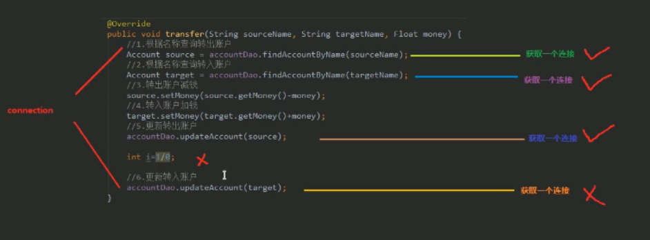

# 2 解决方法：ThreadLocal

我们应该使用ThreadLocal对象把Connection和当前线程绑定，从而使一个线程中只有一个能控制事务的对象。

为了完成这一操作，我们首先建立两个工具类，工具类以Utils命名结尾。

第一个是管理连接的工具类

```java
package com.itheima.utils;

import javax.sql.DataSource;
import java.sql.Connection;

/**
 * 连接的工具类，它用于从数据源中获取一个连接，并且实现和线程的绑定
 */
public class ConnectionUtils {
    private ThreadLocal<Connection> tl = new ThreadLocal<Connection>();

    private DataSource dataSource;

    public void setDataSource(DataSource dataSource) {
        this.dataSource = dataSource;
    }

    /**
     * 获取当前线程上的连接
     * @return
     */
    public Connection getThreadConnection(){
        //1. 先从ThreadLocal上获取
        Connection conn = tl.get();
        //2. 判断当前线程上是否有连接
        try{
        if (conn==null){
            //3.从数据源中获取一个连接，并且存入ThreadLocal中
            conn = dataSource.getConnection();
            tl.set(conn);
        }
        //4. 返回当前线程上的连接
            return conn;
    }catch (Exception e){
            throw new RuntimeException(e);
        }
    }

    /**
     * 把连接和线程解绑
     */
    public void removeConnection(){
        tl.remove();
    }
}

```


第二个是管理事务的工具类

```java
package com.itheima.utils;

import java.sql.Connection;

/**
 * 和事务管理相关的工具类，它包含了开启事务，提交事务，回滚事务和释放连接
 */
public class TransactionManager {
    private ConnectionUtils connectionUtils;

    public void setConnectionUtils(ConnectionUtils connectionUtils) {
        this.connectionUtils = connectionUtils;
    }

    /**
     * 开启事务
     */
    public void beginTransaction(){
        try {
            connectionUtils.getThreadConnection().setAutoCommit(false);
        }
        catch (Exception e){
            e.printStackTrace();
        }

    }
    /**
     * 提交事务
     */
    public void commit(){
        try {
            connectionUtils.getThreadConnection().commit();
        }
        catch (Exception e){
            e.printStackTrace();
        }
    }
    /**
     * 回滚事务
     */
    public void rollback(){
        try {
            connectionUtils.getThreadConnection().rollback();
        }
        catch (Exception e){
            e.printStackTrace();
        }
    }
    /**
     * 释放连接
     */
    public void release(){
        try {
            connectionUtils.getThreadConnection().close(); //将连接还回池中
            connectionUtils.removeConnection();
        }
        catch (Exception e){
            e.printStackTrace();
        }
    }
}

```

这时候业务层的函数实现就可以改成这样：

```java
    public List<Account> findAllAccount() {
        try{
            //1.开始事务
            txManager.beginTransaction();
            //2.执行操作
            List<Account> accounts = accountDao.findAllAccount();
            //3.提交事务
            txManager.commit();
            //4.返回结果
            return accounts;
        }catch (Exception e){
            //5.回滚操作
            txManager.rollback();

        } finally {
            //6.释放连接
            txManager.release();
        }
        return null;
    }
```

# 二 动态代理

# 1 问题引出

问题引出：我们发现在业务层实现类函数中大量使用了beginTransaction函数，该函数一旦在后期改名，就会导致我们要修改业务层实现类中所有该函数的名字，这对我们的打击是毁灭性的。

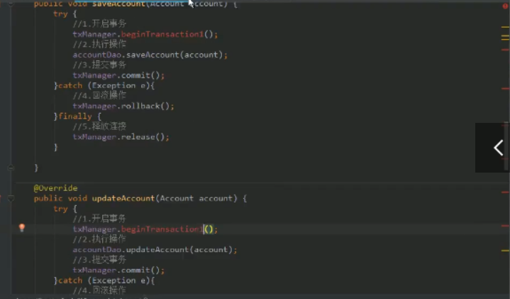

# 2 解决方法

## 2.1 基于接口的动态代理

①写一个产家的接口及其实现类

接口：

```java
package com.itheima.proxy;

/**
 * 对生产厂家要求的接口
 */
public interface IProducer {

    /**
     * 销售
     * @param money
     */
    public void saleProduct(float money);

    /**
     * 售后
     * @param money
     */
    public void afterService(float money);
}

```

实现类：

```java
package com.itheima.proxy;

/**
 * 一个生产者
 */
public class Producer implements IProducer{

    /**
     * 销售
     * @param money
     */
    public void saleProduct(float money){
        System.out.println("销售产品，并拿到钱："+money);
    }

    /**
     * 售后
     * @param money
     */
    public void afterService(float money){
        System.out.println("提供售后服务，并拿到钱："+money);
    }
}
```

②编写代理类

```java
package com.itheima.proxy;

import java.lang.reflect.InvocationHandler;
import java.lang.reflect.Method;
import java.lang.reflect.Proxy;

/**
 * 模拟一个消费者
 */
public class Client {

    public static void main(String[] args) {
        final Producer producer = new Producer();

        /**
         * 动态代理：
         *  特点：字节码随用随创建，随用随加载
         *  作用：不修改源码的基础上对方法增强
         *  分类：
         *      基于接口的动态代理
         *      基于子类的动态代理
         *  基于接口的动态代理：
         *      涉及的类：Proxy
         *      提供者：JDK官方
         *  如何创建代理对象：
         *      使用Proxy类中的newProxyInstance方法
         *  创建代理对象的要求：
         *      被代理类最少实现一个接口，如果没有则不能使用
         *  newProxyInstance方法的参数：
         *      ①ClassLoader：类加载器
         *          它是用于加载代理对象字节码的。和被代理对象使用相同的类加载器。固定写法。
         *     	②Class[]：字节码数组
         *          它是用于让代理对象和被代理对象有相同方法。固定写法。
         *      ③InvocationHandler：用于提供增强的代码
         *          它是让我们写如何代理。我们一般都是些一个该接口的实现类，通常情况下都是匿名内部类，但不是必须的。
         *          此接口的实现类都是谁用谁写。
         */
       IProducer proxyProducer = (IProducer) Proxy.newProxyInstance(producer.getClass().getClassLoader(),
                producer.getClass().getInterfaces(),
                new InvocationHandler() {
                    /**
                     * 作用：执行被代理对象的任何接口方法都会经过该方法
                     * 方法参数的含义
                     * @param proxy   代理对象的引用
                     * @param method  当前执行的方法
                     * @param args    当前执行方法所需的参数
                     * @return        和被代理对象方法有相同的返回值
                     * @throws Throwable
                     */
                    public Object invoke(Object proxy, Method method, Object[] args) throws Throwable {
                        //提供增强的代码
                        Object returnValue = null;

                        //1.获取方法执行的参数
                        Float money = (Float)args[0];
                        //2.判断当前方法是不是销售
                        if("saleProduct".equals(method.getName())) {
                            returnValue = method.invoke(producer, money*0.8f);
                        }
                        return returnValue;
                    }
                });
        proxyProducer.saleProduct(10000f);
    }
}

```

## 2.2 基于子类的动态代理

### 1 配置pom.xml

导入依赖cglib

```xml
<?xml version="1.0" encoding="UTF-8"?>
<project xmlns="http://maven.apache.org/POM/4.0.0"
         xmlns:xsi="http://www.w3.org/2001/XMLSchema-instance"
         xsi:schemaLocation="http://maven.apache.org/POM/4.0.0 http://maven.apache.org/xsd/maven-4.0.0.xsd">
    <modelVersion>4.0.0</modelVersion>

    <groupId>com.itheima</groupId>
    <artifactId>day03_eesy_02proxy</artifactId>
    <version>1.0-SNAPSHOT</version>
    <packaging>jar</packaging>

    <dependencies>
        <dependency>
            <groupId>cglib</groupId>
            <artifactId>cglib</artifactId>
            <version>2.1_3</version>
        </dependency>
    </dependencies>
</project>
```

### 2 创建新的producer

在itheima文件夹下创建Producer和Client两个类。这时候我们的Producer不再是一个接口实现类了，Client也要发生改变了。

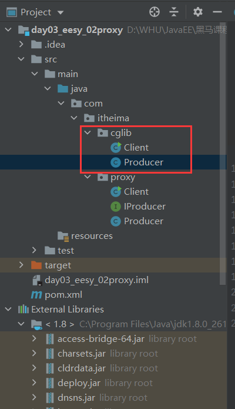

Client类的内容如下：

```java
package com.itheima.cglib;

import net.sf.cglib.proxy.Enhancer;
import net.sf.cglib.proxy.MethodInterceptor;
import net.sf.cglib.proxy.MethodProxy;

import java.lang.reflect.Method;

/**
 * 模拟一个消费者
 */
public class Client {

    public static void main(String[] args) {
        final Producer producer = new Producer();

        /**
         * 动态代理：
         *  特点：字节码随用随创建，随用随加载
         *  作用：不修改源码的基础上对方法增强
         *  分类：
         *      基于接口的动态代理
         *      基于子类的动态代理
         *  基于子类的动态代理：
         *      涉及的类：Enhancer
         *      提供者：第三方cglib库
         *  如何创建代理对象：
         *      使用Enhancer类中的create方法
         *  创建代理对象的要求：
         *      被代理类不能是最终类
         *  create方法的参数：
         *      Class：字节码
         *          它是用于指定被代理对象的字节码。
         *
         *      Callback：用于提供增强的代码
         *          它是让我们写如何代理。我们一般都是些一个该接口的实现类，通常情况下都是匿名内部类，但不是必须的。
         *          此接口的实现类都是谁用谁写。
         *          我们一般写的都是该接口的子接口实现类：MethodInterceptor
         */
        //Enhancer.create方法默认返回的是一个Object类型的对象，所以当我们接受的是Producer类型的对象的时候需要通过(Producer)来进行强转一下。
        Producer cglibProducer = (Producer)Enhancer.create(producer.getClass(), new MethodInterceptor() {
            /**
             * 执行被代理对象的任何方法都会经过该方法
             * @param proxy
             * @param method
             * @param args
             *    以上三个参数和基于接口的动态代理中invoke方法的参数是一样的
             * @param methodProxy ：当前执行方法的代理对象
             * @return
             * @throws Throwable
             */

            public Object intercept(Object proxy, Method method, Object[] args, MethodProxy methodProxy) throws Throwable {
                //提供增强的代码
                Object returnValue = null;

                //1.获取方法执行的参数
                Float money = (Float)args[0];
                //2.判断当前方法是不是销售
                if("saleProduct".equals(method.getName())) {
                    returnValue = method.invoke(producer, money*0.8f);
                }
                return returnValue;
            }
        });
        cglibProducer.saleProduct(12000f);
    }
}

```

Producer类的内容如下：

```java
package com.itheima.cglib;

/**
 * 一个生产者
 */
public class Producer {

    /**
     * 销售
     * @param money
     */
    public void saleProduct(float money){
        System.out.println("销售产品，并拿到钱："+money);
    }

    /**
     * 售后
     * @param money
     */
    public void afterService(float money){
        System.out.println("提供售后服务，并拿到钱："+money);
    }
}

```

## 2.3 问题解决

创建一个工厂类，该工厂类生产Service对象时就通过动态代理对类对象的方法进行增强。这里的增强就是自动做获取事务、提交事务、释放连接等操作。

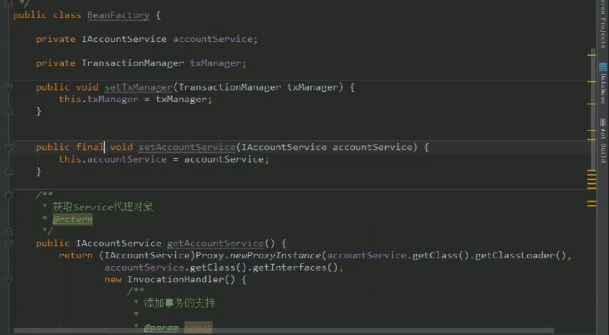

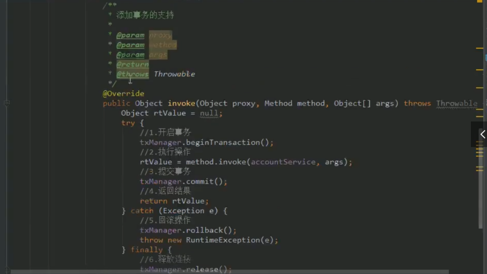

配置完xml文件后编写测试，让IAccountService对象as自动获取代理对象的bean：

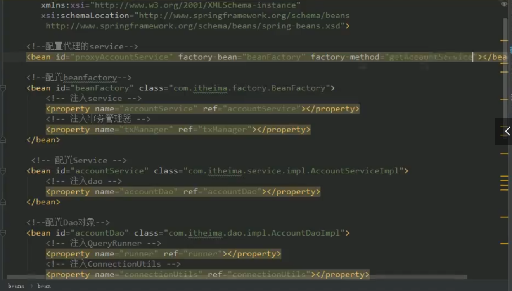

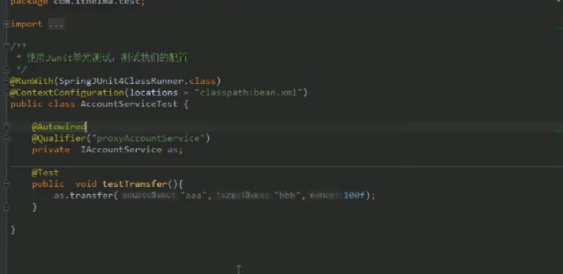

# 三 面向切面的编程AOP

# 1 AOP的简介

## 1.1 定义

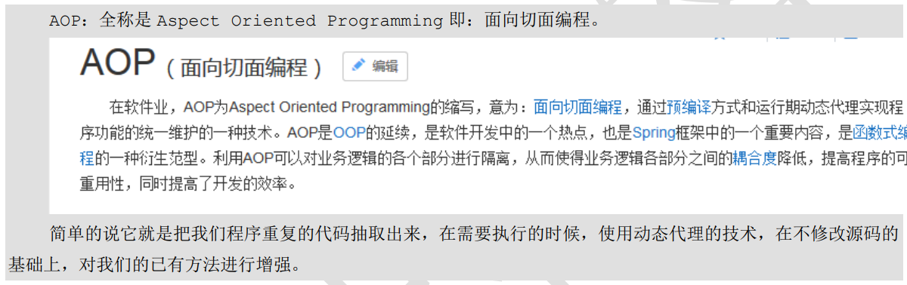

## 1.2 优势


## 1.3 实现方式


## 2 Spring中的AOP

### 2.1 spring中的相关术语

#### 2.1.1 Jointpoint接入点

所谓接入点，其实也就是业务层接口中的方法，这些方法都能够被代理增强。

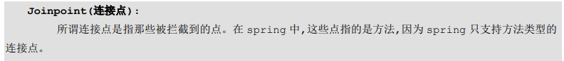

```java
package com.itheima.service;

/**
 * 账户的业务层接口
 */
public interface IAccountService {

    /**
     * 模拟保存账户
     */
   void saveAccount();

    /**
     * 模拟更新账户
     * @param i
     */
   void updateAccount(int i);

    /**
     * 删除账户
     * @return
     */
   int  deleteAccount();
}

```

#### 2.1.2 Pointcut切入点

切入点是指实际上被代理增强了的方法。如图代码所示，如果方法是业务层接口中的test方法，则直接return方法操作，不进行任何方法增强，test方法在这里就不是切入点，而只是一个连接点。

**拦截：通俗地说就是在执行连接点Joinpoint的方法之前，动态代理将其拦截下来，先做一些增强方法的操作。**


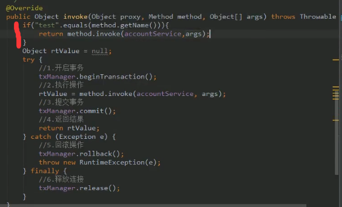

#### 2.1.3 Advice通知/增强

通知实际上就是增强的内容。


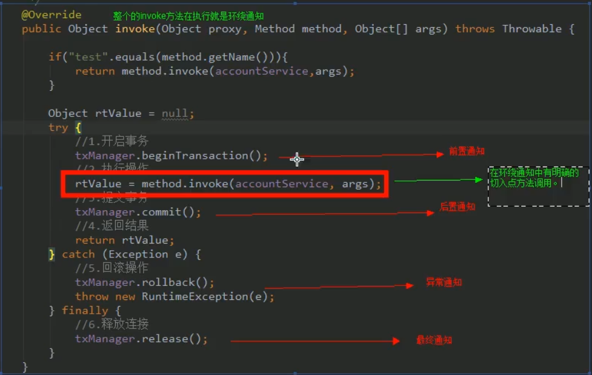

#### 2.1.4 Introduction引介(了解)

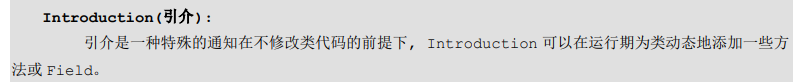

#### 2.1.5 目标对象


#### 2.1.6 Waving织入


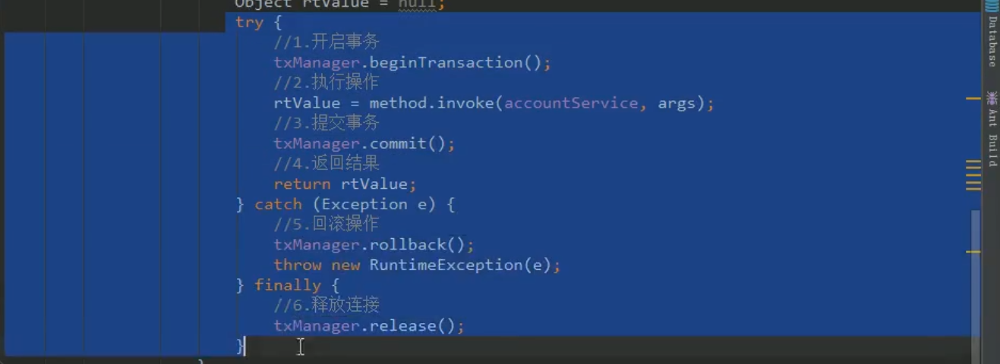

#### 2.1.7 Proxy代理


#### 2.1.7 Aspect切面


### 2.2 学习Spring中的AOP要明确的事

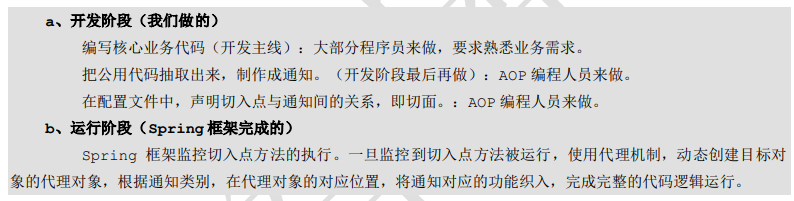

### 2.3 基于XML的Spring AOP配置

#### 2.3.1 在文档中找到AOP的xml配置

从spring core的文档中找到xmlns:aop的官方xml配置导入到工程的bean.xml中

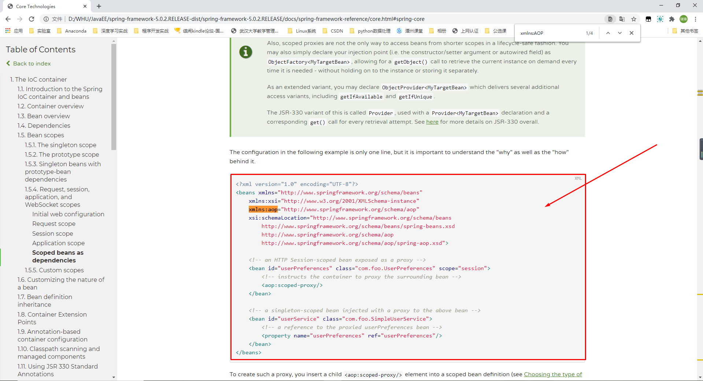

#### 2.3.2 xml指定增强方法和通知类的写法

配置resouces文件夹下的bean.xml

```xml
<?xml version="1.0" encoding="UTF-8"?>
<beans xmlns="http://www.springframework.org/schema/beans"
       xmlns:xsi="http://www.w3.org/2001/XMLSchema-instance"
       xmlns:aop="http://www.springframework.org/schema/aop"
       xsi:schemaLocation="http://www.springframework.org/schema/beans
        http://www.springframework.org/schema/beans/spring-beans.xsd
        http://www.springframework.org/schema/aop
        http://www.springframework.org/schema/aop/spring-aop.xsd">

    <!-- 配置srping的Ioc,把service对象配置进来-->
    <bean id="accountService" class="com.itheima.service.impl.AccountServiceImpl"></bean>

    <!--spring中基于XML的AOP配置步骤
        1、把通知Bean也交给spring来管理
        2、使用aop:config标签表明开始AOP的配置
        3、使用aop:aspect标签表明配置切面
                id属性：是给切面提供一个唯一标识
                ref属性：是指定通知类bean的Id。
        4、在aop:aspect标签的内部使用对应标签来配置通知的类型
               我们现在示例是让printLog方法在切入点方法执行之前之前：所以是前置通知
               aop:before：表示配置前置通知
                    method属性：用于指定Logger类中哪个方法是前置通知
                    pointcut属性：用于指定切入点表达式，该表达式的含义指的是对业务层中哪些方法增强

            切入点表达式的写法：
                关键字：execution(表达式)
                表达式：
                    访问修饰符  返回值  包名.包名.包名...类名.方法名(参数列表)
                标准的表达式写法：
                    public void com.itheima.service.impl.AccountServiceImpl.saveAccount()
                访问修饰符可以省略
                    void com.itheima.service.impl.AccountServiceImpl.saveAccount()
                返回值可以使用通配符，表示任意返回值
                    * com.itheima.service.impl.AccountServiceImpl.saveAccount()
                包名可以使用通配符，表示任意包。但是有几级包，就需要写几个*.
                    * *.*.*.*.AccountServiceImpl.saveAccount())
                包名可以使用..表示当前包及其子包
                    * *..AccountServiceImpl.saveAccount()
                类名和方法名都可以使用*来实现通配
                    * *..*.*()
                参数列表：
                    可以直接写数据类型：
                        基本类型直接写名称           int
                        引用类型写包名.类名的方式   java.lang.String
                    可以使用通配符表示任意类型，但是必须有参数
                    可以使用..表示有无参数均可，有参数可以是任意类型
                全通配写法：
                    * *..*.*(..)

                实际开发中切入点表达式的通常写法：
                    切到业务层实现类下的所有方法
                        * com.itheima.service.impl.*.*(..)
    -->

    <!-- 配置Logger类 (Logger类是一个通知类) -->
    <bean id="logger" class="com.itheima.utils.Logger"></bean>

    <!--配置AOP-->
    <aop:config>
        <!--配置切面 -->
        <aop:aspect id="logAdvice" ref="logger">
            <!-- 配置通知的类型，并且建立通知方法和切入点方法的关联-->
            <aop:before method="printLog" pointcut="execution(* com.itheima.service.impl.*.*(..))"></aop:before>
        </aop:aspect>
    </aop:config>

</beans>
```

#### 2.3.3 编写测试类测试

测试类java代码如下： 

```java
package com.itheima.test;

import com.itheima.service.IAccountService;
import org.springframework.context.ApplicationContext;
import org.springframework.context.support.ClassPathXmlApplicationContext;

/**
 * 测试AOP的配置
 */
public class AOPTest {

    public static void main(String[] args) {
        //1.获取容器
        ApplicationContext ac = new ClassPathXmlApplicationContext("bean.xml");
        //2.获取对象
        IAccountService as = (IAccountService)ac.getBean("accountService");
        //3.执行方法
        as.saveAccount();
    }
}

```

测试输出结果如图：

可以看到通知类Logger中的配xml配置为前置通知的printLog方法先执行了，然后saveAccount()方法才被执行，这说明我们的配置正确。

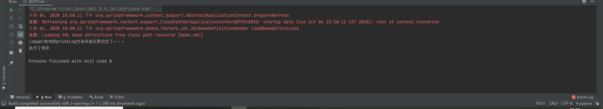

#### 2.3.4 所有类型通知的xml配置方式(重点)

在xml注释中说明了单独指明前置、后置、异常等通知的xml代码使用方法。当然也有更加简明的使用方法，那就是直接使用around方法，并且在通知类Logger中使用`ProceedingJoinPoint`接口声明环绕通知方法。

至此基于XML配置AOP，从指定需要被增强的类方法，到指定通知类，指定增强方法的通知全部介绍完毕了。

```xml
<?xml version="1.0" encoding="UTF-8"?>
<beans xmlns="http://www.springframework.org/schema/beans"
       xmlns:xsi="http://www.w3.org/2001/XMLSchema-instance"
       xmlns:aop="http://www.springframework.org/schema/aop"
       xsi:schemaLocation="http://www.springframework.org/schema/beans
        http://www.springframework.org/schema/beans/spring-beans.xsd
        http://www.springframework.org/schema/aop
        http://www.springframework.org/schema/aop/spring-aop.xsd">

    <!-- 配置srping的Ioc,把service对象配置进来-->
    <bean id="accountService" class="com.itheima.service.impl.AccountServiceImpl"></bean>


    <!-- 配置Logger类 -->
    <bean id="logger" class="com.itheima.utils.Logger"></bean>

    <!--配置AOP-->
    <aop:config>
        <!-- 配置切入点表达式 id属性用于指定表达式的唯一标识。expression属性用于指定表达式内容
              此标签写在aop:aspect标签内部只能当前切面使用。
              它还可以写在aop:aspect外面，此时就变成了所有切面可用
          -->
        <aop:pointcut id="pt1" expression="execution(* com.itheima.service.impl.*.*(..))"></aop:pointcut>
        <!--配置切面 -->
        <aop:aspect id="logAdvice" ref="logger">
            <!-- 配置前置通知：在切入点方法执行之前执行
            <aop:before method="beforePrintLog" pointcut-ref="pt1" ></aop:before>-->

            <!-- 配置后置通知：在切入点方法正常执行之后值。它和异常通知永远只能执行一个
            <aop:after-returning method="afterReturningPrintLog" pointcut-ref="pt1"></aop:after-returning>-->

            <!-- 配置异常通知：在切入点方法执行产生异常之后执行。它和后置通知永远只能执行一个
            <aop:after-throwing method="afterThrowingPrintLog" pointcut-ref="pt1"></aop:after-throwing>-->

            <!-- 配置最终通知：无论切入点方法是否正常执行它都会在其后面执行
            <aop:after method="afterPrintLog" pointcut-ref="pt1"></aop:after>-->

            <!-- 配置环绕通知 详细的注释请看Logger类中-->
            <aop:around method="aroundPringLog" pointcut-ref="pt1"></aop:around>
        </aop:aspect>
    </aop:config>

</beans>
```

```java
package com.itheima.utils;

import org.aspectj.lang.ProceedingJoinPoint;

/**
 * 用于记录日志的工具类，它里面提供了公共的代码
 */
public class Logger {

    /**
     * 前置通知
     */
    public  void beforePrintLog(){
        System.out.println("前置通知Logger类中的beforePrintLog方法开始记录日志了。。。");
    }

    /**
     * 后置通知
     */
    public  void afterReturningPrintLog(){
        System.out.println("后置通知Logger类中的afterReturningPrintLog方法开始记录日志了。。。");
    }
    /**
     * 异常通知
     */
    public  void afterThrowingPrintLog(){
        System.out.println("异常通知Logger类中的afterThrowingPrintLog方法开始记录日志了。。。");
    }

    /**
     * 最终通知
     */
    public  void afterPrintLog(){
        System.out.println("最终通知Logger类中的afterPrintLog方法开始记录日志了。。。");
    }

    /**
     * 环绕通知
     * 问题：
     *      当我们配置了环绕通知之后，切入点方法没有执行，而通知方法执行了。
     * 分析：
     *      通过对比动态代理中的环绕通知代码，发现动态代理的环绕通知有明确的切入点方法调用，而我们的代码中没有。
     * 解决：
     *      Spring框架为我们提供了一个接口：ProceedingJoinPoint。该接口有一个方法proceed()，此方法就相当于明确调用切入点方法。
     *      该接口可以作为环绕通知的方法参数，在程序执行时，spring框架会为我们提供该接口的实现类供我们使用。
     *
     * spring中的环绕通知：
     *      它是spring框架为我们提供的一种可以在代码中手动控制增强方法何时执行的方式。
     */
    public Object aroundPringLog(ProceedingJoinPoint pjp){
        Object rtValue = null;
        try{
            Object[] args = pjp.getArgs();//得到方法执行所需的参数

            System.out.println("Logger类中的aroundPringLog方法开始记录日志了。。。前置");

            rtValue = pjp.proceed(args);//明确调用业务层方法（切入点方法）

            System.out.println("Logger类中的aroundPringLog方法开始记录日志了。。。后置");

            return rtValue;
        }catch (Throwable t){
            System.out.println("Logger类中的aroundPringLog方法开始记录日志了。。。异常");
            throw new RuntimeException(t);
        }finally {
            System.out.println("Logger类中的aroundPringLog方法开始记录日志了。。。最终");
        }
    }
}

```

####  2.3.5 基于注解的AOP配置

老一套，先在xml文件里指定需要扫描的包并且打开注解AOP的支持。

```xml
<?xml version="1.0" encoding="UTF-8"?>
<beans xmlns="http://www.springframework.org/schema/beans"
       xmlns:xsi="http://www.w3.org/2001/XMLSchema-instance"
       xmlns:aop="http://www.springframework.org/schema/aop"
       xmlns:context="http://www.springframework.org/schema/context"
       xsi:schemaLocation="http://www.springframework.org/schema/beans
        http://www.springframework.org/schema/beans/spring-beans.xsd
        http://www.springframework.org/schema/aop
        http://www.springframework.org/schema/aop/spring-aop.xsd
        http://www.springframework.org/schema/context
        http://www.springframework.org/schema/context/spring-context.xsd">

    <!-- 配置spring创建容器时要扫描的包-->
    <context:component-scan base-package="com.itheima"></context:component-scan>

    <!-- 配置spring开启注解AOP的支持 -->
    <aop:aspectj-autoproxy></aop:aspectj-autoproxy>
</beans>
```

在业务层实现类上加注解@Service

```java
package com.itheima.service.impl;

import com.itheima.service.IAccountService;
import org.springframework.stereotype.Service;

/**
 * 账户的业务层实现类
 */
@Service("accountService")
public class AccountServiceImpl implements IAccountService{

    @Override
    public void saveAccount() {
        System.out.println("执行了保存");
        int i=1/0;
    }

    @Override
    public void updateAccount(int i) {
        System.out.println("执行了更新"+i);

    }

    @Override
    public int deleteAccount() {
        System.out.println("执行了删除");
        return 0;
    }
}

```

在通知类上加注解@Component注解

@Component
作用：用于把当前类对象存入spring容器中
属性：
	value：用于指定bean的id。当我们补些时，它的默认值就是当前类名，且首字母改小写。


然后加上@Aspect表明该类是一个切面类

用@Pointcut("execution(* com.itheima.service.impl.*.*(..))")指明需要增强的业务层类

用@Before("pt1()")等等来指定相应的通知类型。

**注意：Spring基于@Before，@AfterReturning等注解的AOP调用顺序是有问题的，最终通知比后置通知、异常通知都先调用。但是我们如果使用@Around注解的环绕通知则不存在这个调用顺序的问题。**

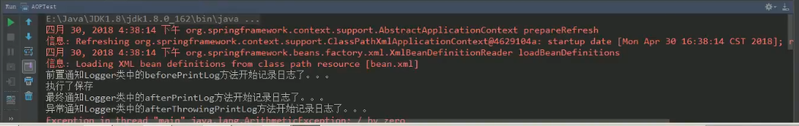

```java
package com.itheima.utils;

import org.aspectj.lang.ProceedingJoinPoint;
import org.aspectj.lang.annotation.*;
import org.springframework.stereotype.Component;

/**
 * 用于记录日志的工具类，它里面提供了公共的代码
 */
@Component("logger")
@Aspect//表示当前类是一个切面类
public class Logger {

    @Pointcut("execution(* com.itheima.service.impl.*.*(..))")
    private void pt1(){}

    /**
     * 前置通知
     */
//    @Before("pt1()")
    public  void beforePrintLog(){
        System.out.println("前置通知Logger类中的beforePrintLog方法开始记录日志了。。。");
    }

    /**
     * 后置通知
     */
//    @AfterReturning("pt1()")
    public  void afterReturningPrintLog(){
        System.out.println("后置通知Logger类中的afterReturningPrintLog方法开始记录日志了。。。");
    }
    /**
     * 异常通知
     */
//    @AfterThrowing("pt1()")
    public  void afterThrowingPrintLog(){
        System.out.println("异常通知Logger类中的afterThrowingPrintLog方法开始记录日志了。。。");
    }

    /**
     * 最终通知
     */
//    @After("pt1()")
    public  void afterPrintLog(){
        System.out.println("最终通知Logger类中的afterPrintLog方法开始记录日志了。。。");
    }

    /**
     * 环绕通知
     * 问题：
     *      当我们配置了环绕通知之后，切入点方法没有执行，而通知方法执行了。
     * 分析：
     *      通过对比动态代理中的环绕通知代码，发现动态代理的环绕通知有明确的切入点方法调用，而我们的代码中没有。
     * 解决：
     *      Spring框架为我们提供了一个接口：ProceedingJoinPoint。该接口有一个方法proceed()，此方法就相当于明确调用切入点方法。
     *      该接口可以作为环绕通知的方法参数，在程序执行时，spring框架会为我们提供该接口的实现类供我们使用。
     *
     * spring中的环绕通知：
     *      它是spring框架为我们提供的一种可以在代码中手动控制增强方法何时执行的方式。
     */
    @Around("pt1()")
    public Object aroundPringLog(ProceedingJoinPoint pjp){
        Object rtValue = null;
        try{
            Object[] args = pjp.getArgs();//得到方法执行所需的参数

            System.out.println("Logger类中的aroundPringLog方法开始记录日志了。。。前置");

            rtValue = pjp.proceed(args);//明确调用业务层方法（切入点方法）

            System.out.println("Logger类中的aroundPringLog方法开始记录日志了。。。后置");

            return rtValue;
        }catch (Throwable t){
            System.out.println("Logger类中的aroundPringLog方法开始记录日志了。。。异常");
            throw new RuntimeException(t);
        }finally {
            System.out.println("Logger类中的aroundPringLog方法开始记录日志了。。。最终");
        }
    }
}

```

##### 完全使用注解的方法

**扩展：如果想把xml额外的东西完全拿掉:**

参加第二天的spring学习笔记，写一个配置类指定需要扫描的包。

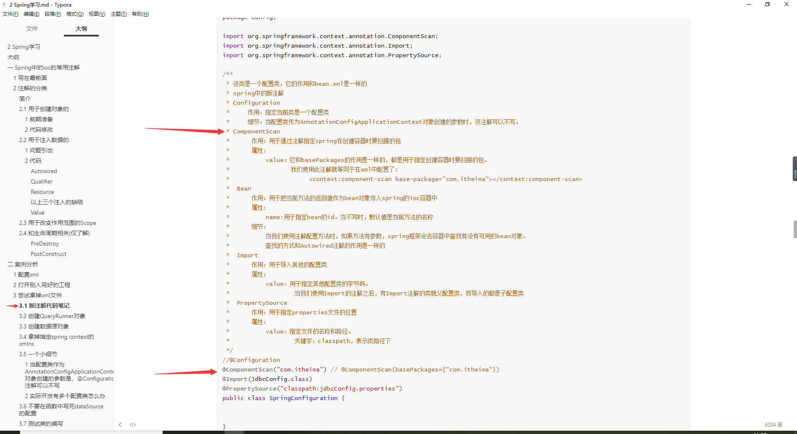

然后在使用Context的时候使用基于注解的context。而不再使用`ClassPathXmlApplicationContext`

```java
ApplicationContext ac = new ClassPathXmlApplicationContext("bean.xml");
```

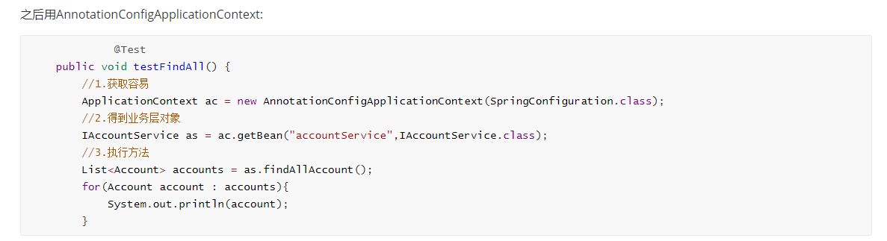

之后在想把xml中打开spring对注解AOP支持的xml拿掉，只需要在配置类上面加上注解@EnableAspectJAutoProxy。如图所示。

```xml
    <!-- 配置spring开启注解AOP的支持 -->
    <aop:aspectj-autoproxy></aop:aspectj-autoproxy>
```

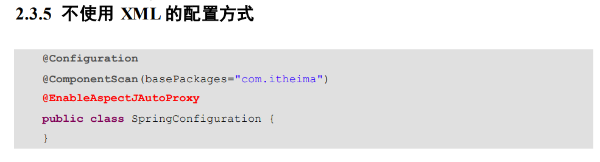