# 4 Spring学习

[TOC]


# 大纲

1. spring中的JdbcTemplate
2. 作业：
   1. spring基于AOP的事务控制
3. spring中的事务控制
   1. 基于XML的
   2. 基于注解的


# 一 Spring中的JdbcTemplate[会用]

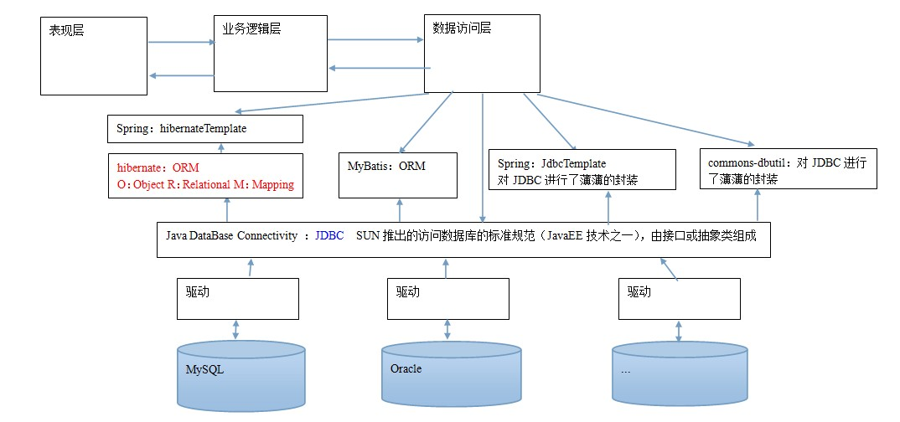

# 1 简介

JdbcTemplate的作用：它就是用于和数据库交互的，实现对表的CRUD操作。

# 2 前期XML配置

配置POM.xml

导入spring框架以及spring框架中与事务控制相关的jar包还有连接Mysql数据库的jar包。

```xml
<?xml version="1.0" encoding="UTF-8"?>
<project xmlns="http://maven.apache.org/POM/4.0.0"
         xmlns:xsi="http://www.w3.org/2001/XMLSchema-instance"
         xsi:schemaLocation="http://maven.apache.org/POM/4.0.0 http://maven.apache.org/xsd/maven-4.0.0.xsd">
    <modelVersion>4.0.0</modelVersion>

    <groupId>com.itheima</groupId>
    <artifactId>day04_eesy_01jdbctemplate</artifactId>
    <version>1.0-SNAPSHOT</version>
    <packaging>jar</packaging>

    <dependencies>
        <dependency>
            <groupId>org.springframework</groupId>
            <artifactId>spring-context</artifactId>
            <version>5.0.2.RELEASE</version>
        </dependency>

        <dependency>
            <groupId>org.springframework</groupId>
            <artifactId>spring-jdbc</artifactId>
            <version>5.0.2.RELEASE</version>
        </dependency>

        <dependency>
            <groupId>org.springframework</groupId>
            <artifactId>spring-tx</artifactId>
            <version>5.0.2.RELEASE</version>
        </dependency>

        <dependency>
            <groupId>mysql</groupId>
            <artifactId>mysql-connector-java</artifactId>
            <version>5.1.6</version>
        </dependency>
    </dependencies>
</project>
```

# 3 实际应用

## 3.1 初步使用JdbcTemplate

如此使用虽然直观，但是耦合度太高了，我们应该使用Spring的Ioc容器，通过xml来进行配置数据库的连接、用户名、密码、数据源等。

```java
package com.itheima.jdbctemplate;

import org.springframework.jdbc.core.JdbcTemplate;
import org.springframework.jdbc.datasource.DriverManagerDataSource;

/**
 * JdbcTemplate的最基本用法
 */
public class JdbcTemplateDemo1 {

    public static void main(String[] args) {
        //准备数据源：spring的内置数据源
        DriverManagerDataSource ds = new DriverManagerDataSource();
        ds.setDriverClassName("com.mysql.jdbc.Driver");
        ds.setUrl("jdbc:mysql://localhost:3306/eesy");
        ds.setUsername("root");
        ds.setPassword("20000912");

        //1.创建JdbcTemplate对象
        JdbcTemplate jt = new JdbcTemplate();
        //给jt设置数据源
        jt.setDataSource(ds);
        //2.执行操作
        jt.execute("insert into account(name,money)values('ccc',1000)");
    }
}

```

## 3.2 通过xml配置JdbcTemplate

在XML配置了JdbcTemplate的数据源以及数据库等信息之后，我们就可以避免在使用的时候再写那么多数据库的配置信息了。

```xml
<?xml version="1.0" encoding="UTF-8"?>
<beans xmlns="http://www.springframework.org/schema/beans"
       xmlns:xsi="http://www.w3.org/2001/XMLSchema-instance"
       xsi:schemaLocation="http://www.springframework.org/schema/beans
        http://www.springframework.org/schema/beans/spring-beans.xsd">

    <!--配置JdbcTemplate-->
    <bean id="jdbcTemplate" class="org.springframework.jdbc.core.JdbcTemplate">
        <property name="dataSource" ref="dataSource"></property>
    </bean>

    <!-- 配置数据源-->
    <bean id="dataSource" class="org.springframework.jdbc.datasource.DriverManagerDataSource">
        <property name="driverClassName" value="com.mysql.jdbc.Driver"></property>
        <property name="url" value="jdbc:mysql://localhost:3306/eesy"></property>
        <property name="username" value="root"></property>
        <property name="password" value="20000912"></property>
    </bean>
</beans>
```

```java
package com.itheima.jdbctemplate;

import org.springframework.context.ApplicationContext;
import org.springframework.context.support.ClassPathXmlApplicationContext;
import org.springframework.jdbc.core.JdbcTemplate;

/**
 * JdbcTemplate的最基本用法
 */
public class JdbcTemplateDemo2 {

    public static void main(String[] args) {
        //1.获取容器
        ApplicationContext ac = new ClassPathXmlApplicationContext("bean.xml");
        //2.获取对象
        JdbcTemplate jt = ac.getBean("jdbcTemplate",JdbcTemplate.class);
        //3.执行操作
        jt.execute("insert into account(name,money)values('ddd',2222)");
    }
}

```

## 3.3 使用JdbcTemplate实现增删改查

#### 3.3.1 如何定位所需要的query方法

如何定位所需要的quert方法？可以看到一个JdbcTemplate对象可以调用如此至多的query方法重载，那么我们如何知道我们需要使用的query方法是哪一个呢？

为了回答这一个问题，我们关键需要知道的是，**我们有什么和我们要什么**

1. 首先我们知道我们这里查询需要返回一个List的集合，所以那些返回值不是List的，我们直接全部排除掉。
2. 然后去除掉要求参数不符合我们要求的query方法。

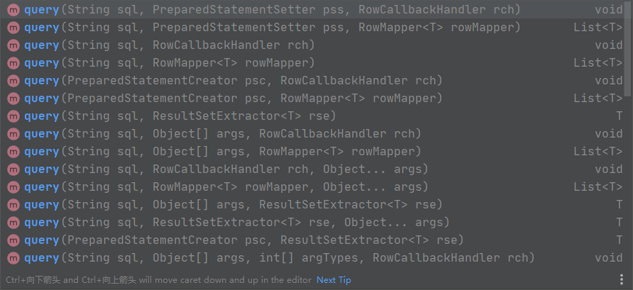

最好我们定位的应该是这两个方法，这两个方法只存在jdb版本的差异。


#### 3.3.2 增删改查

常常使用Spring自带的BeanPropertyRowMapper进行查询。

```java
package com.itheima.jdbctemplate;

import com.itheima.domain.Account;
import org.springframework.context.ApplicationContext;
import org.springframework.context.support.ClassPathXmlApplicationContext;
import org.springframework.jdbc.core.JdbcTemplate;
import org.springframework.jdbc.core.RowMapper;

import java.sql.ResultSet;
import java.sql.SQLException;

/**
 * JdbcTemplate的CRUD操作
 */
public class JdbcTemplateDemo3 {

    public static void main(String[] args) {
        //1.获取容器
        ApplicationContext ac = new ClassPathXmlApplicationContext("bean.xml");
        //2.获取对象
        JdbcTemplate jt = ac.getBean("jdbcTemplate",JdbcTemplate.class);
        //3.执行操作
        //增加
        jt.update("insert into account(name,money)values(?,?)","eee",3333f);
        //更新
        jt.update("update account set name=?,money=? where id=?","test",4567,7);
        //删除
        jt.update("delete from account where id=?",8);
        //查询所有
        List<Account> accounts = jt.query("select * from account where money > ?",new AccountRowMapper(),1000f);
        List<Account> accounts = jt.query("select * from account where money > ?",new BeanPropertyRowMapper<Account>(Account.class),1000f);
        for(Account account : accounts){
            System.out.println(account);
        }
        //查询一个
       List<Account> accounts = jt.query("select * from account where id = ?",new BeanPropertyRowMapper<Account>(Account.class),1);
       System.out.println(accounts.isEmpty()?"没有内容":accounts.get(0));

        //查询返回一行一列（使用聚合函数，但不加group by子句）
        Long count = jt.queryForObject("select count(*) from account where money > ?",Long.class,1000f);
        System.out.println(count);

    }
}

/**
 * 定义Account的封装策略
 */
class AccountRowMapper implements RowMapper<Account>{
    /**
     * 把结果集中的数据封装到Account中，然后由spring把每个Account加到集合中
     * @param rs
     * @param rowNum
     * @return
     * @throws SQLException
     */

    public Account mapRow(ResultSet rs, int rowNum) throws SQLException {
        Account account = new Account();
        account.setId(rs.getInt("id"));
        account.setName(rs.getString("name"));
        account.setMoney(rs.getFloat("money"));
        return account;
    }
}
```

## 3.4 编写持久层接口与实现类

但在实际实现中，我们不会像在上一小节那样把函数都写在main中，我们的开发一定是基于dao的，所以我们会定义dao的接口以及实现类。

持久层接口：

```java
package com.itheima.dao;

import com.itheima.domain.Account;

/**
 * 账户的持久层接口
 */
public interface IAccountDao {

    /**
     * 根据Id查询账户
     * @param accountId
     * @return
     */
    Account findAccountById(Integer accountId);

    /**
     * 根据名称查询账户
     * @param accountName
     * @return
     */
    Account findAccountByName(String accountName);

    /**
     * 更新账户
     * @param account
     */
    void updateAccount(Account account);
}

```

持久层实现类：

```java
package com.itheima.dao.impl;

import com.itheima.dao.IAccountDao;
import com.itheima.domain.Account;
import org.springframework.beans.factory.annotation.Autowired;
import org.springframework.jdbc.core.BeanPropertyRowMapper;
import org.springframework.jdbc.core.JdbcTemplate;
import org.springframework.stereotype.Repository;

import java.util.List;

/**
 * 账户的持久层实现类
 */
@Repository
public class AccountDaoImpl2 implements IAccountDao {

    @Autowired
    private JdbcTemplate jdbcTemplate;


    
    public Account findAccountById(Integer accountId) {
        List<Account> accounts = jdbcTemplate.query("select * from account where id = ?",new BeanPropertyRowMapper<Account>(Account.class),accountId);
        return accounts.isEmpty()?null:accounts.get(0);
    }

    
    public Account findAccountByName(String accountName) {
        List<Account> accounts = jdbcTemplate.query("select * from account where name = ?",new BeanPropertyRowMapper<Account>(Account.class),accountName);
        if(accounts.isEmpty()){
            return null;
        }
        if(accounts.size()>1){
            throw new RuntimeException("结果集不唯一");
        }
        return accounts.get(0);
    }

    
    public void updateAccount(Account account) {
        jdbcTemplate.update("update account set name=?,money=? where id=?",account.getName(),account.getMoney(),account.getId());
    }
}

```

配置XML，说明jdbcTemplate注入数据的来源。

```xml
<?xml version="1.0" encoding="UTF-8"?>
<beans xmlns="http://www.springframework.org/schema/beans"
       xmlns:xsi="http://www.w3.org/2001/XMLSchema-instance"
       xsi:schemaLocation="http://www.springframework.org/schema/beans
        http://www.springframework.org/schema/beans/spring-beans.xsd">

    <!-- 配置账户的持久层-->
    <bean id="accountDao" class="com.itheima.dao.impl.AccountDaoImpl2">
        <property name="jdbcTemplate" ref="jdbcTemplate"></property>
        <!--<property name="dataSource" ref="dataSource"></property>-->
    </bean>

    <!--配置JdbcTemplate-->
    <bean id="jdbcTemplate" class="org.springframework.jdbc.core.JdbcTemplate">
        <property name="dataSource" ref="dataSource"></property>
    </bean>

    <!-- 配置数据源-->
    <bean id="dataSource" class="org.springframework.jdbc.datasource.DriverManagerDataSource">
        <property name="driverClassName" value="com.mysql.jdbc.Driver"></property>
        <property name="url" value="jdbc:mysql://localhost:3306/eesy"></property>
        <property name="username" value="root"></property>
        <property name="password" value="20000912"></property>
    </bean>
</beans>
```

现在我们在执行数据库的CRUD操作时，就不再获取jdbcTemplate对象了，而应该获取dao对象。

```java
package com.itheima.jdbctemplate;

import org.springframework.context.ApplicationContext;
import org.springframework.context.support.ClassPathXmlApplicationContext;
import org.springframework.jdbc.core.JdbcTemplate;

/**
 * JdbcTemplate的最基本用法
 */
public class JdbcTemplateDemo2 {

    public static void main(String[] args) {
        //1.获取容器
        ApplicationContext ac = new ClassPathXmlApplicationContext("bean.xml");
        //2.获取对象
        JdbcTemplate jt = ac.getBean("jdbcTemplate",JdbcTemplate.class);
        //3.执行操作
        jt.execute("insert into account(name,money)values('ddd',2222)");


     /*   //准备数据源：spring的内置数据源
        DriverManagerDataSource ds = new DriverManagerDataSource();
        ds.setDriverClassName("com.mysql.jdbc.Driver");
        ds.setUrl("jdbc:mysql://localhost:3306/eesy");
        ds.setUsername("root");
        ds.setPassword("1234");

        //1.创建JdbcTemplate对象
        JdbcTemplate jt = new JdbcTemplate();
        //给jt设置数据源
        jt.setDataSource(ds);
        //2.执行操作
        jt.execute("insert into account(name,money)values('ccc',1000)");*/
    }
}

```


### 3.4.1 精简重复代码

在3.4部分的持久层实现类中我们多次调用了jdbcTemplate对象，重复的使用相同的代码是我们不希望的。我们可以专门封装一个类来进行jdbcTemplate的操作，然后让业务层实现类继承该类就可以避免重复写jdbcTemplate对象了。

```java
package com.itheima.dao.impl;

/**
 * 此类用于抽取dao中的重复代码
*/
public class JdbcDaoSupport {

    private JdbcTemplate jdbcTemplate;

    public void setJdbcTemplate(JdbcTemplate jdbcTemplate) {
        this.jdbcTemplate = jdbcTemplate;
    }

    public JdbcTemplate getJdbcTemplate() {
        return jdbcTemplate;
    }

    public void setDataSource(DataSource dataSource) {
        if(jdbcTemplate == null){
            jdbcTemplate = createJdbcTemplate(dataSource);
        }
    }

    private JdbcTemplate createJdbcTemplate(DataSource dataSource){
        return new JdbcTemplate(dataSource);
    }
}

```

之后业务层实现类可以删除jdbcTemplate对象，并且通过super来调用父类中的属性和方法。其实在spring core框架中也提供了JdbcDaoSupport，我们可以不需要自己写这个类，spring能够根据xml自己配置jdbc。就可以删除JdbcDaoSupport这个类，在AccountDao的实现中继承Spring写的JdbcDaoSupport即可。

```java
package com.itheima.dao.impl;

import com.itheima.dao.IAccountDao;
import com.itheima.domain.Account;
import org.springframework.jdbc.core.BeanPropertyRowMapper;
import org.springframework.jdbc.core.support.JdbcDaoSupport;

import java.util.List;

/**
 * 账户的持久层实现类
 */
public class AccountDaoImpl extends JdbcDaoSupport implements IAccountDao {


    public Account findAccountById(Integer accountId) {
        List<Account> accounts = super.getJdbcTemplate().query("select * from account where id = ?",new BeanPropertyRowMapper<Account>(Account.class),accountId);
        return accounts.isEmpty()?null:accounts.get(0);
    }


    public Account findAccountByName(String accountName) {
        List<Account> accounts = super.getJdbcTemplate().query("select * from account where name = ?",new BeanPropertyRowMapper<Account>(Account.class),accountName);
        if(accounts.isEmpty()){
            return null;
        }
        if(accounts.size()>1){
            throw new RuntimeException("结果集不唯一");
        }
        return accounts.get(0);
    }


    public void updateAccount(Account account) {
        super.getJdbcTemplate().update("update account set name=?,money=? where id=?",account.getName(),account.getMoney(),account.getId());
    }
}

```

一旦继承了Spring提供的JdbcDaoSupport，由于在JdbcDaoSupport创建DataSource对象时就会自动配置JdbcTemplate，我们就不需要在xml中对JdbcTemplate对象进行配置了，可以将其注释掉，accountDao直接引用必须配置的DataSource即可。

```xml
<?xml version="1.0" encoding="UTF-8"?>
<beans xmlns="http://www.springframework.org/schema/beans"
       xmlns:xsi="http://www.w3.org/2001/XMLSchema-instance"
       xsi:schemaLocation="http://www.springframework.org/schema/beans
        http://www.springframework.org/schema/beans/spring-beans.xsd">

    <!-- 配置账户的持久层-->
    <bean id="accountDao" class="com.itheima.dao.impl.AccountDaoImpl">
        <!--<property name="jdbcTemplate" ref="jdbcTemplate"></property>-->
        <property name="dataSource" ref="dataSource"></property>
    </bean>

    <!--配置JdbcTemplate
    <bean id="jdbcTemplate" class="org.springframework.jdbc.core.JdbcTemplate">
        <property name="dataSource" ref="dataSource"></property>
    </bean>-->

    <!-- 配置数据源-->
    <bean id="dataSource" class="org.springframework.jdbc.datasource.DriverManagerDataSource">
        <property name="driverClassName" value="com.mysql.jdbc.Driver"></property>
        <property name="url" value="jdbc:mysql://localhost:3306/eesy"></property>
        <property name="username" value="root"></property>
        <property name="password" value="20000912"></property>
    </bean>
</beans>
```


# 二 Spring的声明式事务控制

# 1 简介

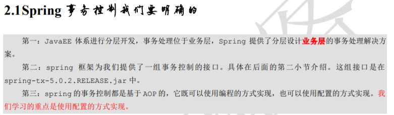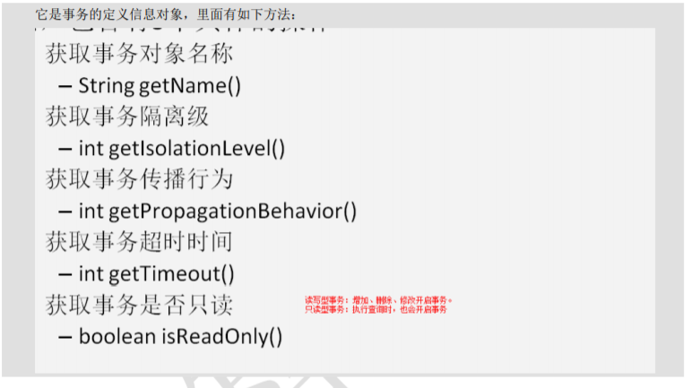

## 1.1 事务的隔离级别

默认级别归属下列某一种，即根据数据库的默认定义进行隔离。


## 1.2 事务的传播行为

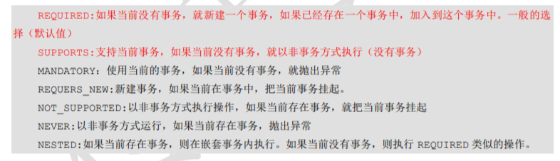

## 1.3 超时时间


## 1.4 是否是只读事务


## 1.5 TransactionStatus

事务的存储点：如果设置了事务的存储点，那么执行到事务的存储点时就会进行一次事务的提交，如果一次存储点执行发生异常，则回滚也只会回滚到该存储点之前，而不是全部回滚。

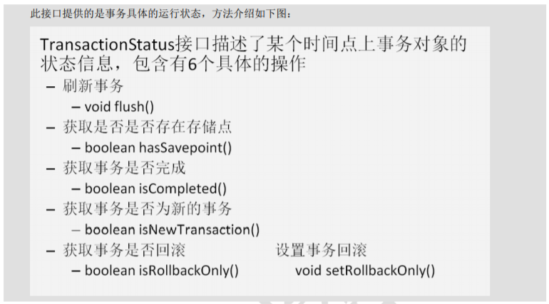

# 2 Spring事务控制的代码准备

配置pom.xml

```xml
<?xml version="1.0" encoding="UTF-8"?>
<project xmlns="http://maven.apache.org/POM/4.0.0"
         xmlns:xsi="http://www.w3.org/2001/XMLSchema-instance"
         xsi:schemaLocation="http://maven.apache.org/POM/4.0.0 http://maven.apache.org/xsd/maven-4.0.0.xsd">
    <modelVersion>4.0.0</modelVersion>

    <groupId>com.itheima</groupId>
    <artifactId>day04_eesy_04tx</artifactId>
    <version>1.0-SNAPSHOT</version>
    <packaging>jar</packaging>

    <dependencies>
        <dependency>
            <groupId>org.springframework</groupId>
            <artifactId>spring-context</artifactId>
            <version>5.0.2.RELEASE</version>
        </dependency>

        <dependency>
            <groupId>org.springframework</groupId>
            <artifactId>spring-jdbc</artifactId>
            <version>5.0.2.RELEASE</version>
        </dependency>

        <dependency>
            <groupId>org.springframework</groupId>
            <artifactId>spring-tx</artifactId>
            <version>5.0.2.RELEASE</version>
        </dependency>

        <dependency>
            <groupId>org.springframework</groupId>
            <artifactId>spring-test</artifactId>
            <version>5.0.2.RELEASE</version>
        </dependency>

        <dependency>
            <groupId>mysql</groupId>
            <artifactId>mysql-connector-java</artifactId>
            <version>5.1.6</version>
        </dependency>

        <dependency>
            <groupId>org.aspectj</groupId>
            <artifactId>aspectjweaver</artifactId>
            <version>1.8.7</version>
        </dependency>

        <dependency>
            <groupId>junit</groupId>
            <artifactId>junit</artifactId>
            <version>4.12</version>
        </dependency>
    </dependencies>
</project>
```

定义业务层接口类：

```java
package com.itheima.service;

import com.itheima.domain.Account;

/**
 * 账户的业务层接口
 */
public interface IAccountService {
    /**
     * 根据id查询账户信息
     * @param accountId
     * @return
     */
    Account findAccountById(Integer accountId);

    /**
     * 转账
     * @param sourceName    转成账户名称
     * @param targetName    转入账户名称
     * @param money         转账金额
     */
    void transfer(String sourceName,String targetName,Float money);
}

```

编写业务层实现类：

```java
package com.itheima.service.impl;

import com.itheima.dao.IAccountDao;
import com.itheima.domain.Account;
import com.itheima.service.IAccountService;

/**
 * 账户的业务层实现类
 *
 * 事务控制应该都是在业务层
 */
public class AccountServiceImpl implements IAccountService{

    private IAccountDao accountDao;

    public void setAccountDao(IAccountDao accountDao) {
        this.accountDao = accountDao;
    }


    public Account findAccountById(Integer accountId) {
        return accountDao.findAccountById(accountId);

    }


    
    public void transfer(String sourceName, String targetName, Float money) {
        System.out.println("transfer....");
            //2.1根据名称查询转出账户
            Account source = accountDao.findAccountByName(sourceName);
            //2.2根据名称查询转入账户
            Account target = accountDao.findAccountByName(targetName);
            //2.3转出账户减钱
            source.setMoney(source.getMoney()-money);
            //2.4转入账户加钱
            target.setMoney(target.getMoney()+money);
            //2.5更新转出账户
            accountDao.updateAccount(source);

            //int i=1/0;

            //2.6更新转入账户
            accountDao.updateAccount(target);
    }
}

```

配置bean.xml。设置好accountDao以及DataSource

```xml
<?xml version="1.0" encoding="UTF-8"?>
<beans xmlns="http://www.springframework.org/schema/beans"
       xmlns:xsi="http://www.w3.org/2001/XMLSchema-instance"
       xsi:schemaLocation="http://www.springframework.org/schema/beans
        http://www.springframework.org/schema/beans/spring-beans.xsd">

    <!-- 配置业务层-->
    <bean id="accountService" class="com.itheima.service.impl.AccountServiceImpl">
        <property name="accountDao" ref="accountDao"></property>
    </bean>

    <!-- 配置账户的持久层-->
    <bean id="accountDao" class="com.itheima.dao.impl.AccountDaoImpl">
        <property name="dataSource" ref="dataSource"></property>
    </bean>


    <!-- 配置数据源-->
    <bean id="dataSource" class="org.springframework.jdbc.datasource.DriverManagerDataSource">
        <property name="driverClassName" value="com.mysql.jdbc.Driver"></property>
        <property name="url" value="jdbc:mysql://localhost:3306/eesy"></property>
        <property name="username" value="root"></property>
        <property name="password" value="1234"></property>
    </bean>
</beans>
```

# 3 Spring基于XML的声明式事务控制配置

配置beam.xml。现在我们使用的transactionManager就是Spring框架实现的了。

配置过程为：①配置事务管理器②配置事务的通知③配置切入点表达式④建立通知和切入点表达式的管理⑤配置事务的属性。

- 首先我们导入xmlns，在Spring Doc界面找到Data Access进入。

  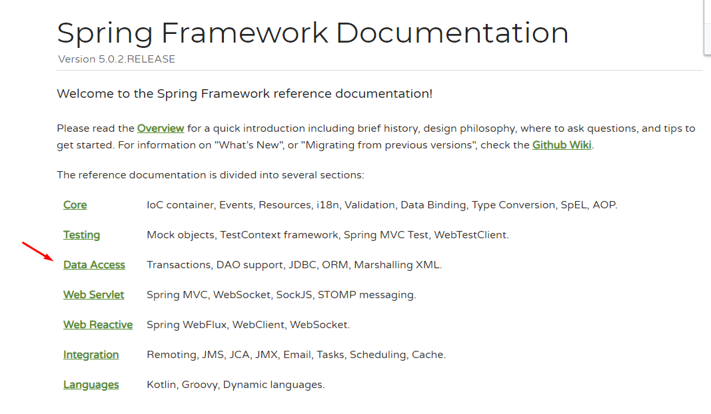

- 搜索xmlns:tx。就可以一次性将aop，tx等包全部导入。然后开始配置事务管理。

  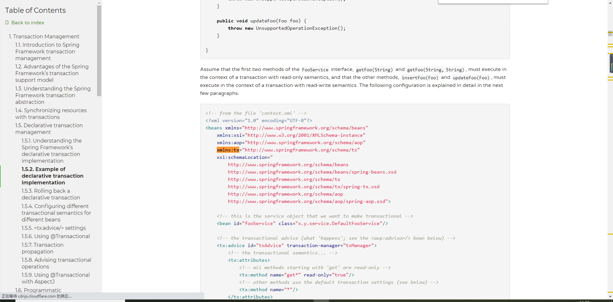

```xml
<?xml version="1.0" encoding="UTF-8"?>
<beans xmlns="http://www.springframework.org/schema/beans"
       xmlns:xsi="http://www.w3.org/2001/XMLSchema-instance"
       xmlns:aop="http://www.springframework.org/schema/aop"
       xmlns:tx="http://www.springframework.org/schema/tx"
       xsi:schemaLocation="
        http://www.springframework.org/schema/beans
        http://www.springframework.org/schema/beans/spring-beans.xsd
        http://www.springframework.org/schema/tx
        http://www.springframework.org/schema/tx/spring-tx.xsd
        http://www.springframework.org/schema/aop
        http://www.springframework.org/schema/aop/spring-aop.xsd">

    <!-- 配置业务层-->
    <bean id="accountService" class="com.itheima.service.impl.AccountServiceImpl">
        <property name="accountDao" ref="accountDao"></property>
    </bean>

    <!-- 配置账户的持久层-->
    <bean id="accountDao" class="com.itheima.dao.impl.AccountDaoImpl">
        <property name="dataSource" ref="dataSource"></property>
    </bean>


    <!-- 配置数据源-->
    <bean id="dataSource" class="org.springframework.jdbc.datasource.DriverManagerDataSource">
        <property name="driverClassName" value="com.mysql.jdbc.Driver"></property>
        <property name="url" value="jdbc:mysql://localhost:3306/eesy"></property>
        <property name="username" value="root"></property>
        <property name="password" value="1234"></property>
    </bean>

    <!-- spring中基于XML的声明式事务控制配置步骤
        1、配置事务管理器
        2、配置事务的通知
                此时我们需要导入事务的约束 tx名称空间和约束，同时也需要aop的
                使用tx:advice标签配置事务通知
                    属性：
                        id：给事务通知起一个唯一标识
                        transaction-manager：给事务通知提供一个事务管理器引用
        3、配置AOP中的通用切入点表达式
        4、建立事务通知和切入点表达式的对应关系
        5、配置事务的属性
               是在事务的通知tx:advice标签的内部

     -->
    <!-- 配置事务管理器 -->
    <bean id="transactionManager" class="org.springframework.jdbc.datasource.DataSourceTransactionManager">
        <property name="dataSource" ref="dataSource"></property>
    </bean>

    <!-- 配置事务的通知-->
    <tx:advice id="txAdvice" transaction-manager="transactionManager">
        <!-- 配置事务的属性
                isolation：用于指定事务的隔离级别。默认值是DEFAULT，表示使用数据库的默认隔离级别。
                propagation：用于指定事务的传播行为。默认值是REQUIRED，表示一定会有事务，增删改的选择。查询方法可以选择SUPPORTS。
                read-only：用于指定事务是否只读。只有查询方法才能设置为true。默认值是false，表示读写。
                timeout：用于指定事务的超时时间，默认值是-1，表示永不超时。如果指定了数值，以秒为单位。
                rollback-for：用于指定一个异常，当产生该异常时，事务回滚，产生其他异常时，事务不回滚。没有默认值。表示任何异常都回滚。
                no-rollback-for：用于指定一个异常，当产生该异常时，事务不回滚，产生其他异常时事务回滚。没有默认值。表示任何异常都回滚。
        -->
        <tx:attributes>
            <tx:method name="*" propagation="REQUIRED" read-only="false"/>
            <tx:method name="find*" propagation="SUPPORTS" read-only="true"></tx:method>
        </tx:attributes>
    </tx:advice>
    <!--用*来表示通配符，find*表示find开头的所有方法，特殊的优先级更高-->

    <!-- 配置aop-->
    <aop:config>
        <!-- 配置切入点表达式-->
        <aop:pointcut id="pt1" expression="execution(* com.itheima.service.impl.*.*(..))"></aop:pointcut>
        <!--建立切入点表达式和事务通知的对应关系 -->
        <aop:advisor advice-ref="txAdvice" pointcut-ref="pt1"></aop:advisor>
    </aop:config>


</beans>
```

# 4 使用注解配置事务控制

倒数第五个视频。xml更优。

使用@Transactional可以对整个类进行事务控制，也可以单独注解在方法上对方法进行特定配置。

```java
package com.itheima.service.impl;

import com.itheima.dao.IAccountDao;
import com.itheima.domain.Account;
import com.itheima.service.IAccountService;
import org.springframework.beans.factory.annotation.Autowired;
import org.springframework.stereotype.Service;
import org.springframework.transaction.annotation.Propagation;
import org.springframework.transaction.annotation.Transactional;

/**
 * 账户的业务层实现类
 *
 * 事务控制应该都是在业务层
 */
@Service("accountService")
@Transactional(propagation= Propagation.SUPPORTS,readOnly=true)//只读型事务的配置
public class AccountServiceImpl implements IAccountService{

    @Autowired
    private IAccountDao accountDao;


    public Account findAccountById(Integer accountId) {
        return accountDao.findAccountById(accountId);

    }


    //需要的是读写型事务配置
    @Transactional(propagation= Propagation.REQUIRED,readOnly=false)

    public void transfer(String sourceName, String targetName, Float money) {
        System.out.println("transfer....");
            //2.1根据名称查询转出账户
            Account source = accountDao.findAccountByName(sourceName);
            //2.2根据名称查询转入账户
            Account target = accountDao.findAccountByName(targetName);
            //2.3转出账户减钱
            source.setMoney(source.getMoney()-money);
            //2.4转入账户加钱
            target.setMoney(target.getMoney()+money);
            //2.5更新转出账户
            accountDao.updateAccount(source);

//            int i=1/0;

            //2.6更新转入账户
            accountDao.updateAccount(target);
    }
}

```

# 5 完全使用注解

[打开第四天代码文件夹](D:\WHU\JavaEE\黑马课程\spring-day4\代码\spring_day04)


# 三 Spring5的新特性(了解)

# 1 更换JDK

如何更换jdk

①打开File->Project Structure。配置Project

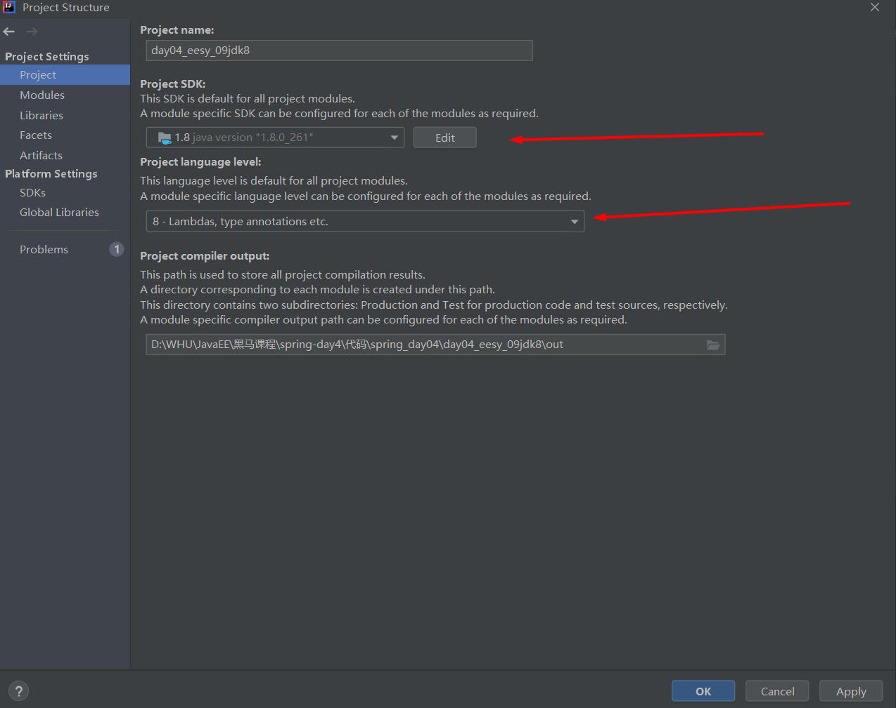

②配置Modules

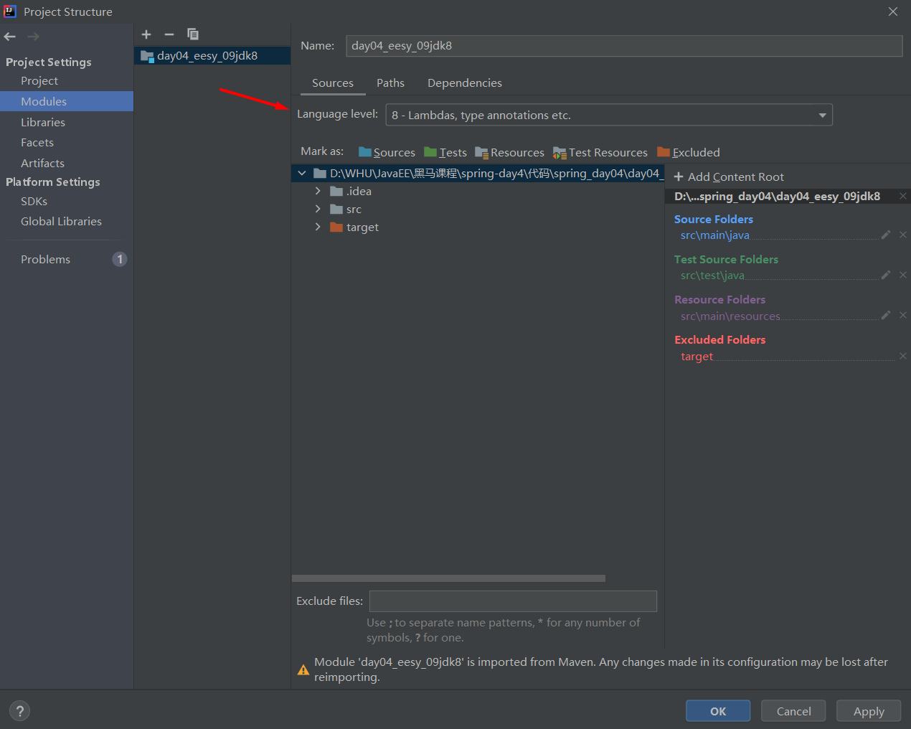

③点击Apply，点击OK。再点击File->settings，再配置Java Compiler。

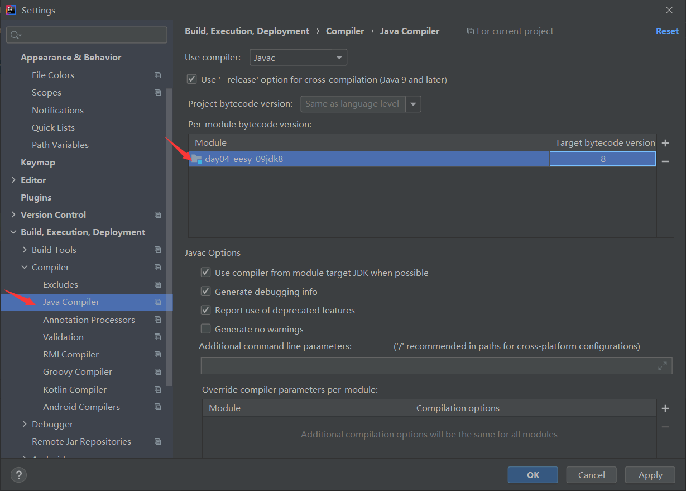 

