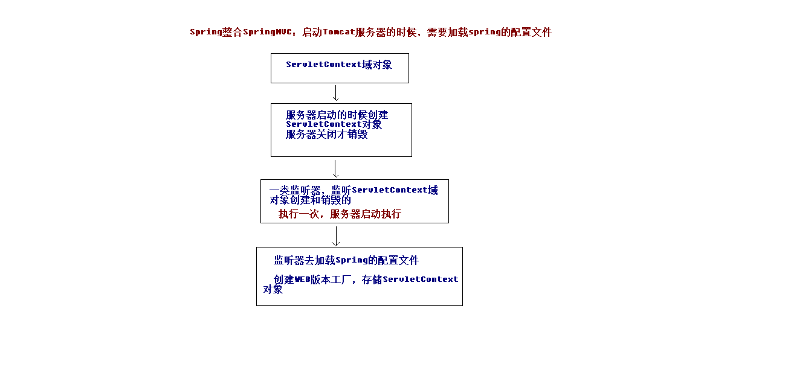

# 3 SpringMVC

# 一 搭建整合环境

## 1 回顾三层架构

表现层：SpringMVC框架

业务层：Spring框架

持久层：Mybatis框架


## 2 搭建环境

查看课程PDF，[点击这里](D:\WHU\JavaEE\Javaspring_mybatis_springmvc\SpringMVC\SpringMVC-03\资料/SpringMVC第三天.pdf)

1. 首先建立数据库表

2. 创建一个webapp项目作为父工程

3. 引入pom.xml

   ```xml
   <?xml version="1.0" encoding="UTF-8"?>
   
   <project xmlns="http://maven.apache.org/POM/4.0.0" xmlns:xsi="http://www.w3.org/2001/XMLSchema-instance"
     xsi:schemaLocation="http://maven.apache.org/POM/4.0.0 http://maven.apache.org/xsd/maven-4.0.0.xsd">
     <modelVersion>4.0.0</modelVersion>
   
     <groupId>cn.itcast</groupId>
     <artifactId>ssm</artifactId>
     <version>1.0-SNAPSHOT</version>
     <packaging>war</packaging>
   
     <name>ssm Maven Webapp</name>
     <!-- FIXME change it to the project's website -->
     <url>http://www.example.com</url>
   
     <properties>
       <project.build.sourceEncoding>UTF-8</project.build.sourceEncoding>
       <maven.compiler.source>1.8</maven.compiler.source>
       <maven.compiler.target>1.8</maven.compiler.target>
       <spring.version>5.0.2.RELEASE</spring.version>
       <slf4j.version>1.6.6</slf4j.version>
       <log4j.version>1.2.12</log4j.version>
       <mysql.version>5.1.6</mysql.version>
       <mybatis.version>3.4.5</mybatis.version>
     </properties>
   
     <dependencies>
       <!-- spring -->
       <dependency>
         <groupId>org.aspectj</groupId>
         <artifactId>aspectjweaver</artifactId>
         <version>1.6.8</version>
       </dependency>
   
       <dependency>
         <groupId>org.springframework</groupId>
         <artifactId>spring-aop</artifactId>
         <version>${spring.version}</version>
       </dependency>
   
       <dependency>
         <groupId>org.springframework</groupId>
         <artifactId>spring-context</artifactId>
         <version>${spring.version}</version>
       </dependency>
   
       <dependency>
         <groupId>org.springframework</groupId>
         <artifactId>spring-web</artifactId>
         <version>${spring.version}</version>
       </dependency>
   
       <dependency>
         <groupId>org.springframework</groupId>
         <artifactId>spring-webmvc</artifactId>
         <version>${spring.version}</version>
       </dependency>
   
       <dependency>
         <groupId>org.springframework</groupId>
         <artifactId>spring-test</artifactId>
         <version>${spring.version}</version>
       </dependency>
   
       <dependency>
         <groupId>org.springframework</groupId>
         <artifactId>spring-tx</artifactId>
         <version>${spring.version}</version>
       </dependency>
   
       <dependency>
         <groupId>org.springframework</groupId>
         <artifactId>spring-jdbc</artifactId>
         <version>${spring.version}</version>
       </dependency>
   
       <dependency>
         <groupId>junit</groupId>
         <artifactId>junit</artifactId>
         <version>4.12</version>
         <scope>compile</scope>
       </dependency>
   
       <dependency>
         <groupId>mysql</groupId>
         <artifactId>mysql-connector-java</artifactId>
         <version>${mysql.version}</version>
       </dependency>
   
       <dependency>
         <groupId>javax.servlet</groupId>
         <artifactId>servlet-api</artifactId>
         <version>2.5</version>
         <scope>provided</scope>
       </dependency>
   
       <dependency>
         <groupId>javax.servlet.jsp</groupId>
         <artifactId>jsp-api</artifactId>
         <version>2.0</version>
         <scope>provided</scope>
       </dependency>
   
       <dependency>
         <groupId>jstl</groupId>
         <artifactId>jstl</artifactId>
         <version>1.2</version>
       </dependency>
   
       <!-- log start -->
       <dependency>
         <groupId>log4j</groupId>
         <artifactId>log4j</artifactId>
         <version>${log4j.version}</version>
       </dependency>
   
       <dependency>
         <groupId>org.slf4j</groupId>
         <artifactId>slf4j-api</artifactId>
         <version>${slf4j.version}</version>
       </dependency>
   
       <dependency>
         <groupId>org.slf4j</groupId>
         <artifactId>slf4j-log4j12</artifactId>
         <version>${slf4j.version}</version>
       </dependency>
   
       <!-- log end -->
       <dependency>
         <groupId>org.mybatis</groupId>
         <artifactId>mybatis</artifactId>
         <version>${mybatis.version}</version>
       </dependency>
   
       <dependency>
         <groupId>org.mybatis</groupId>
         <artifactId>mybatis-spring</artifactId>
         <version>1.3.0</version>
       </dependency>
   
       <dependency>
         <groupId>c3p0</groupId>
         <artifactId>c3p0</artifactId>
         <version>0.9.1.2</version>
         <type>jar</type>
         <scope>compile</scope>
       </dependency>
     </dependencies>
   
     <build>
       <finalName>ssm</finalName>
       <pluginManagement><!-- lock down plugins versions to avoid using Maven defaults (may be moved to parent pom) -->
         <plugins>
           <plugin>
             <artifactId>maven-clean-plugin</artifactId>
             <version>3.0.0</version>
           </plugin>
           <!-- see http://maven.apache.org/ref/current/maven-core/default-bindings.html#Plugin_bindings_for_war_packaging -->
           <plugin>
             <artifactId>maven-resources-plugin</artifactId>
             <version>3.0.2</version>
           </plugin>
           <plugin>
             <artifactId>maven-compiler-plugin</artifactId>
             <version>3.7.0</version>
           </plugin>
           <plugin>
             <artifactId>maven-surefire-plugin</artifactId>
             <version>2.20.1</version>
           </plugin>
           <plugin>
             <artifactId>maven-war-plugin</artifactId>
             <version>3.2.0</version>
           </plugin>
           <plugin>
             <artifactId>maven-install-plugin</artifactId>
             <version>2.5.2</version>
           </plugin>
           <plugin>
             <artifactId>maven-deploy-plugin</artifactId>
             <version>2.8.2</version>
           </plugin>
         </plugins>
       </pluginManagement>
     </build>
   </project>
   
   ```

4. 然后就是创建我们的数据库接口类，实体类。参见Mybatis的学习笔记。

5. 创建业务层，配置业务层专门的xml配置文件，注意开启注解扫描时需要排除表现层，不扫描Controller。。

   ```xml
   <?xml version="1.0" encoding="UTF-8"?>
   <beans xmlns="http://www.springframework.org/schema/beans"
          xmlns:xsi="http://www.w3.org/2001/XMLSchema-instance"
          xmlns:context="http://www.springframework.org/schema/context"
          xmlns:aop="http://www.springframework.org/schema/aop"
          xmlns:tx="http://www.springframework.org/schema/tx"
          xsi:schemaLocation="http://www.springframework.org/schema/beans
   	http://www.springframework.org/schema/beans/spring-beans.xsd
   	http://www.springframework.org/schema/context
   	http://www.springframework.org/schema/context/spring-context.xsd
   	http://www.springframework.org/schema/aop
   	http://www.springframework.org/schema/aop/spring-aop.xsd
   	http://www.springframework.org/schema/tx
   	http://www.springframework.org/schema/tx/spring-tx.xsd">
   
       <!--开启注解的扫描，希望处理service和dao，controller不需要Spring框架去处理-->
       <context:component-scan base-package="cn.itcast" >
           <!--配置哪些注解不扫描-->
           <context:exclude-filter type="annotation" expression="org.springframework.stereotype.Controller" />
       </context:component-scan>
   
       <!--Spring整合MyBatis框架-->
       <!--配置连接池-->
       <bean id="dataSource" class="com.mchange.v2.c3p0.ComboPooledDataSource">
           <property name="driverClass" value="com.mysql.jdbc.Driver"/>
           <property name="jdbcUrl" value="jdbc:mysql:///ssm"/>
           <property name="user" value="root"/>
           <property name="password" value="20000912"/>
       </bean>
   
       <!--配置SqlSessionFactory工厂-->
       <bean id="sqlSessionFactory" class="org.mybatis.spring.SqlSessionFactoryBean">
           <property name="dataSource" ref="dataSource" />
       </bean>
   
       <!--配置AccountDao接口所在包-->
       <bean id="mapperScanner" class="org.mybatis.spring.mapper.MapperScannerConfigurer">
           <property name="basePackage" value="cn.itcast.dao"/>
       </bean>
   
       <!--配置Spring框架声明式事务管理-->
       <!--配置事务管理器-->
       <bean id="transactionManager" class="org.springframework.jdbc.datasource.DataSourceTransactionManager">
           <property name="dataSource" ref="dataSource" />
       </bean>
   
       <!--配置事务通知-->
       <tx:advice id="txAdvice" transaction-manager="transactionManager">
           <tx:attributes>
               <tx:method name="find*" read-only="true"/>
               <tx:method name="*" isolation="DEFAULT"/>
           </tx:attributes>
       </tx:advice>
   
       <!--配置AOP增强-->
       <aop:config>
           <aop:advisor advice-ref="txAdvice" pointcut="execution(* cn.itcast.service.impl.*ServiceImpl.*(..))"/>
       </aop:config>
   
   </beans>
   ```

   

## 3 整合的原理图



## 4 配置事务通知

向cn.itcast.service.impl下的所有类的所有方法做增强。将find开头的方法操作数据库的权限都设置为`只读`。

```xml
    <!--配置Spring框架声明式事务管理-->
    <!--配置事务管理器-->
    <bean id="transactionManager" class="org.springframework.jdbc.datasource.DataSourceTransactionManager">
        <property name="dataSource" ref="dataSource" />
    </bean>

    <!--配置事务通知-->
    <tx:advice id="txAdvice" transaction-manager="transactionManager">
        <tx:attributes>
            <tx:method name="find*" read-only="true"/>
            <tx:method name="*" isolation="DEFAULT"/>
        </tx:attributes>
    </tx:advice>

    <!--配置AOP增强-->
    <aop:config>
        <aop:advisor advice-ref="txAdvice" pointcut="execution(* cn.itcast.service.impl.*ServiceImpl.*(..))"/>
    </aop:config>
```

