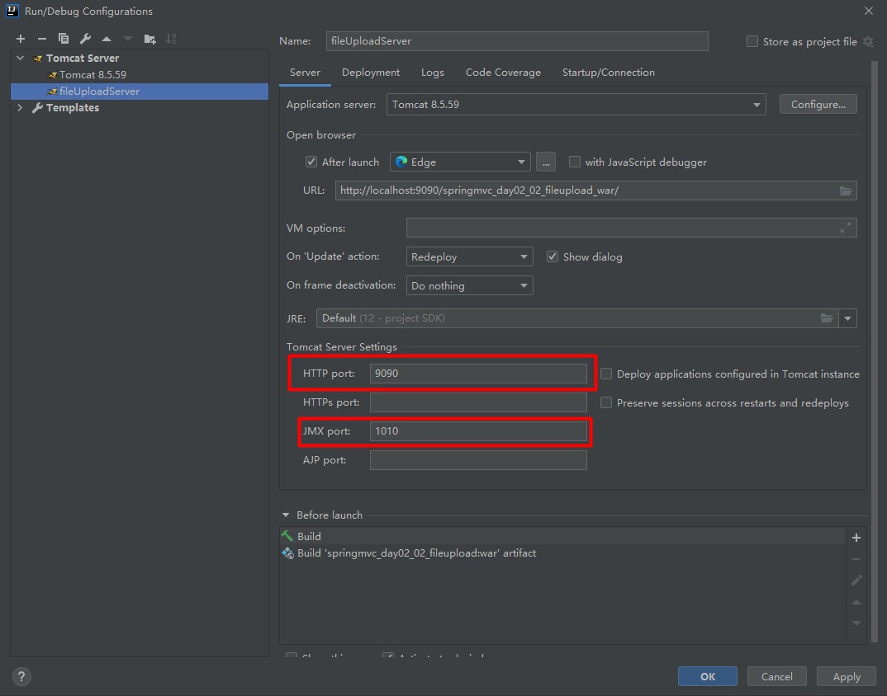
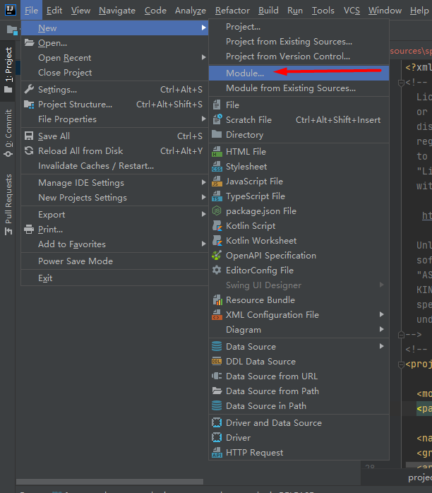
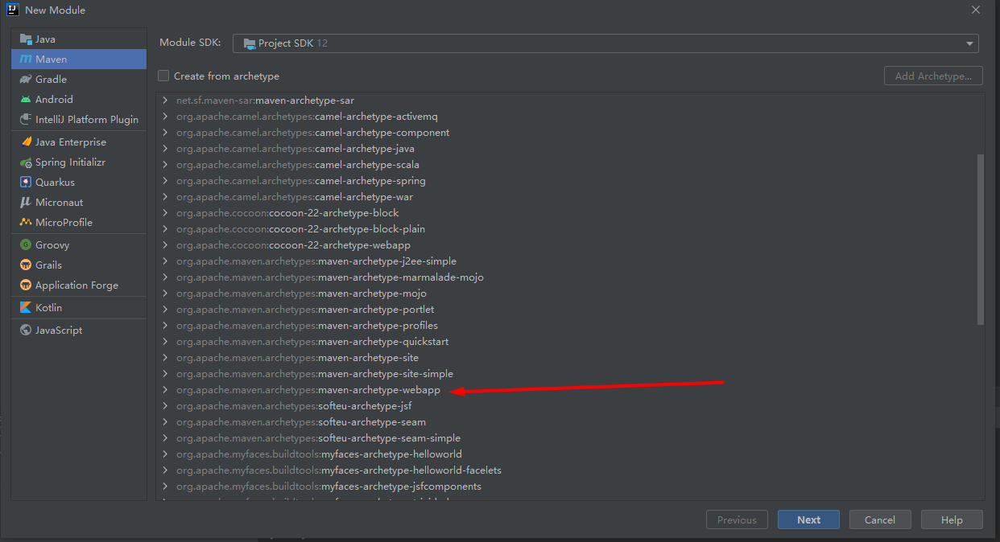

# 在同一台电脑上部署两个tomcat服务器

我们只需要在idea中新建一个tomcat的local服务器，并且保证`HTTP port`以及`JMX port`的端口号不重复即可。然后在Deplyment中部署我们需要部署的项目，在springmvc第二天的学习中，两个项目分别是应用服务器以及文件服务器的项目。

我们还需要在工程下创建一个部署到文件上传服务器的webapp的模块，通过下图指示进行创建。

注意，我们搭建的项目的webapp是这个，而不是别的webapp，注意不要选错了：

