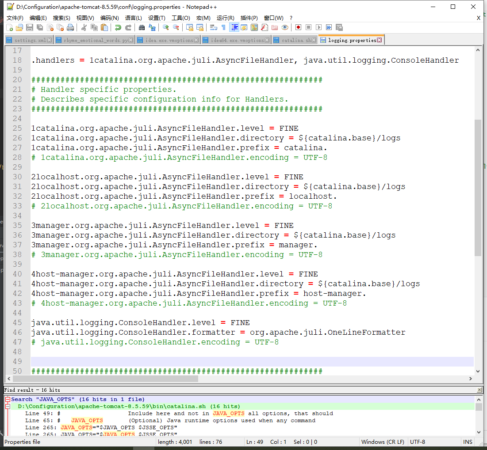
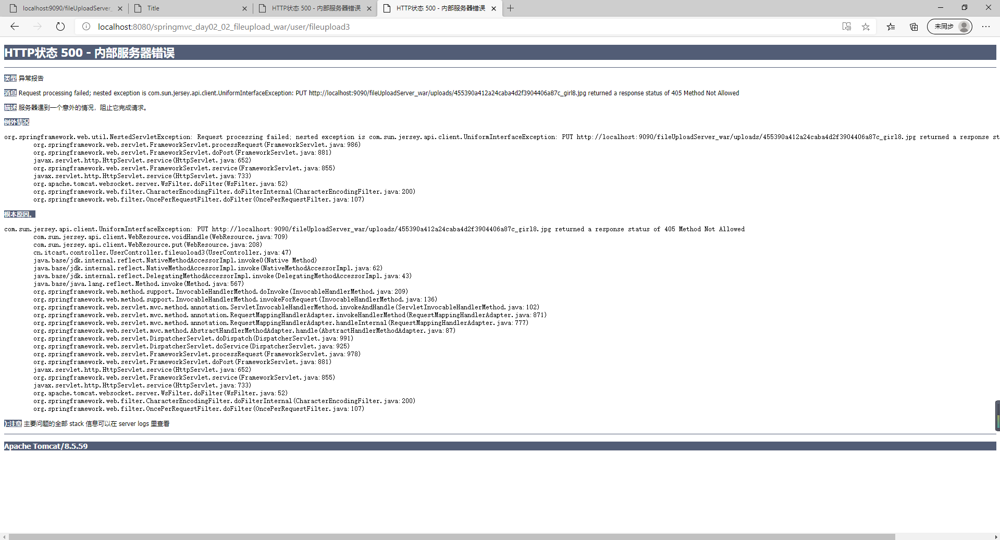
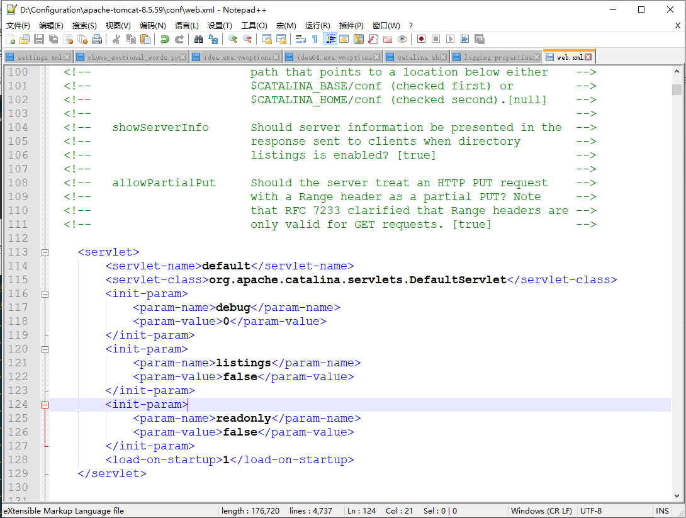

# SpringMVC踩坑笔记

# 1 请求出现中文乱码

这是因为请求默认只支持英文，为了能够使用中文，我们可以在webapp的web.xml中新加一个解决中文乱码的过滤器，对所有请求都进行拦截，加上encoding为UTF-8的指定。

```xml
<!DOCTYPE web-app PUBLIC
 "-//Sun Microsystems, Inc.//DTD Web Application 2.3//EN"
 "http://java.sun.com/dtd/web-app_2_3.dtd" >

<web-app>
  <display-name>Archetype Created Web Application</display-name>

  <!--配置前端控制器-->
  <servlet>
    <servlet-name>dispatcherServlet</servlet-name>
    <servlet-class>org.springframework.web.servlet.DispatcherServlet</servlet-class>
    <init-param>
      <param-name>contextConfigLocation</param-name>
      <param-value>classpath:springmvc.xml</param-value>
    </init-param>
    <load-on-startup>1</load-on-startup>
  </servlet>
  <servlet-mapping>
    <servlet-name>dispatcherServlet</servlet-name>
    <url-pattern>/</url-pattern>
  </servlet-mapping>

  <!--配置解决中文乱码的过滤器-->
  <filter>
    <filter-name>characterEncodingFilter</filter-name>
    <filter-class>org.springframework.web.filter.CharacterEncodingFilter</filter-class>
    <init-param>
      <param-name>encoding</param-name>
      <param-value>UTF-8</param-value>
    </init-param>
  </filter>
  <filter-mapping>
    <filter-name>characterEncodingFilter</filter-name>
    <url-pattern>/*</url-pattern>
  </filter-mapping>

</web-app>

```


# 2 Tomcat日志输出中文乱码

在tomcat的安装路径的conf文件夹下D:\Configuration\apache-tomcat-8.5.59\conf

找到logging.properties文件，然后将所有编码为UTF-8的行都注释掉即可。




# 3 跨服务器上传文件报错405

参考CSDN博客：https://blog.csdn.net/Dawn510/article/details/103915414



405的意思是指方法不被允许。

解决方法为修改tomcat安装目录的conf文件夹下的web.xml，添加如下配置，关闭tomcat的只读权限：

```xml
        </init-param>
				<init-param>
			<param-name>readonly</param-name>
			<param-value>false</param-value>
		</init-param>
```

