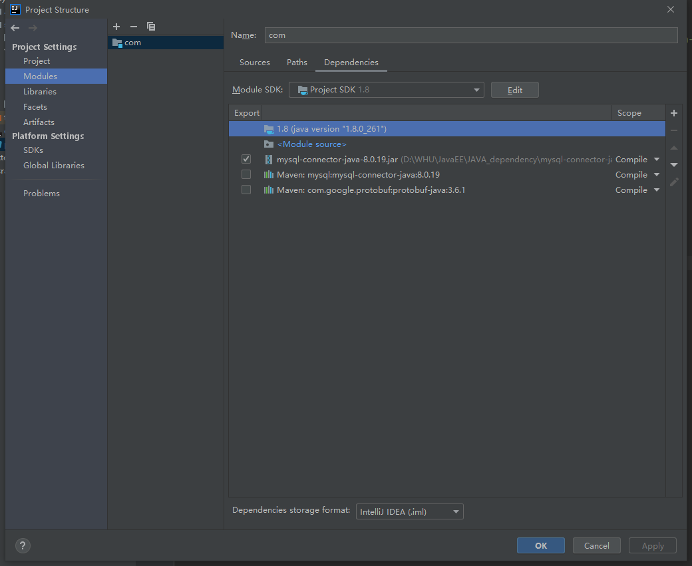
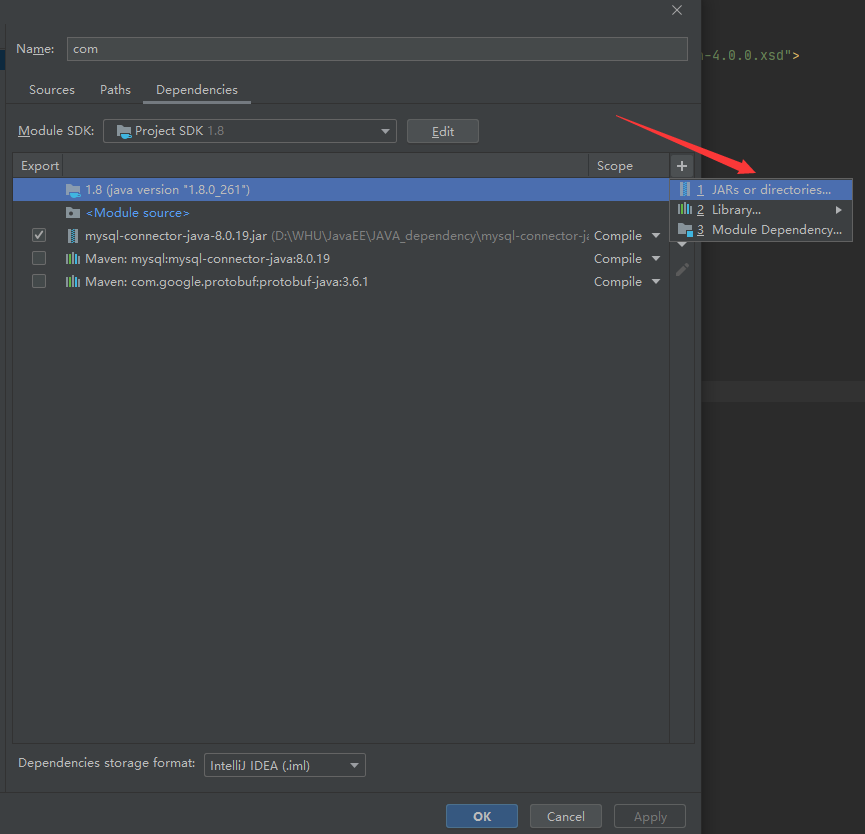

# Spring第一天踩坑笔记

# 实验环境声明

jdk8

2020 idea-community

mysql 8.0.19

# 一 Mysql数据库配置踩坑

## 1 java: 程序包com.mysql.jdbc不存在

首先报错：

```
java: 程序包com.mysql.jdbc不存在
```

丢一波pom.xml配置文件，配置文件是没有问题的：

```xml
<?xml version="1.0" encoding="UTF-8"?>
<project xmlns="http://maven.apache.org/POM/4.0.0"
         xmlns:xsi="http://www.w3.org/2001/XMLSchema-instance"
         xsi:schemaLocation="http://maven.apache.org/POM/4.0.0 http://maven.apache.org/xsd/maven-4.0.0.xsd">
    <modelVersion>4.0.0</modelVersion>

    <groupId>org.example</groupId>
    <artifactId>day01_eesc_java.jdbc</artifactId>
    <version>1.0-SNAPSHOT</version>
    <packaging>jar</packaging>

    <dependencies>
        <dependency>
            <groupId>mysql</groupId>
            <artifactId>mysql-connector-java</artifactId>
            <version>8.0.19</version>
        </dependency>
    </dependencies>

</project>
```

解决方法：针对该问题是因为新建的idea工程中并没有自动配置mysql的依赖，我们需要去mysql的官网上下载对应版本的依赖。下载链接：https://downloads.mysql.com/archives/c-j/

下载完对应的ZIP压缩包之后解压到一个路径。然后点击File->Prooject Structure进入到如图所示的界面：



博主是已经添加完成了的效果，如果你在该界面没有mysql-connector-java-8.0.19.jar的那个包，那么请点击右边的+号，然后点击JARs or directories...。在弹出来的窗口选择jar包就可以了！



## 2 The server time zone value '�й���׼ʱ��' is unrecognized or represents more than one time zone. You must configure either the server or JDBC driver (via the serverTimezone configuration

这其实是一个时区的指定问题，出现该问题是因为使用了过高版本的mysql。比如我的8.0.19。解决方法可以参考这个blog：https://blog.csdn.net/m0_38039437/article/details/97270423

还有的解决方法如下：

在连接字符串后面加上

`
?serverTimezone=UTC
`

其中UTC是统一标准世界时间，完整的连接字符串示例：

`
jdbc:mysql://localhost:3306/eesy?serverTimezone=UTC
`

或者还有另一种选择，这个是解决中文乱码输入问题。：
`jdbc:mysql://localhost:3306/eesy?useUnicode=true&characterEncoding=UTF-8`

当然也可以和上面的一起结合：
` jdbc:mysql://localhost:3306/eesy?useUnicode=true&characterEncoding=UTF-8&serverTimezone=UTC `


不过这些在连接数据库时进行指定太麻烦了！不如在mysql命令行中直接指定时区一劳永逸：

```sql
use eesy;
show variables like '%time_zone%';  
set global time_zone='+8:00';  
```

